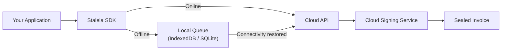

# Invoicing SDK Reference

The Stalela SDK provides client libraries for **JavaScript** and **Python** that wrap the Cloud API with type-safe models, built-in offline queuing, automatic retries, and receipt rendering helpers. Use the SDK when you want to integrate fiscal invoicing into your application without managing raw HTTP calls.

## Installation

=== "JavaScript (npm)"

    ```bash
    npm install @stalela/sdk
    ```

=== "Python (pip)"

    ```bash
    pip install stalela-sdk
    ```

## Quick start

=== "JavaScript"

    ```javascript
    import { Stalela } from '@stalela/sdk';

    const client = new Stalela({
      apiKey: process.env.BONO_API_KEY,
      outletId: 'OUTLET-001',
      // Note: Pure offline queuing of unsigned drafts is not legally valid for printed receipts.
      // For offline signing, use the Fiscal Extension (Phase 1.5) or a hardware DEF (Phase 3).
      offline: { enabled: true, gracePeriodMs: 24 * 60 * 60 * 1000 }
    });

    // Create a fiscalized invoice
    const invoice = await client.invoices.create({
      invoiceType: 'sale',
      merchantNif: '123456789',
      client: { name: 'Acme Ltd', nif: '987654321', classification: 'company' },
      items: [
        { sku: 'SKU-001', description: 'Consulting', quantity: 1, unitPrice: 100000, taxGroup: 'TG03' }
      ],
      payments: [
        { method: 'bank_transfer', amount: 116000, reference: 'TXN-789' }
      ]
    });

    console.log(invoice.fiscalNumber);  // "BONO-OUTLET001-000123"
    console.log(invoice.authCode);      // "MEUCIQD8j2w8s..."
    console.log(invoice.qrPayload);     // "https://verify.stalela.cd/i?hash=..."
    ```

=== "Python"

    ```python
    from stalela import Stalela

    client = Stalela(
        api_key=os.environ["BONO_API_KEY"],
        outlet_id="OUTLET-001",
        # Note: Pure offline queuing of unsigned drafts is not legally valid for printed receipts.
        # For offline signing, use the Fiscal Extension (Phase 1.5) or a hardware DEF (Phase 3).
        offline={"enabled": True, "grace_period_seconds": 86400}
    )

    # Create a fiscalized invoice
    invoice = client.invoices.create(
        invoice_type="sale",
        merchant_nif="123456789",
        client={"name": "Acme Ltd", "nif": "987654321", "classification": "company"},
        items=[
            {"sku": "SKU-001", "description": "Consulting", "quantity": 1, "unit_price": 100000, "tax_group": "TG03"}
        ],
        payments=[
            {"method": "bank_transfer", "amount": 116000, "reference": "TXN-789"}
        ]
    )

    print(invoice.fiscal_number)  # "BONO-OUTLET001-000123"
    print(invoice.auth_code)      # "MEUCIQD8j2w8s..."
    ```

## Core modules

### `client.invoices`

| Method | Description |
|--------|-------------|
| `create(payload)` | Submit a canonical payload for fiscalization. Returns a sealed invoice with security elements. |
| `get(fiscalNumber)` | Retrieve a sealed invoice by fiscal number. |
| `getStatus(fiscalNumber)` | Check DGI sync status for a specific invoice. |
| `list(filters?)` | List invoices with optional filters (date range, status, client). |
| `createBatch(payloads[])` | Submit multiple payloads in one call. Returns array of sealed responses. |

### `client.reports`

| Method | Description |
|--------|-------------|
| `generate(type, period)` | Generate a Z, X, or A report for the specified period. |
| `download(reportId)` | Download a generated report as PDF or JSON. |
| `list(filters?)` | List previously generated reports. |

### `client.audit`

| Method | Description |
|--------|-------------|
| `export(options?)` | Download the hash-chained Fiscal Ledger export. |

### `client.outlets`

| Method | Description |
|--------|-------------|
| `getStatus()` | Check outlet health, next fiscal number, and sync status. |

### `client.webhooks`

| Method | Description |
|--------|-------------|
| `register(config)` | Register a webhook endpoint. |
| `list()` | List registered webhooks. |
| `delete(webhookId)` | Remove a webhook registration. |
| `verifySignature(payload, signature, secret)` | Verify webhook payload signature (HMAC-SHA256). |

### `client.verify`

| Method | Description |
|--------|-------------|
| `verify(fiscalNumber, authCode)` | Verify a sealed invoice via the public Verification API — no API key required. Returns `status`, `signature_valid`, `dgi_status`. |
| `verifyQR(qrData)` | Parse a QR code URL and verify the referenced invoice. |
| `verifyBatch(invoices)` | Bulk-verify an array of `{ fiscal_number, auth_code }` pairs (requires API key). |
| `verifySignatureOffline(payload, signature, publicKey)` | Verify the ECDSA signature locally without an API call — useful for auditors and air-gapped environments. |

See [Invoice Verification](../fiscal/invoice-verification.md) for the full verification flow, portal, and anti-abuse protections.

## Offline queue

The SDK includes a built-in offline queue that automatically handles connectivity issues:



### Queue behavior

1. When `offline.enabled` is `true`, the SDK intercepts failed API calls and stores payloads in the local queue.
2. A background sync worker checks connectivity periodically (default: every 30 seconds).
3. When online, queued payloads are submitted **in creation order** with idempotency keys.
4. The `onSync` callback fires for each successfully sealed invoice.
5. Payloads older than `gracePeriodMs` trigger an `onGracePeriodExceeded` warning.

### Queue events

=== "JavaScript"

    ```javascript
    client.on('queue:synced', (invoice) => {
      console.log(`Invoice ${invoice.fiscalNumber} sealed after offline queue`);
    });

    client.on('queue:failed', (error, payload) => {
      console.error(`Failed to submit queued invoice: ${error.message}`);
    });

    client.on('queue:grace-exceeded', (payload) => {
      console.warn(`Draft has been queued for over ${payload.age}ms`);
    });
    ```

=== "Python"

    ```python
    @client.on("queue:synced")
    def on_synced(invoice):
        print(f"Invoice {invoice.fiscal_number} sealed after offline queue")

    @client.on("queue:failed")
    def on_failed(error, payload):
        print(f"Failed to submit queued invoice: {error}")
    ```

## Tax engine helpers

The SDK includes helpers for building valid tax summaries:

=== "JavaScript"

    ```javascript
    import { TaxEngine } from '@stalela/sdk';

    const taxSummary = TaxEngine.calculate({
      items: [
        { unitPrice: 100000, quantity: 1, taxGroup: 'TG03' }
      ],
      clientClassification: 'company'
    });
    // Returns: { taxGroups: [{ code: 'TG03', baseAmount: 100000, rate: 0.16, taxAmount: 16000 }], totals: { ... } }
    ```

## Error handling

The SDK throws typed errors for common scenarios:

| Error class | HTTP status | Description |
|-------------|-------------|-------------|
| `ValidationError` | 400 | Invalid payload (missing fields, bad tax group) |
| `AuthenticationError` | 401 | Invalid or expired API key |
| `PermissionError` | 403 | API key lacks required scope |
| `NotFoundError` | 404 | Invoice or outlet not found |
| `DuplicateError` | 409 | Idempotency key collision (returns existing invoice) |
| `RateLimitError` | 429 | Rate limit exceeded (includes `retryAfter`) |
| `NetworkError` | — | No connectivity (queued if offline mode enabled) |

## Configuration

| Option | Default | Description |
|--------|---------|-------------|
| `apiKey` | — | Required. Your Stalela API key. |
| `outletId` | — | Required. The outlet to scope requests to. |
| `baseUrl` | `https://api.stalela.cd` | API base URL. |
| `timeout` | `30000` | Request timeout in milliseconds. |
| `offline.enabled` | `false` | Enable local offline queue. |
| `offline.gracePeriodMs` | `86400000` | Grace period before warning (24h default). |
| `offline.maxRetries` | `10` | Max retries per queued payload. |
| `offline.storage` | `auto` | Storage backend: `indexeddb`, `sqlite`, or `auto`. |
