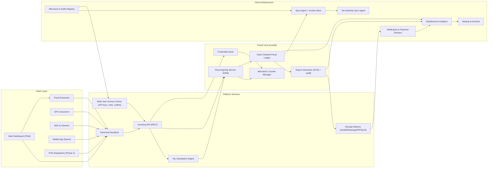
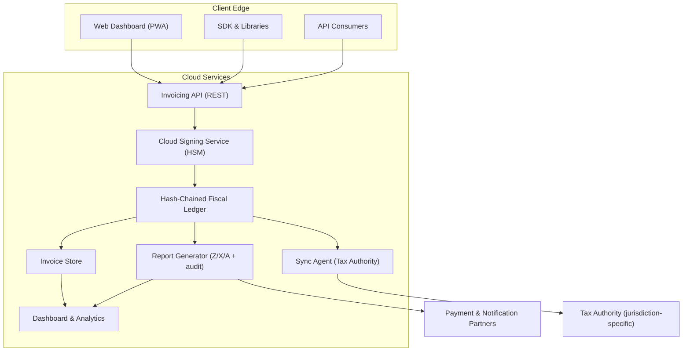

# Component Map

This page records the layered services, actors, and dependencies that deliver Stalela's software-first invoicing platform. It highlights how untrusted clients feed canonical payloads into the platform services, how the trusted fiscal core seals invoices, and how cloud infrastructure stores, syncs, and observes every fiscal event.

!!! note "Phase 1 trust boundary"
    The Cloud Signing Service (HSM-backed) is the only trusted component in Phase 1. Clients (dashboard, API consumers, SDKs, and future POS integrations) remain untrusted, and every security element (fiscal number, auth code, timestamp, QR) originates inside the cloud. Phase 3 reserves the archived USB Fiscal Memory device as an optional trust anchor, but until DEF homologation is required the cloud signs and stores every invoice.

## Client Layer

Stalela clients live in the untrusted zone (with the exception of the Fiscal Extension, which is semi-trusted). They prepare invoices with deterministic identifiers and tax data, queue drafts while offline, and hand canonical serializers the inputs that the platform services validate and fiscalize.

- `Web Dashboard (PWA)` — Tablet-friendly interface with service workers, IndexedDB queues, simplified invoice entry, and status indicators (green/yellow/red) for fiscalization progress.
- `Stalela Fiscal Extension` — A Chrome/Edge browser extension that runs in an isolated sandbox. It holds short-lived Delegated Credentials and silently auto-signs invoices for the PWA when operating in Delegated Offline Mode.
- `API Consumers` — Backend integrations (ERPs, e-commerce, ERP connectors) that call the Invoicing API with canonical payloads, metadata (merchant_tin, outlet_id, pos_terminal_id, jurisdiction), and source headers.
- `SDK & Libraries` — JavaScript/Python/PHP clients that enforce canonical ordering, handle offline queues (IndexedDB/SQLite), and surface callbacks for fiscalized/queued/error states.
- `Mobile App (future PWA)` — Mobile-first UI that reuses the dashboard experience with push notifications and offline-first behavior.
- `POS Integrations (Phase 2 preview)` — Legacy POS systems that will plug into the SDKs and delegate signing requests to Stalela Cloud instead of local hardware.

## Platform Services Layer

Platform services normalize, secure, and route every request before the fiscal core signs it. They convert raw user input into deterministic payloads, enforce multi-user policies, apply the tax engine, and deliver receipts.

- `Canonical Serializer` — Produces deterministic JSON (merchant/outlet identifiers, timestamp, client, items, tax_groups, totals, payments) so the Cloud Signing Service can reproduce hashes and ledger entries.
- `Invoicing API (REST)` — The developer-facing surface that handles authentication (merchant/outlet-scoped API keys), rate limiting, request validation, and orchestration of tax calculation + signing.
- `Tax Calculation Engine` — Loads the active jurisdiction's tax group manifest, computes per-group amounts, applies client classification rules and rounding adjustments, then attaches totals to the canonical payload. See [Tax Engine](../fiscal/tax-engine.md) and [Jurisdictions](../../40-jurisdictions/index.md).
- `Multi-User Access Control (API keys, roles, outlet scoping)` — Enforces quotas, roles (admin, invoicer, viewer, auditor), and source metadata so only authorized users can fiscalize invoices.
- `Receipt Delivery (email/WhatsApp/PDF/print)` — Renders sealed invoices with fiscal numbers, auth codes, timestamps, and QR payloads for immediate customer delivery.

## Fiscal Core Layer (trusted)

The fiscal core contains the Cloud Signing Service and its supporting services that live behind the trust boundary.

- `Cloud Signing Service (HSM)` — Assigns sequential fiscal numbers, generates authentication codes, anchors trusted timestamps, and builds QR payloads; all operations execute within the HSM so keys never leave the boundary.
- `Delegated Credential Issuer` — Provisions short-lived Verifiable Credentials (sub-keys) to authorized POS terminals, enabling them to sign invoices locally when offline.
- `Monotonic Counter Manager` — Ensures strictly increasing fiscal numbers per outlet even with concurrent API/SDK/cashier activity via serializable database isolation. Also handles block allocation for Delegated Credentials.
- `Hash-Chained Fiscal Ledger` — Appends every invoice, void, refund, and report entry with a prev-hash so auditors can verify immutability.
- `Report Generator (Z/X/A + audit)` — Derives compliance reports from the ledger (fiscal number ranges, auth codes, tax group totals) and surfaces downloads through the dashboard or API.

## Cloud Infrastructure Layer

Cloud infrastructure stores sealed invoices, uploads them to the jurisdiction's tax authority, and gives operators visibility while preserving backups.

- `Sync Agent + Invoice Store` — Queues sealed invoices, retries uploads to the jurisdiction's tax authority endpoint when connectivity returns, and keeps a copy of every fiscal response for replays or audits.
- `Tax Authority Sync Agent` — Dedicated connector that authenticates to the jurisdiction's tax authority, packages sealed payloads using the authority's protocol, and records acknowledgments (`queued`, `synced`, `failed`). See [Authority Sync](../cloud/authority-sync.md).
- `Merchant & Outlet Registry` — Tracks which merchants, outlets, API keys, and POS integrations are active, their quotas, firmware versions (for future hardware), and metadata required by the fiscal core. Identity management (KYB verification, user provisioning, credential issuance) is delegated to the [Customer Identity Service (CIS)](../../15-identity/index.md); the registry consumes CIS data to enforce outlet-scoped access.
- `Dashboard & Analytics` — Observability layer for device health, backlog depth, report generation, and sync failures. It consumes metrics from the Invoicing API, Sync Agent, and ledger.
- `Backup & Archival` — Off-site snapshots of the fiscal ledger, report payloads, and DAG metadata so compliance teams can restore or audit historical data.

## Component Dependency Map

The diagram below shows how the client layer feeds canonical data into the platform services, how the fiscal core seals invoices, and how cloud infrastructure persists and syncs every fiscal event. The labels show the services mentioned above and their calling directions.

## Cloud Deployment Diagram

This deployment diagram emphasizes the cloud services that fiscalize invoices, store them, and sync them to the jurisdiction's tax authority. Every client hits the Invoicing API, the Cloud Signing Service signs the payload, and the Sync Agent ships the ledger to the tax authority while analytics and payment partners observe the results.

