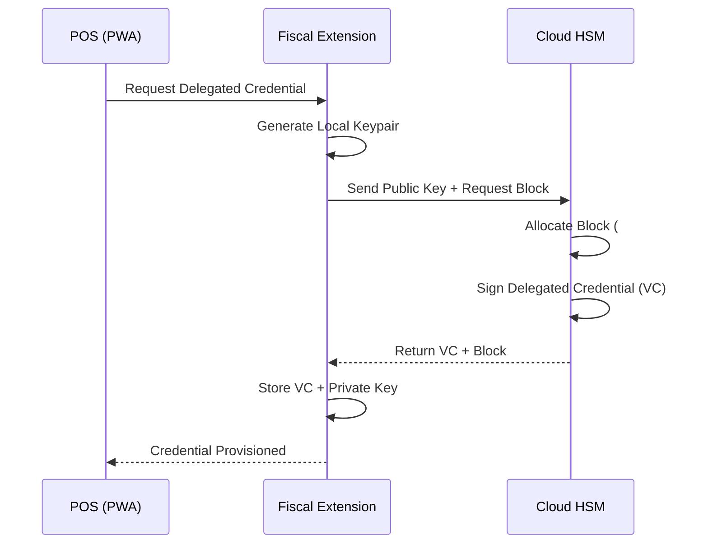
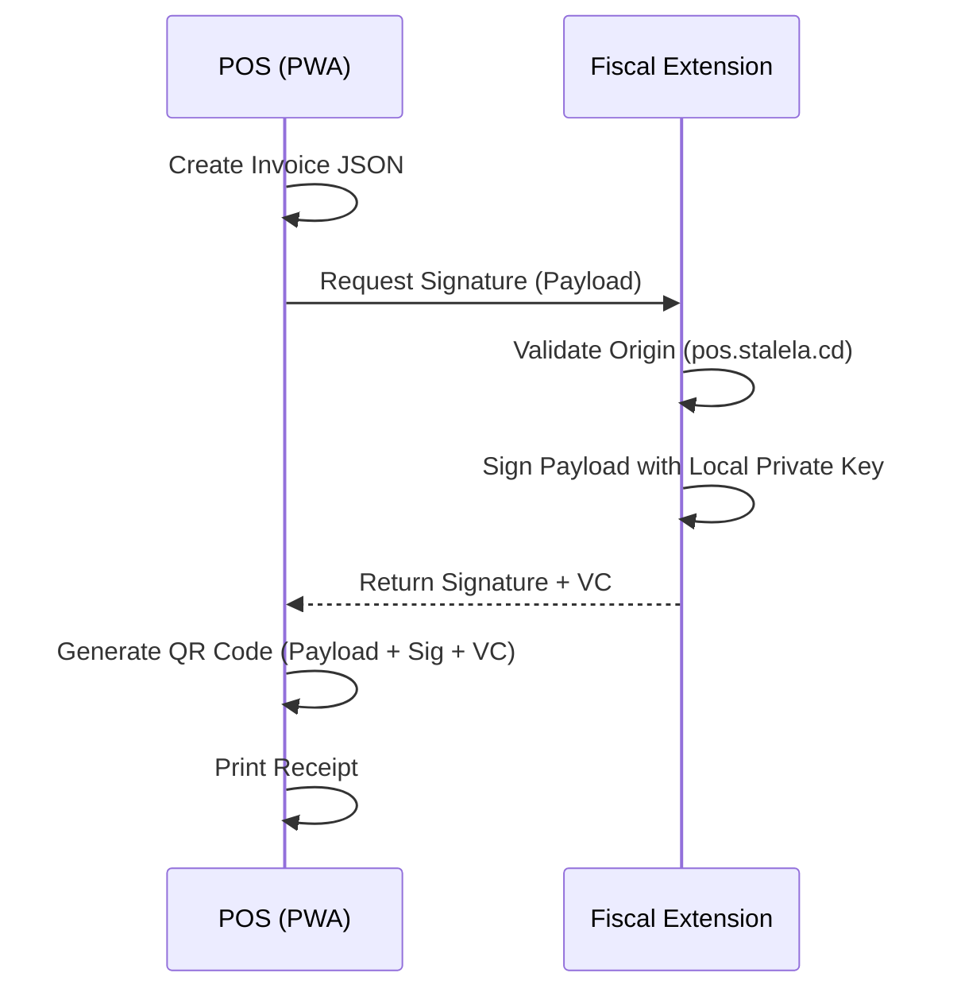
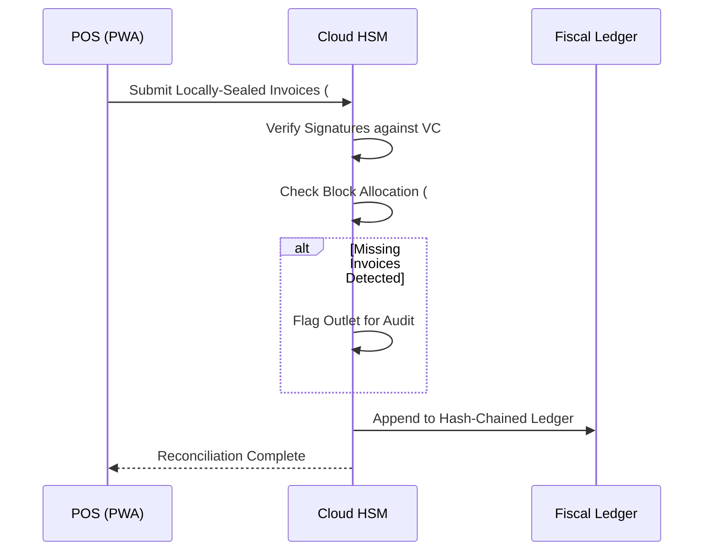

# Delegated Offline Token Architecture

## Problem Statement

In Phase 1, Stalela relies entirely on the Cloud Signing Service (HSM) to generate fiscal numbers, signatures, and QR payloads. The original design assumed that if a client (e.g., a web dashboard) lost internet connectivity, it would queue "unsigned drafts" locally and submit them for fiscalization once connectivity returned.

However, a deep review of the DRC regulatory framework (specifically Arrêté 033) revealed a critical compliance gap: **physical receipts handed to customers in a retail environment must contain the fiscal signature and QR code at the moment of sale.** A strategy of queuing unsigned drafts is legally incompatible with B2C physical retail.

To solve this, we need a way for Point of Sale (POS) terminals to sign invoices offline securely, without destroying the user experience (e.g., requiring a biometric prompt for every receipt) or exposing the master Cloud HSM private keys.

## The Model

We introduce the **Delegated Offline Token Architecture** as a Phase 1.5 fast-follow. This model combines principles from Self-Sovereign Identity (Verifiable Credentials), Browser Extensions (the MetaMask pattern), and HOTP (Block Allocation).

### 1. Delegated Credential Issuance
Instead of the POS holding the master Cloud HSM key, the Cloud HSM issues a short-lived (e.g., 12-hour) "Delegated Private Key" to the POS terminal when it is online. The POS terminal must first be authenticated by [CIS](../../15-identity/index.md) as a valid cashier/terminal identity, with a current KYC tier. The key is then packaged as a Verifiable Credential (VC) that says:
> *"I, Stalela Cloud (Trusted Authority), certify that Public Key [XYZ] belongs to POS Terminal #12, and is authorized to sign Invoices #1000 to #1500 until Midnight tonight."*

### 2. Local Signing (The Fiscal Extension)
To protect this delegated key from XSS attacks on the PWA, the key is stored inside a dedicated **Stalela Chrome Extension**. The extension runs in an isolated sandbox.
* The cashier unlocks the extension once per shift with a PIN.
* The PWA sends invoice payloads to the extension.
* The extension silently auto-signs them (only if the request originates from the trusted `pos.stalela.cd` domain) and returns the signature.

### 3. Block Allocation (Tamper Detection)
To prevent merchants from deleting local databases to hide sales, the Cloud HSM allocates a strict, sequential block of fiscal numbers (e.g., #1000 to #1500) along with the Delegated Credential.
* If the merchant deletes their local data and reconnects, the Cloud detects the missing block and flags the outlet for a tax audit.

### 4. Reconciliation
When connectivity returns, the POS submits the locally-sealed invoices to the Cloud. The Cloud verifies the signatures against the Delegated Credential and appends them to the Hash-Chained Fiscal Ledger.

## Trust Boundary Changes

Clients with valid delegated credentials are "semi-trusted" for a bounded scope. The Cloud HSM remains the root of trust. The trust boundary is relaxed to allow delegated signing via short-lived Verifiable Credentials.

## Security Analysis

* **Signing Oracle Attack:** The extension is programmed to silently auto-sign requests from `pos.stalela.cd`. If an attacker finds an XSS vulnerability on the PWA, they could inject malicious JavaScript to send fake invoices to the extension.
  * *Mitigation:* Strict Content Security Policy (CSP) on the PWA. The extension must validate the payload totals before signing. The blast radius is limited by the short TTL (12 hours) and block cap (500 invoices).
* **Supply Chain Attack:** A compromised Google developer account could push a malicious extension update.
  * *Mitigation:* Strict access control (MFA, hardware keys) for the Chrome Web Store account. Code signing and reproducible builds. The compromised extension would only access temporary 12-hour keys, not the master Cloud HSM keys.
* **Local Malware:** A keylogger could capture the PIN and read the encrypted key file.
  * *Mitigation:* This is a fundamental limitation of software-based solutions. The only true defense is Phase 3 (Hardware USB Tokens).
* **XSS Immunity:** The private keys are isolated from the web page. XSS attacks cannot steal the keys.

## Verification Flow

A two-step cryptographic check is required to verify a locally-sealed invoice offline:
1. **Validate the Delegated Credential:** Did Stalela Cloud sign the Delegated Credential? (Verified via Stalela's cached Public Key).
2. **Validate the Invoice Signature:** Did the POS local key sign the invoice? (Verified via the Public Key inside the Delegated Credential).

## Sequence Diagrams

### Credential Provisioning

### Offline Signing

### Reconciliation & Tamper Detection

## Open Questions

* **DGI Acceptance:** Will the DGI accept delegated signatures, or will they mandate hardware-backed security (accelerating Phase 3)?
* **Acceptable TTL/Block Size:** What is the optimal balance between security (short TTL, small blocks) and offline resilience (long TTL, large blocks)?
* **Credential Revocation:** How do we handle revocation of a Delegated Credential if a POS terminal is compromised before the TTL expires?
