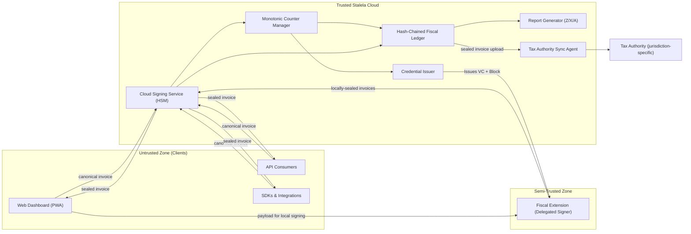

# Trust Boundary

Stalela positions the **Cloud Signing Service (HSM-backed)** as the root trusted fiscal authority. However, to support offline retail compliance, the trust boundary includes a **Semi-Trusted Zone** for clients holding valid Delegated Credentials.

Web dashboards, API consumers, and SDKs generally live in the untrusted zone; they author canonical payloads (`merchant_tin`, `outlet_id`, `pos_terminal_id`, `jurisdiction`, `client`, `tax_groups`, `totals`, `payments`, `timestamp`) and deliver them to Stalela Cloud for validation, tax calculation, signing, and ledger storage. 

When operating in **Delegated Offline Mode**, a POS terminal equipped with the Stalela Fiscal Extension acts as a bounded, semi-trusted signer. It uses a short-lived Verifiable Credential to generate security elements locally, which are later reconciled with the Cloud Ledger.

## What crosses the boundary

1. **Canonical invoice requests** — Clients send deterministic JSON through `POST /api/v1/invoices` (or direct API/SDK calls) that include the jurisdiction-configured tax groups, client classification, outlet/scoping identifiers, and payments in the field order mandated by the spec.
2. **Delegated Credential Requests** — POS terminals request short-lived signing keys and block allocations from the Credential Issuer.
3. **Locally-Sealed Invoices (Reconciliation)** — When connectivity returns, POS terminals submit invoices signed by the Fiscal Extension to the Cloud for verification and ledger appending.
4. **Payment metadata & tracing headers** — Each request carries `X-Stalela-Merchant-ID`, `X-Stalela-Outlet-ID`, optionally `X-Stalela-User-ID`/`X-Stalela-Source`, and other telemetry. The [CIS](../../15-identity/index.md)-issued JWT validates the identity claims in these headers — the middleware verifies the token signature and extracts `tenantId`, `merchant_tin`, `outlet_id`, and `kycTier` before forwarding to the Cloud Signing Service.

## What the trusted zone produces

- **Sealed responses** — The Cloud Signing Service returns the five mandatory elements (fiscal number, fiscal authority ID, cryptographic auth code, trusted timestamp, QR payload) plus `ledger_hash`, `authority_sync_status`, and the signed payload.
- **Delegated Credentials (VCs)** — The Credential Issuer produces short-lived Verifiable Credentials and allocates blocks of fiscal numbers to authorized POS terminals.
- **Ledger entries** — The hash-chained Fiscal Ledger records each fiscal event immutably.
- **Tax authority upload bundles** — The Sync Agent packages sealed invoices for the jurisdiction's tax authority. See [Authority Sync](../cloud/authority-sync.md).
- **Audit-ready reports** — The Report Generator emits Z/X/A/audit exports.

## What never crosses the boundary

- **Master Private Keys** — HSM-held master keys stay inside the Cloud Signing Service. Clients never see them. *(Note: Short-lived, delegated sub-keys do cross the boundary into the isolated Fiscal Extension sandbox).*
- **Raw monotonic counters or journal mutations** — Counter increments and journal writes occur only inside the trusted zone. 
- **Fabricated security elements** — Client applications outside the strict Fiscal Extension sandbox cannot invent fiscal numbers, timestamps, auth codes, or QR payloads.

## Failure modes at the boundary

1. **Cloud Signing Service unavailable** — Clients without a delegated credential queue invoices locally (unsigned drafts) and retry when online. Clients with the Fiscal Extension sign locally within their allocated block.
2. **Delegated Credential Expiry** — If a POS terminal remains offline past its credential's TTL (e.g., 12 hours) or exhausts its allocated block of fiscal numbers, it must revert to queuing unsigned drafts until it can reconnect and request a new credential.
3. **Key rotation inside HSM** — The Cloud handles key rollovers without exposing private material. 
4. **Counter corruption or serialization violation** — The Monotonic Counter Manager enforces serializable isolation in PostgreSQL.
5. **Tax authority sync backpressure** — The Sync Agent queues outbound bundles and retries with exponential backoff.

## Trust assumptions table

| Assumption | Enforcement |
| --- | --- |
| The Cloud Signing Service (HSM) is the root authority for fiscal numbers, auth codes, timestamps, and QR payloads. | The HSM + Monotonic Counter Manager run inside Stalela Cloud. |
| **Delegated Credential Holder (semi-trusted, bounded scope)** | The Fiscal Extension operates in an isolated browser sandbox, signing only within the strict TTL and block allocation defined by its Verifiable Credential. |
| Canonical payloads hit the trusted zone before fiscalization (or reconciliation). | API/SDK clients serialize payloads per spec. The Cloud rejects schema deviations before signing or reconciling. |
| Clients may not fabricate security elements. | Only the Cloud HSM or the isolated Fiscal Extension can produce valid cryptographic signatures. |
| Multi-user, multi-terminal tenants share fiscal access safely. | Each request includes `merchant_id`, `outlet_id`, and `api_key_id`/`user_id`. |
| Audit reports originate from the hash-chained ledger. | The Report Generator queries the ledger directly. |

## Phase 3 note

Phase 3 introduces the optional USB Fiscal Memory device as a trust anchor for DEF-homologated merchants. When that hardware is deployed, it replaces the Cloud Signing Service for the local outlet while replicating every sealed invoice back to Stalela Cloud for ledger consistency and tax authority sync (`design/docs-archive/hardware/`). The documentation above keeps the cloud-first story intact but flags the archived USB specs for future reference.
