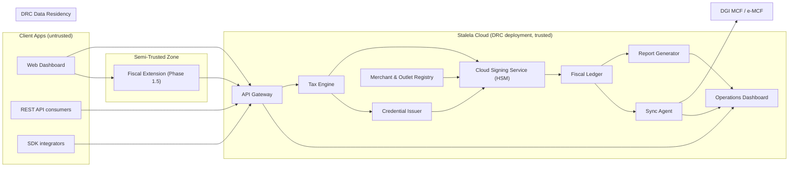

# Cloud Architecture

The Stalela Cloud is the **trusted fiscal authority** in Phase 1 (Software Invoicing). Unlike a relay that merely forwards sealed data, the cloud is responsible for the entire fiscalization pipeline: it receives canonical payloads from untrusted client applications, validates them, signs them via the HSM-backed Cloud Signing Service, assigns sequential fiscal numbers, timestamps them, stores them in the append-only Fiscal Ledger, and delivers sealed responses back to the caller. Only after an invoice is sealed does the Sync Agent forward it to the DGI.

## Responsibilities

| Component | Role |
|-----------|------|
| **Cloud Signing Service (HSM)** | Assigns fiscal numbers via the Monotonic Counter Manager, signs canonical payloads with ECDSA keys that never leave the HSM, generates QR payloads, and produces trusted timestamps. In Phase 1.5, it verifies locally-sealed invoices during reconciliation. |
| **Credential Issuer** | Issues short-lived Delegated Credentials (Verifiable Credentials) and allocates blocks of fiscal numbers to the Fiscal Extension for offline signing. |
| **Fiscal Ledger** | Append-only, hash-chained storage of every sealed invoice. Source of truth for Z/X/A reports and audit exports. |
| **Tax Engine** | Validates the 14 DGI tax groups, applies client classification rules, performs rounding, and rejects invalid payloads before signing. |
| **Report Generator** | Produces Z, X, A reports and full audit exports from the Fiscal Ledger on schedule or on demand. |
| **Sync Agent** | Uploads sealed invoices to the DGI MCF/e-MCF endpoint, handles retries with exponential backoff, and records acknowledgements. |
| **Merchant & Outlet Registry** | Tracks merchants, outlets, API keys, users, and their association with HSM signing contexts. Manages provisioning, activation, and key rotation. |
| **Operations Dashboard** | Surfaces sync health, invoice pipeline status, report generation, and compliance KPIs for auditors and support staff. |

!!! warning "Trust boundary reminder"
    In Phase 1 the Cloud Signing Service is the **root authority** for fiscal numbers, signatures, timestamps, and QR metadata. Client applications (API consumers, web dashboard, SDK integrators) submit canonical payloads and receive sealed responses. In Phase 1.5, the **Fiscal Extension** acts as a semi-trusted signer using a Delegated Credential, but the Cloud HSM remains the ultimate verifier during reconciliation.

!!! info "Phase 3 — USB Hardware"
    In Phase 3, the USB Fiscal Memory device (DEF) can replace or augment the Cloud Signing Service for merchants needing DEF homologation. The cloud then acts as a sync relay. Hardware docs are archived in `docs-archive/hardware/`.

## Deployment model

### Deployment options

1. **Serverless ingestion** — Stateless functions (FaaS) validate incoming payloads, route them to the signing pipeline, and return sealed responses. This keeps bursty loads from overloading stateful systems and scales naturally when many outlets submit concurrently.
2. **Containerized services** — Longer-running components (Cloud Signing Service, Report Generator, Operations Dashboard, Sync Agent) run inside orchestrated containers with horizontal scaling per tenant cluster. Containers host the HSM integration, ledger writes, reporting, and heavy CSV/Excel exports.
3. **Hybrid pattern** — Front-door API and validation workers stay serverless for elasticity; the Cloud Signing Service, Fiscal Ledger, and Report Generator run on containers inside a private VPC within the DRC region.

Each deployment option feeds into a multi-tenant namespace (see below) so containers and functions can be scaled independently per customer while sharing operational tooling, logs, and secrets.

## Multi-tenant & per-outlet isolation

The cloud is multi-tenant by design: every merchant (and by extension, every outlet) receives its own namespace, audit partition, and quota enforcement while being hosted inside the shared DRC deployment. Tenant metadata flows from the API request (merchant NIF, outlet ID, API key / user ID) into the registry and signing pipeline so the cloud can enforce serial numbering per outlet.

The **Monotonic Counter Manager** maintains one counter per outlet with serializable database isolation. Even if multiple API consumers or dashboard users submit invoices simultaneously, the counter serializes them before the Cloud Signing Service signs, guaranteeing gap-free sequential fiscal numbers. Shared tooling (monitoring, billing, backups) reuses the same clusters, but each tenant's data sits in logically separated partitions with IAM policies.

## Data residency & compliance

All cloud workloads run in a **DRC-hosted region** to comply with local data residency expectations. Invoices, logs, and audit exports are stored encrypted at rest; keys are managed within the same region; TLS 1.3+ enforces encryption in transit. Backups are kept on redundant DRC zones, and any cross-border reporting is delivered through sealed exports (not raw invoice data) so no sensitive tax information leaves the country without explicit ministerial approval.

The cloud also tracks regulatory metadata (compliance deadlines, report cadence, audit trail hashes) so operators can prove they met the DGI requirements described in the SFE specifications.

## Deployment diagram

