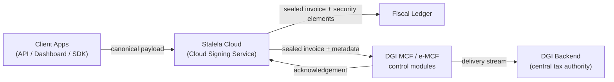

# DGI Integration

This page captures how the Stalela Cloud interfaces with the DGI control modules (MCF / e-MCF) and documents the known obligations versus the remaining unknowns uncovered during the integration spike (`spec/infrastructure-dgi-integration-1.md`).

## Overview

The DGI enforces a layered chain for fiscal compliance in the DRC. In Stalela's Phase 1 (Software Invoicing), the **Cloud Signing Service (HSM)** acts as the trusted fiscal authority — it assigns sequential fiscal numbers, signs invoices, generates timestamps and QR codes, and stores everything in the Fiscal Ledger. The **Sync Agent** then uploads sealed invoices to the DGI MCF/e-MCF control modules for central verification and tax surveillance.

This diagram emphasizes that the Cloud Signing Service **generates** the security elements (fiscal number, auth code, timestamp, QR) — it does not merely relay them. The Sync Agent handles the upstream delivery to the DGI.

!!! info "Phase 3 — USB Hardware"
    In Phase 3, the USB Fiscal Memory device (DEF) can serve as the trusted signer for merchants needing DEF homologation. The Sync Agent still uploads sealed invoices from the DEF through the cloud to the DGI using the same pipeline.

## Known constraints and responsibilities

- In Phase 1, the **Cloud Signing Service (HSM)** produces the sequential fiscal number, authentication code, trusted timestamp, and QR payload that make an invoice legally valid. In Phase 3, the DEF can assume this role.
- Every submission to the DGI control modules must include the sealed canonical payload plus identifiers (fiscal_authority_id, outlet_id, merchant_nif, cashier_id / api_key_id) so that the DGI can link the invoice to its originating outlet.
- Offline client issuance is permitted via the **Fiscal Extension (Phase 1.5)**, which seals invoices locally using a Delegated Credential. The Cloud then verifies and reconciles these locally-sealed invoices before uploading them to the DGI. Purely unsigned drafts are not legally valid receipts.
- The DGI control modules enforce immutability, continuous compliance, and real-time VAT surveillance (per Arrêté 033), meaning the Cloud must log every sync attempt, failure, and acknowledgement.
- Stalela Cloud is also responsible for merchant/outlet registry tasks: storing activation codes, monitoring outlet health, and surfacing failure alerts to operators.

## Sync Agent pipeline

The Sync Agent runs as a background service within the Stalela Cloud:

1. **Poll the Fiscal Ledger** for newly sealed invoices not yet acknowledged by the DGI.
2. **Format the DGI submission** with the required security elements and identifiers.
3. **Upload to the MCF/e-MCF endpoint** via authenticated HTTPS.
4. **Record the acknowledgement** (or failure) in the Fiscal Ledger and update the invoice's `dgi_status`.
5. **Retry with exponential backoff** on transient failures; escalate to FAILED after max retries.
6. **Surface dashboards and alerts** for operators when uploads are pending or failing.

## Unknowns (tracked as ??? admonitions)

??? warning "MCF/e-MCF API surface still unpublished"
    The research spike confirmed that the DGI has not released the endpoint URLs, transport protocol, or schema definitions for the control modules. Until those are published we cannot code the HTTP client or test payload validation.

??? warning "Authentication method for the control modules is undefined"
    We do not know whether the control modules require a DGI-issued certificate, bearer token, signed JWT, or another credential, nor how key rotation or revocation is handled.

??? warning "Offline behavior and retry rules are unspecified"
    The legislation insists every invoice must be reported, but the precise grace period, retry intervals, or thresholds that trigger manual intervention are unknown, so the sync engine must remain configurable until the DGI clarifies.

## Spike reference & next steps

Refer to `spec/infrastructure-dgi-integration-1.md` for the full list of known facts and open questions gathered during this research pass. Update that file (and this page) as soon as the DGI publishes more integration guidance so the Sync Agent can evolve from placeholders to production-ready connectors.
