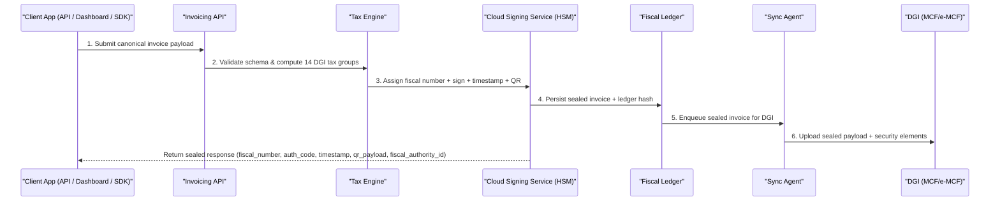
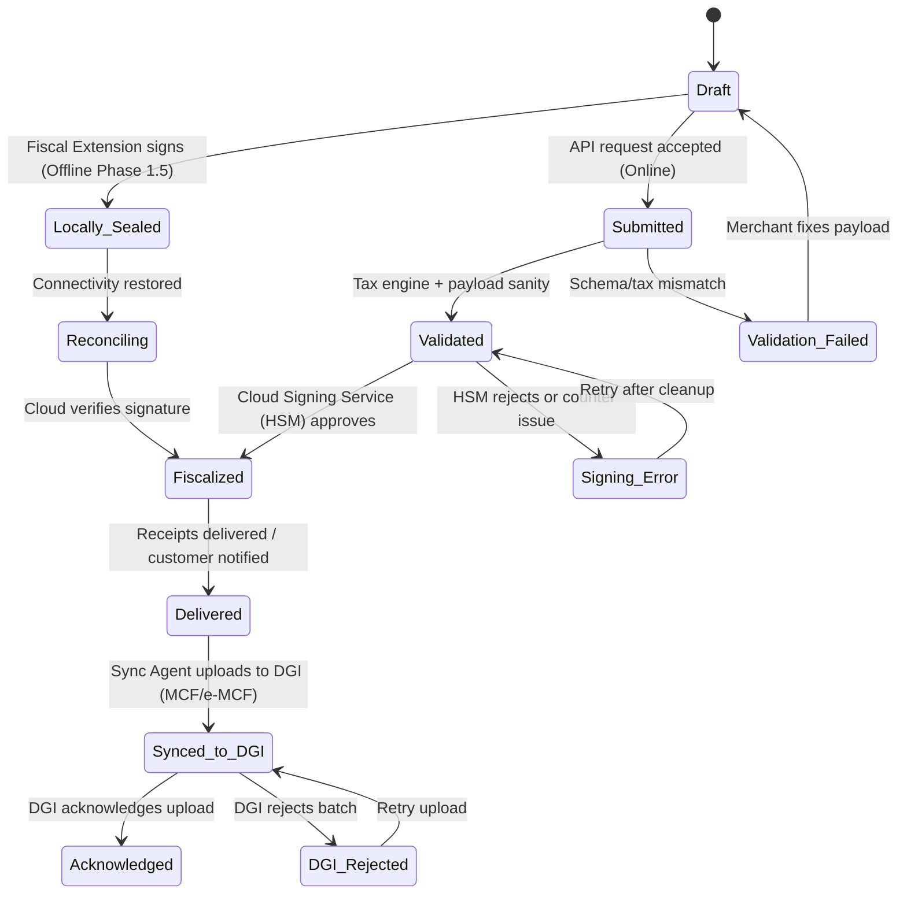
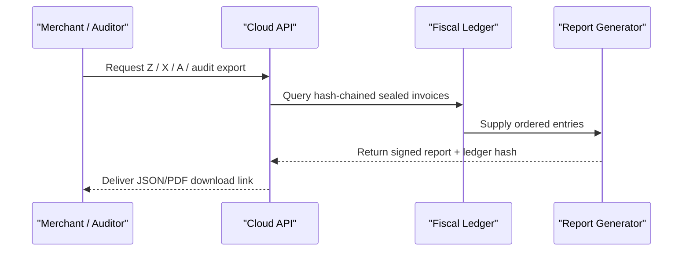

# Invoice lifecycle

## Non-negotiable six-step flow

Every fiscal invoice must follow the same locked-down path so the trust boundary stays intact, the canonical payload remains deterministic, and the Cloud Signing Service (HSM) retains sole authority over fiscal numbers, signatures, timestamps, and QR payloads.

1. **Client apps prepare canonical payloads.** Dashboards, SDKs, and API consumers submit deterministic JSON that includes `merchant_nif`, `outlet_id`, `pos_terminal_id`, `cashier_id`, `client` (classification), `items`, `tax_groups`, `totals`, `payments`, and `timestamp`. In Phase 1.5, POS terminals equipped with the Fiscal Extension can sign these payloads locally when offline using a Delegated Credential.
2. **Invoicing API validates and taxes.** The platform enforces schema, deterministic field ordering, the 14 DGI tax groups, and client classification before letting the Tax Engine compute the grouped totals and confirm the payload is well-formed.
3. **Cloud Signing Service (HSM) fiscalizes.** The Monotonic Counter Manager guarantees sequential numbering per outlet, the HSM signs the payload (ECDSA), stamps a trusted UTC timestamp, and generates the QR code that bundles fiscal_number, auth_code, timestamp, and verification URL.
4. **Fiscal Ledger persists sealed events.** The hash-chained, append-only ledger stores the sealed invoice, ledger hash, and security metadata so every report and audit entry can trace back to the same fiscal event.
5. **Clients deliver receipts.** The platform surfaces the sealed response (fiscal_number, auth_code, timestamp, qr_payload, fiscal_authority_id) so merchants can deliver receipts via email, WhatsApp, PDF download, thermal print, or the API/web dashboard.
6. **Sync Agent uploads to DGI.** The Sync Agent queues sealed invoices for MCF/e-MCF transmission, marks ledger entries `Synced_to_DGI`, and records acknowledgments as `Acknowledged`. If the DGI rejects a batch, the Sync Agent retries while preserving the hash chain and reportability.

### Primary fiscalization sequence

## Invoice state machine

The state diagram enforces the expectation that invoices never skip validation, signing, or synchronization; errors route back to safe states for retries. `Synced_to_DGI` captures the ledger entry once the Sync Agent pushes the sealed payload to the control modules, and `Acknowledged` only occurs after DGI confirms receipt.

## Invoice types

Every invoice type the DGI mandates flows through the cloud-first lifecycle above. The Cloud Signing Service (HSM) masks service differences while the Fiscal Ledger keeps the immutable record.

| Type | Code | Description |
| --- | --- | --- |
| Sale invoice | `SALE` | Standard retail/wholesale invoice that includes a full 14 tax-group breakdown and cloud-generated security elements. |
| Advance invoice | `ADVANCE` | Prepayment invoice that locks in tax treatment, yet still uses the same canonical flow and receives a sealed response from the cloud. |
| Credit note | `CREDIT` | Correction referencing the original fiscal number; signed as a new fiscal event so auditors can trace the adjustment. |
| Export invoice | `EXPORT` | Duty/export-centric invoice that records customs/product details and shares the canonical payload + signing pipeline. |
| Export credit note | `EXPORT_CREDIT` | Refund or correction for an export invoice; it binds to the export fiscal number and travels through the cloud signing sequence. |

## Special flows

### Void flow

Voids are new fiscal events. A merchant references the original `fiscal_number`, builds a canonical payload with `invoice_type: "CREDIT"` or a dedicated void marker, and resubmits via `POST /api/v1/invoices`. The same six-step lifecycle applies: the Tax Engine recomputes totals, the Cloud Signing Service (HSM) issues a fresh fiscal number + signature, and the Fiscal Ledger appends a link back to the voided invoice. No records are deleted.

### Refund (credit note) flow

Refunds (credit notes) follow the canonical path because fiscalization happens inside the cloud. The Cloud Signing Service assigns a unique fiscal number, timestamps it, and emits a QR payload that the merchant can deliver alongside the refund receipt. The Fiscal Ledger tracks the lineage so auditors can reconcile the refund with the original invoice.

### Draft cancellation

If a merchant cancels before submitting the canonical payload, the invoice stays local and never touches the trusted boundary. No fiscal number, ledger entry, or security elements are generated until the invoice re-enters the flow.

!!! warning "Ancillary records remain read-only"
    Every sealed invoice is append-only. Voids, refunds, and corrections create new fiscal events that reference the originals; nothing is rewound or deleted once the payload leaves the client application. This keeps the hash-chained ledger intact and satisfies the DGI mandate.

## Report generation flow

Reports read the same hash-chained ledger, include fiscal_authority_id + ledger hash, and can stream data to auditors even while the Sync Agent handles DGI uploads.

## Phase 3 note

When the archived USB Fiscal Memory device is deployed for DEF homologation, it replaces the Cloud Signing Service only for that outlet’s signing step. The rest of the lifecycle (canonical payload, tax engine, ledger, Sync Agent, reports) remains unchanged. Refer to `design/docs-archive/hardware/` for the DEF protocol.

## References

- `spec/architecture-kutapay-system-1.md` (trust boundary, canonical payload, tax engine, and lifecycle guardrails)
- `.github/copilot-instructions.md` (Cloud Signing Service trust rules, offline behavior, and canonical payload requirements)
