# Invoice Verification

Every sealed Stalela invoice carries a QR code that encodes the fiscal number, auth code, timestamp, and a verification URL. Invoice verification is the public-facing system that lets **anyone** — customers, auditors, DGI inspectors, or merchants themselves — confirm that an invoice was genuinely issued and sealed by the Cloud Signing Service (HSM) or a trusted Fiscal Extension (Phase 1.5). This page specifies the verification channels, API, cryptographic flow, and trust model.

## Why verification matters

Counterfeit invoices are a compliance and revenue risk in DRC markets. A trader hands a customer a receipt — how does the customer know it was really fiscalized? Verification closes that loop:

- **Customers** scan the QR on their receipt and instantly see whether the invoice is authentic.
- **DGI inspectors** verify invoices during field audits without needing VPN access to the merchant's systems.
- **Auditors** validate invoice chains in bulk through the API.
- **Business partners** confirm supplier invoices before recording them as deductible expenses.

## Verification channels

```mermaid
flowchart LR
    QR["QR Code on Receipt"] --> PORTAL["Public Verification Portal\nverify.stalela.cd"]
    QR --> API["Verification API\n/api/v1/verify"]
    QR --> WHATSAPP["WhatsApp Bot\n'Vérifier facture'"]
    MANUAL["Manual Entry\n(fiscal number + auth code)"] --> PORTAL
    MANUAL --> WHATSAPP
    PORTAL --> RESULT["✅ Verified / ❌ Not Found / ⚠️ Tampered"]
    API --> RESULT
    WHATSAPP --> RESULT
```



| Channel | Description | Authentication required | Phase |
|---------|-------------|------------------------|-------|
| **Public Verification Portal** | Web page at `verify.stalela.cd` — scan QR or type fiscal number + auth code | No (public) | Phase 1 |
| **Verification API** | REST endpoint for programmatic verification | No (public, rate-limited) | Phase 1 |
| **WhatsApp Bot** | Send QR photo or fiscal number to the bot | No (public) | Phase 2 |
| **Dashboard** | Inline verification in the merchant dashboard | Yes (authenticated) | Phase 1 |
| **SDK helpers** | `verifyInvoice()` method in JavaScript / Python SDKs | No (delegates to API) | Phase 1 |

---

## Public Verification Portal

The portal at **`verify.stalela.cd`** is a lightweight, mobile-first web page that requires no login. It's the URL encoded in every QR code.

### User flow


### Portal display

**Verified invoice (✅):**

```
╔══════════════════════════════════════════════╗
║  ✅  FACTURE VÉRIFIÉE                       ║
║                                              ║
║  N° Fiscal:    BONO-OUTLET001-000123         ║
║  Commerçant:   Acme SARL                     ║
║  Date:         17 fév 2026, 14:32 UTC        ║
║  Montant:      116 000 FC (TVA incl.)        ║
║  Autorité:     HSM-CLUSTER-01                ║
║                                              ║
║  Signature cryptographique: ✅ Valide        ║
║  Chaîne du registre:        ✅ Intacte       ║
║  Statut DGI:                ✅ Synchronisé   ║
╚══════════════════════════════════════════════╝
```

**Not found (❌):**

```
╔══════════════════════════════════════════════╗
║  ❌  FACTURE NON TROUVÉE                    ║
║                                              ║
║  Le numéro fiscal fourni ne correspond       ║
║  à aucune facture enregistrée dans le        ║
║  système Stalela.                           ║
║                                              ║
║  Si vous pensez que c'est une erreur,        ║
║  contactez le commerçant ou le support.      ║
╚══════════════════════════════════════════════╝
```

**Tampered / invalid signature (⚠️):**

```
╔══════════════════════════════════════════════╗
║  ⚠️  ATTENTION — SIGNATURE INVALIDE        ║
║                                              ║
║  La facture existe dans le registre mais     ║
║  la signature cryptographique ne correspond  ║
║  pas. Ce document a peut-être été modifié    ║
║  après son émission.                         ║
║                                              ║
║  Contactez le commerçant et la DGI.          ║
╚══════════════════════════════════════════════╝
```

### Privacy constraints

The public portal shows a **limited summary** — merchant name, date, total amount, and verification status. It does **not** expose:

- Individual line items or item descriptions
- Client (buyer) name or NIF
- Payment method details
- Raw canonical payload or ledger hashes

Merchants can optionally enable **full receipt display** for verified invoices via a dashboard toggle. Default: summary only.

---

## Verification API

### Verify by fiscal number

```
GET /api/v1/verify/{fiscal_number}?auth_code={auth_code}
```

**No authentication required.** This is a public endpoint. Rate-limited to prevent abuse.

**Response (200 — verified):**

```json
{
  "status": "verified",
  "fiscal_number": "BONO-OUTLET001-000123",
  "fiscal_authority_id": "HSM-CLUSTER-01",
  "merchant_name": "Acme SARL",
  "outlet_name": "Kinshasa Branch",
  "timestamp": "2026-02-17T14:32:00Z",
  "total": 116000,
  "currency": "CDF",
  "invoice_type": "sale",
  "signature_valid": true,
  "ledger_chain_valid": true,
  "dgi_status": "synced",
  "dgi_acknowledged_at": "2026-02-17T14:35:12Z"
}
```

**Response (404 — not found):**

```json
{
  "status": "not_found",
  "fiscal_number": "BONO-OUTLET001-999999",
  "message": "No invoice found with this fiscal number."
}
```

**Response (200 — tampered):**

```json
{
  "status": "tampered",
  "fiscal_number": "BONO-OUTLET001-000123",
  "message": "Invoice exists but the provided auth_code does not match the signature on record.",
  "signature_valid": false
}
```

### Verify by QR payload

```
POST /api/v1/verify/qr
Content-Type: application/json

{
  "qr_data": "https://verify.stalela.cd/i?fn=BONO-OUTLET001-000123&ac=MEUCIQD8j2w8s...&ts=2026-02-17T14:32:00Z&fa=HSM-CLUSTER-01"
}
```

The API parses the QR data, extracts the fiscal number and auth code, and performs the same verification flow. This endpoint is useful for mobile apps that decode QR images.

### Bulk verification

```
POST /api/v1/verify/batch
Content-Type: application/json
Authorization: Bearer bono_key_abc123

{
  "invoices": [
    { "fiscal_number": "BONO-OUTLET001-000123", "auth_code": "MEUCIQD8j2w8s..." },
    { "fiscal_number": "BONO-OUTLET001-000124", "auth_code": "MEUCIQCx9k..." },
    { "fiscal_number": "BONO-OUTLET001-000125", "auth_code": "MEUCIQDp2..." }
  ]
}
```

**Response (200):**

```json
{
  "results": [
    { "fiscal_number": "BONO-OUTLET001-000123", "status": "verified", "signature_valid": true },
    { "fiscal_number": "BONO-OUTLET001-000124", "status": "verified", "signature_valid": true },
    { "fiscal_number": "BONO-OUTLET001-000125", "status": "not_found" }
  ],
  "verified_count": 2,
  "not_found_count": 1,
  "tampered_count": 0
}
```

Bulk verification requires authentication (Bearer token) and is rate-limited separately (10 req/s, max 100 invoices per batch).

---

## Cryptographic verification flow

The verification service performs these checks in order:

```mermaid
flowchart TD
    INPUT["Fiscal number + auth code"] --> LOOKUP["1. Look up fiscal_number\nin Fiscal Ledger"]
    LOOKUP -->|Not found| NF["❌ NOT FOUND"]
    LOOKUP -->|Found| SIGCHECK["2. Verify ECDSA signature\nusing HSM public key"]
    SIGCHECK -->|Invalid| TAMPERED["⚠️ TAMPERED"]
    SIGCHECK -->|Valid| AUTHCHECK["3. Compare auth_code\nwith stored value"]
    AUTHCHECK -->|Mismatch| TAMPERED
    AUTHCHECK -->|Match| TSCHECK["4. Verify timestamp\nagainst ledger ordering"]
    TSCHECK -->|Anomaly| TAMPERED
    TSCHECK -->|Valid| CHAINCHECK["5. Verify hash chain\n(previous + current entry)"]
    CHAINCHECK -->|Broken| TAMPERED
    CHAINCHECK -->|Valid| VERIFIED["✅ VERIFIED"]
```



### Step details

| Step | What is checked | Failure meaning |
|------|----------------|-----------------|
| **1. Ledger lookup** | Fiscal number exists in the append-only Fiscal Ledger | Invoice was never sealed by Stalela — possible counterfeit |
| **2. Signature verification** | ECDSA signature over canonical payload is valid against the HSM's registered public key | Invoice data was modified after signing — tampered |
| **3. Auth code comparison** | Provided `auth_code` matches the stored cryptographic authentication code | The auth code on the receipt doesn't match the original — possible forgery |
| **4. Timestamp validation** | Timestamp is consistent with the ledger's monotonic ordering for that outlet | Timestamp was backdated or replayed |
| **5. Hash chain integrity** | The ledger entry's hash links correctly to the previous entry | Ledger was tampered with — entries inserted, deleted, or reordered |

### Public key distribution

- The HSM's public key is published at `verify.stalela.cd/.well-known/fiscal-keys.json`.
- Keys are rotated according to the HSM key lifecycle (see ADR-0002). Old public keys remain available for verifying historical invoices.
- The DGI receives the public key during registration and can independently verify signatures without calling the Stalela API.

```json
GET https://verify.stalela.cd/.well-known/fiscal-keys.json

{
  "keys": [
    {
      "fiscal_authority_id": "HSM-CLUSTER-01",
      "algorithm": "ECDSA-P256",
      "public_key": "MFkwEwYHKoZIzj0CAQYIKoZIzj0DAQcDQgAE...",
      "valid_from": "2026-03-01T00:00:00Z",
      "valid_until": null,
      "status": "active"
    }
  ]
}
```

---

## QR code payload format

The QR code on every receipt encodes a URL that the verification portal can parse directly:

```
https://verify.stalela.cd/i?fn={fiscal_number}&ac={auth_code}&ts={timestamp}&fa={fiscal_authority_id}
```

| Parameter | Description | Example |
|-----------|-------------|---------|
| `fn` | Fiscal number | `BONO-OUTLET001-000123` |
| `ac` | Cryptographic auth code (Base64URL-encoded ECDSA signature) | `MEUCIQD8j2w8s...` |
| `ts` | Trusted timestamp (ISO 8601 UTC) | `2026-02-17T14:32:00Z` |
| `fa` | Fiscal authority ID | `HSM-CLUSTER-01` |

The QR code is generated as a **QR Code Model 2** with error correction level **H** (30% recovery) to ensure readability on thermal prints, wrinkled paper, and low-resolution phone cameras.

---

## WhatsApp verification

The WhatsApp Invoice Bot (see [AI & Natural Language Capabilities](../platform/ai-capabilities.md#2-whatsapp-invoice-bot)) supports invoice verification as a public service — anyone with the bot's number can verify:

**By text:**

```
User: Vérifier facture BONO-OUTLET001-000123
Bot:  ✅ FACTURE VÉRIFIÉE
      Commerçant: Acme SARL
      Date: 17 fév 2026, 14:32
      Montant: 116 000 FC
      DGI: Synchronisé ✅
```

**By QR photo:**

```
User: [sends photo of receipt QR code]
Bot:  Scanning QR... ✅ FACTURE VÉRIFIÉE
      N° Fiscal: BONO-OUTLET001-000123
      Commerçant: Acme SARL
      Date: 17 fév 2026, 14:32
      Montant: 116 000 FC
      DGI: Synchronisé ✅
```

**Failed verification:**

```
User: Vérifier facture FAKE-000001
Bot:  ❌ FACTURE NON TROUVÉE
      Ce numéro fiscal n'existe pas dans le système Stalela.
      Si vous pensez que c'est une erreur, contactez le commerçant.
```

### Phase: **Phase 2** (alongside WhatsApp bot launch)

---

## SDK verification helpers

Both the JavaScript and Python SDKs include verification methods:

### JavaScript SDK

```javascript
import { Stalela } from '@stalela/sdk';

const client = new Stalela(); // No API key needed for verification

// Verify single invoice
const result = await client.verify('BONO-OUTLET001-000123', {
  authCode: 'MEUCIQD8j2w8s...'
});
console.log(result.status);          // "verified"
console.log(result.signatureValid);  // true
console.log(result.dgiStatus);       // "synced"

// Verify from QR data
const result = await client.verifyQR(
  'https://verify.stalela.cd/i?fn=BONO-OUTLET001-000123&ac=MEUCIQD8j2w8s...'
);

// Offline signature verification (no API call)
const valid = client.verifySignatureOffline(payload, signature, publicKey);
```

### Python SDK

```python
from stalela import Stalela

client = Stalela()  # No API key needed for verification

# Verify single invoice
result = client.verify("BONO-OUTLET001-000123", auth_code="MEUCIQD8j2w8s...")
print(result.status)           # "verified"
print(result.signature_valid)  # True

# Bulk verify
results = client.verify_batch([
    {"fiscal_number": "BONO-OUTLET001-000123", "auth_code": "MEUCIQD8j2w8s..."},
    {"fiscal_number": "BONO-OUTLET001-000124", "auth_code": "MEUCIQCx9k..."},
])

# Offline signature verification
valid = client.verify_signature_offline(payload, signature, public_key)
```

### Offline verification

The SDKs also support **offline signature verification** — given the canonical payload, the ECDSA signature, and the HSM's public key (cached from `/.well-known/fiscal-keys.json`), the SDK can verify the signature without calling the API. This is useful for:

- Auditors verifying large batches of invoices without rate limit concerns.
- DGI systems that verify signatures in their own infrastructure.
- Air-gapped environments where internet access is restricted.

Offline verification checks the cryptographic signature only. It does **not** confirm ledger chain integrity, DGI sync status, or whether the invoice was voided/refunded after sealing.

---

## Dashboard verification

The merchant dashboard includes inline verification:

- **Verification badge** — every invoice in the dashboard shows a verification status icon (✅ verified, ⚠️ chain anomaly, 🔄 pending sync).
- **Public link** — each invoice detail page has a "Share verification link" button that copies the `verify.stalela.cd` URL for that invoice.
- **Bulk verify** — merchants can select multiple invoices and run batch verification to confirm ledger integrity. This is useful after system migrations or to prepare for audits.
- **Verification log** — the dashboard shows how many times each invoice has been verified via the public portal, with timestamps and source channel (QR scan, manual entry, API, WhatsApp). No verifier identity is recorded.

---

## Anti-abuse protections

The public verification endpoints are unauthenticated by design — anyone should be able to verify an invoice. However, abuse prevention is critical:

| Protection | Detail |
|-----------|--------|
| **Rate limiting** | Single-invoice verification: 30 req/min per IP. Bulk: 10 req/s per API key, max 100 per batch. |
| **CAPTCHA** | Portal shows CAPTCHA after 10 consecutive lookups from the same session. API endpoint is CAPTCHA-free. |
| **No enumeration** | 404 responses do not reveal whether the fiscal number format is valid — all non-matching inputs return the same "not found" response. |
| **Timing-safe comparison** | Auth code comparison uses constant-time comparison to prevent timing attacks. |
| **Logging** | Excessive verification attempts for the same fiscal number trigger an `invoice.verification_spike` alert (anomaly detection). |
| **Geo-restriction (optional)** | Merchants can restrict public verification to DRC IP ranges if they want to limit external probing. |

---

## Phasing

| Capability | Phase 1 | Phase 2 | Phase 4 |
|-----------|---------|---------|---------|
| Public Verification Portal | ✅ Web portal + QR scanning | — | — |
| Verification API (single + QR) | ✅ Public, rate-limited | — | — |
| SDK `verify()` + `verifyQR()` | ✅ In JS + Python SDKs | — | — |
| Offline signature verification | ✅ SDK offline mode | — | — |
| Public key distribution (JWKS) | ✅ `/.well-known/fiscal-keys.json` | — | — |
| Dashboard verification badges | ✅ Inline badges + share link | — | — |
| Bulk verification API | — | ✅ Authenticated, batch endpoint | — |
| WhatsApp verification | — | ✅ Text + QR photo | — |
| Verification analytics | — | — | ✅ Verification heatmaps, fraud detection |
