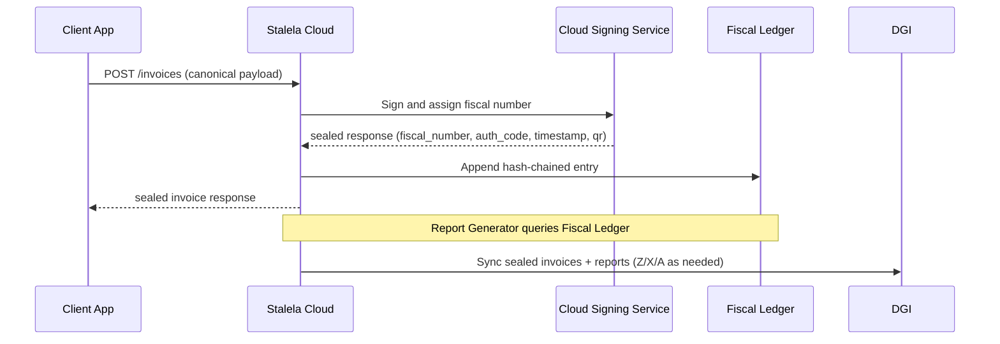

# Reports (Z / X / A and Audit Export)

Stalela delivers the **mandatory Z, X, and A reports plus an audit export** directly from the **Fiscal Ledger** — the append-only, hash-chained journal maintained by the Cloud Signing Service. These reports are produced from the same canonical data that powers invoices, include the cloud-generated security elements (`fiscal_authority_id`, `fiscal_number`, `auth_code`, `trusted_timestamp`, `qr_payload`), and can be generated on demand or on a schedule for auditors and the DGI.

## Report catalog

| Report | Purpose | Frequency | Primary audience |
| ------ | ------- | --------- | ---------------- |
| **Z report** | Daily closure with per-tax-group totals and invoice range | End of day / merchant close | Merchant, auditor, DGI |
| **X report** | Mid-period snapshot for shifts, sessions, and spot checks | Hourly / shift / on-demand | Merchant supervisors, auditors |
| **A report** | Line-item detail across invoices filtered by time period | Ad-hoc (audits, inspections) | Auditors, inspectors |
| **Audit export** | Full hash-chained journal dump (sales, voids, refunds) | Scheduled or triggered by DGI | DGI, compliance teams |

### Z report (Daily closure)

- **What it tells you:** The exact invoice sequence consumed that day plus totals for every tax group, payment method, and grand totals. Use it to reconcile the fiscal counter and to prove that no invoice was skipped.
- **How it's produced:** The Report Generator samples the Fiscal Ledger after the last invoice of the day, collects the totals, and signs the report via the Cloud Signing Service. The report is stored in the cloud and available via the dashboard and API.
- **Key fields:** `outlet_id`, `fiscal_authority_id`, `date`, `sequence_start`, `sequence_end`, `invoice_count`, `tax_totals`, `grand_totals`, `ledger_hash`, `generated_at`.

### X report (Session snapshot)

- **What it tells you:** Where the outlet stands mid-shift: invoiced range, totals by payment instrument, platform health, and any warning flags (e.g., sync delays, offline clients).
- **How it's produced:** Triggered on demand, at the start/end of a shift, or automatically (e.g., hourly). It helps supervisors detect drift before the day closes.
- **Key fields:** `period_id`, `sequence_start`, `sequence_end`, `totals`, `platform_status`, `generated_at`.

### A report (Article-level detail)

- **What it tells you:** Every line item contributing to the invoices in a time range, including `tax_group`, `tax_rate`, `client_classification`, `line_total`, and a reference to the originating invoice.
- **How it's produced:** Filtered view over the Fiscal Ledger entries; the Report Generator assembles the subset using the merchant's product metadata and the canonical payloads stored alongside each sealed invoice.
- **Key fields:** `invoice_ref`, `article_id`, `description`, `quantity`, `unit_price`, `tax_group`, `tax_rate`, `tax_amount`, `client_classification`, `generated_at`.

### Audit export (Full journal dump)

- **What it tells you:** The complete, append-only Fiscal Ledger (sales, voids, refunds, credit notes) with hashes, signatures, and all canonical payload metadata. Ideal for DGI reconciliation or for auditors that need a forensic copy.
- **How it's produced:** Read each ledger entry sequentially, attach `prev_hash`, `signature`, and `canonical_payload_hash`, then stream entries in chunked batches (`chunk_index`, `chunk_count`). Each chunk is acknowledged before the next is delivered to avoid partial exports.
- **Key fields per entry:** `record_type`, `sequence`, `timestamp`, `merchant_nif`, `client`, `totals`, `tax_breakdown`, `prev_hash`, `signature`, `canonical_payload_hash`.

## Sample report outputs

```json
{
  "type": "Z",
  "date": "2026-02-16",
  "outlet_id": "OUTLET-42",
  "fiscal_authority_id": "HSM-CLUSTER-01",
  "sequence_start": 101,
  "sequence_end": 125,
  "invoice_count": 25,
  "tax_totals": [
    { "tax_group": "TG02", "base_amount": "15000.00", "tax_amount": "2400.00" },
    { "tax_group": "TG01", "base_amount": "500.00", "tax_amount": "0.00" }
  ],
  "grand_totals": { "subtotal": "15500.00", "total_vat": "2400.00", "total": "17900.00", "currency": "CDF" },
  "ledger_hash": "3F9B-7A12-...",
  "generated_at": "2026-02-16T23:58:30Z"
}
```

```json
{
  "type": "X",
  "period_id": "Shift-A-2026-02-16-08",
  "sequence_start": 101,
  "sequence_end": 110,
  "invoice_count": 10,
  "totals": {
    "cash": { "subtotal": "4800.00", "tax": "768.00", "total": "5568.00" },
    "mobile_money": { "subtotal": "2200.00", "tax": "352.00", "total": "2552.00" }
  },
  "platform_status": {
    "cloud_signing_service": "healthy",
    "pending_sync": 0,
    "next_invoice_seq": 111
  },
  "generated_at": "2026-02-16T13:00:00Z"
}
```

```json
{
  "type": "A",
  "reporting_period": "2026-02-16",
  "entries": [
    {
      "invoice_ref": "BONO-OUTLET42-110",
      "description": "Wholesale service plan",
      "quantity": 1,
      "unit_price": "10000.00",
      "line_total": "10000.00",
      "tax_group": "TG03",
      "tax_rate": "0.16",
      "tax_amount": "1600.00",
      "client_classification": "Company",
      "generated_at": "2026-02-16T13:05:32Z"
    }
  ]
}
```

```json
{
  "type": "AUDIT_EXPORT",
  "chunk_index": 2,
  "chunk_count": 5,
  "fiscal_authority_id": "HSM-CLUSTER-01",
  "entries": [
    {
      "sequence": 109,
      "record_type": "sale",
      "timestamp": "2026-02-16T12:54:17Z",
      "total": "116.00",
      "tax_breakdown": [{ "tax_group": "TG02", "tax_amount": "16.00" }],
      "prev_hash": "A4B2",
      "signature": "ABCD1234EFGH",
      "canonical_payload_hash": "8F3C"
    }
  ],
  "generated_at": "2026-02-16T23:59:50Z"
}
```

## Report generation flow



Every sealed invoice creates a ledger entry that can be sampled by the Report Generator. Z reports are emitted at end-of-day closing, X reports are generated on shift/period boundaries, and A reports can be filtered per auditor request. Audit exports walk the ledger in order, so auditors always receive the hash chain and signature sequence to prove immutability.

## Using the reports

1. **During operations** — Supervisors pull X reports via the dashboard or API to ensure totals match expected revenue and to monitor platform health (sync status, pending invoices, warning flags for connectivity issues).
2. **At close-of-day** — Merchants run the Z report, download or print it, and archive the output alongside the receipts; the report's `ledger_hash` acts as a tamper-evident fingerprint of that day.
3. **Audits** — Inspectors request A reports for specific clients, products, or dates. The exported lines include references to the canonical payload so they can verify the tax group and client classification.
4. **DGI exports** — The audit export stream replicates the full Fiscal Ledger to the tax authority (chunked if necessary). Each chunk is acknowledged before the next is delivered to protect against network interruptions.

No data is deleted: voids and refunds appear as separate entries in every report, and the audit export documents the corrective events with their own `sequence` numbers. When a client application is temporarily offline, unsigned payloads are queued locally and submitted once connectivity returns — reports reflect only invoices that have been sealed by the Cloud Signing Service.
