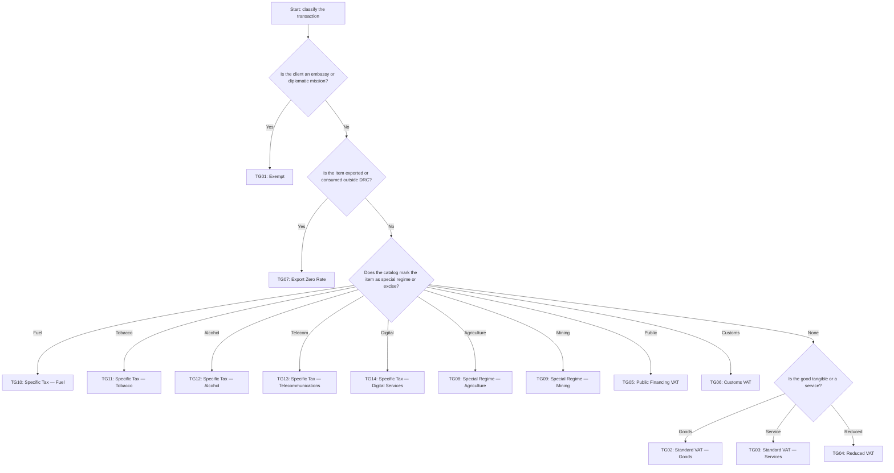

# Tax Engine

## Regulatory mandate

The DGI SFE specification and the Stalela discussion notes are unambiguous: **the tax engine must handle all 14 DGI-defined tax groups, client classifications that drive tax selection, and precise rounding before an invoice is submitted to the Cloud Signing Service (HSM).** The `spec/schema-tax-engine-1.md` document controls the canonical schema, while this page focuses on implementation guidance and examples.

!!! warning "Regulatory constraint"
    The tax engine cannot shortcut the 14-group requirement. If the documentable tax group manifest does not list a TG## code, the invoice must fail validation before it reaches the Cloud Signing Service.

## Tax Group Matrix

| Code | Name | Default Rate | Typical usage |
|------|------|--------------|---------------|
| TG01 | Exempt | 0% | Embassies, diplomatic transfers, NGOs |
| TG02 | Standard VAT — Goods | 16% | Domestic merchandise |
| TG03 | Standard VAT — Services | 16% | Professional and intangible services |
| TG04 | Reduced VAT | 9% | Essential food, medicine, medical devices |
| TG05 | Public Financing VAT | 16% | State-sponsored programs or subsidies |
| TG06 | Customs VAT | 16% | Import deliveries billed in CDF |
| TG07 | Export Zero Rate | 0% | Export invoices, cross-border services |
| TG08 | Special Regime — Agriculture | 5% | Agriculture supply chain participants |
| TG09 | Special Regime — Mining | 10% | Mining operators with an active license |
| TG10 | Specific Tax — Fuel | 25% | Gasoline, diesel, aviation fuel |
| TG11 | Specific Tax — Tobacco | 30% | Cigarettes, cigars, tobacco sheets |
| TG12 | Specific Tax — Alcohol | 20% | Distilled spirits, beer, wine |
| TG13 | Specific Tax — Telecommunications | 15% | Mobile voice, data, SMS bundles |
| TG14 | Specific Tax — Digital Services | 12% | SaaS, streaming, digital ads consumed in DRC |

The manifest version must travel with every invoice via `tax_group_manifest_version` so that audits can map totals to the rate set that was active at issuance.

## Decision Tree — Which tax group applies?

This flowchart should be embedded into the product catalog taxonomy. At each branch, the catalog metadata must flag the appropriate tax group so that the invoicing platform never guesses a code. The `special` branch also checks for catalogue flags such as `is_excise`, `use_customs_rate`, or `special_regime_code`.

## Client Classification and Its Effects

| Classification | Description | Tax behavior |
|----------------|-------------|--------------|
| individual | Private person | Default to TG02/TG03 or TG04 if the catalog marks the line as an essential good. |
| company | Registered corporation | Use any tax group; TG02/TG03 are defaults. |
| commercial_individual | Sole trader | Same as company but carries proprietor ID. |
| professional | Licensed professionals | Services default to TG03; specify TG04 when the Ministry authorizes the reduced regime. |
| embassy | Diplomatic mission | Always TG01 unless DGI issues a `tax_override_reason`. |

!!! note
    Classification is recorded on every invoice. Use the classification to drive the first two branches of the tax group decision tree and to populate `client_classification` in the canonical payload.

## Calculation & Rounding Rules

1. Calculate `tax_amount` as `tax_base × tax_rate`.
2. Round each line-level tax to the nearest centime (0.01 CDF) using half-up rounding; store any delta in `tax_rounding_adjustment`.
3. Populate `tax_summary` with one row per tax group code, including zero-amount entries so auditors can verify conformity with the manifest.
4. Apply TG07 (Export Zero Rate) only when the customer is outside DRC and the invoice_type is `export` or `export_service`.
5. Do not mix TG01 with any other code in the same invoice unless the embassy provides a DGI override value that is logged in `tax_override_reason`.

## Worked Examples

| Example | Item | Client classification | Tax group | Base (CDF) | Rate | Tax (CDF) | Notes |
|---------|------|-----------------------|-----------|------------|------|-----------|-------|
| 1 | Solar panels sold to a retailer | company | TG02 | 100000 | 16% | 16000 | Standard domestic goods example. |
| 2 | Galenic medicine sold to a clinic | company | TG04 | 150000 | 9% | 13500 | Reduced regime triggered by catalog flag `is_essential`. |
| 3 | Digital consultancy sold to a customer in Brussels | company | TG07 | 200000 | 0% | 0 | Export zero-rate; `tax_rounding_adjustment` remains 0. |

## Implementation guidance

1. Reference `spec/schema-tax-engine-1.md` for the authoritative TG## definitions and canonical schema fields before you add a new tax_group_code.
2. Drive the taxonomy (export vs. local, special regime, excise) through catalog metadata and client classification.
3. When the Cloud Signing Service returns the sealed fiscal response, persist `tax_summary` so you can regenerate Z/X/A reports that align with the manifest version.
4. Update `tax_group_manifest_version` whenever DGI publishes a new rate or adds a group; the spec file mirrors the latest manifest and should be the source of truth for the document.
