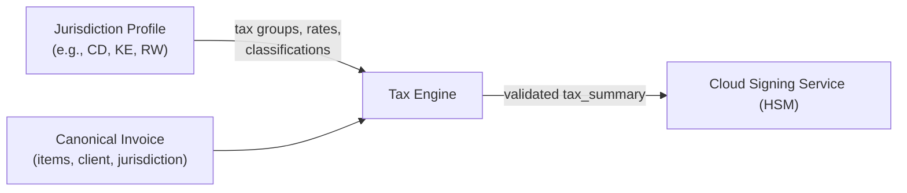

# Tax Engine

## Overview

The Tax Engine is the jurisdiction-configurable component that computes per-line-item tax amounts, validates client classifications, and applies rounding rules before an invoice reaches the Cloud Signing Service (HSM). It loads its rules from the active **jurisdiction profile** — tax group codes, rates, client classifications, and rounding rules are all defined per country.



!!! warning "Regulatory constraint"
    The tax engine must enforce the **complete** tax group manifest for the invoice's jurisdiction. If a tax group code is not present in the jurisdiction's manifest, the invoice must fail validation before it reaches the Cloud Signing Service.

---

## How It Works

1. **Read `jurisdiction`** from the canonical invoice payload.
2. **Load the tax group manifest** for that jurisdiction (codes, rates, decision tree) at the version specified by `tax_group_manifest_version`.
3. **Classify each line item** using the jurisdiction's decision tree (catalog metadata + client classification → tax group code).
4. **Calculate `tax_amount`** as `tax_base × tax_rate` for each line.
5. **Round** per the jurisdiction's currency rules (e.g., nearest 0.01 CDF for DRC, nearest 1 RWF for Rwanda).
6. **Populate `tax_summary`** with one row per tax group code, including zero-amount entries for audit conformity.
7. **Attach** the validated `tax_groups` and `tax_summary` to the canonical payload and forward to the Cloud Signing Service.

---

## Jurisdiction-Configured Elements

| Element | Description | Where Defined |
|---|---|---|
| **Tax Group Manifest** | Codes, names, default rates, decision tree | `40-jurisdictions/{code}/tax-groups.md` |
| **Client Classifications** | Buyer categories and their tax behavior | `40-jurisdictions/{code}/client-classifications.md` |
| **Invoice Types** | Permitted document types that may restrict tax groups | `40-jurisdictions/{code}/invoice-types.md` |
| **Rounding Rules** | Minimum currency unit, rounding method, adjustment field | `40-jurisdictions/{code}/currencies.md` |

---

## Manifest Versioning

The `tax_group_manifest_version` field travels with every invoice so that audits can map totals to the rate set that was active at issuance. When a jurisdiction's tax authority publishes new rates or adds groups, the manifest version increments and the Tax Engine loads the updated rules.

```json
{
  "jurisdiction": "CD",
  "tax_group_manifest_version": "CD-2026-01",
  "tax_groups": [
    { "code": "TG02", "base": "100000.00", "rate": "0.16", "amount": "16000.00" }
  ]
}
```

---

## Calculation & Rounding (Generic)

1. Calculate `tax_amount` as `tax_base × tax_rate`.
2. Round each line-level tax to the jurisdiction's minimum currency unit using the jurisdiction's rounding method; store any delta in `tax_rounding_adjustment`.
3. Populate `tax_summary` with one row per tax group code, including zero-amount entries so auditors can verify conformity with the manifest.
4. Apply export zero-rate groups only when the customer is outside the jurisdiction and the `invoice_type` indicates an export.
5. Exempt classifications (e.g., embassy in DRC, diplomatic in Kenya) force the exempt tax group unless the authority provides an override logged in `tax_override_reason`.

---

## Country Profiles

For jurisdiction-specific tax groups, decision trees, client classifications, and worked examples:

| Jurisdiction | Tax Groups | Client Classifications | Currencies |
|---|---|---|---|
| **DRC (CD)** | [14 groups (TG01–TG14)](../../40-jurisdictions/cd/tax-groups.md) | [5 categories](../../40-jurisdictions/cd/client-classifications.md) | [CDF/USD](../../40-jurisdictions/cd/currencies.md) |
| **Zimbabwe (ZW)** | [Planned](../../40-jurisdictions/zw/index.md) | Planned | Planned |
| **Kenya (KE)** | [Planned](../../40-jurisdictions/ke/index.md) | Planned | Planned |
| **Rwanda (RW)** | [Planned](../../40-jurisdictions/rw/index.md) | Planned | Planned |
| **Tanzania (TZ)** | [Planned](../../40-jurisdictions/tz/index.md) | Planned | Planned |
| **Nigeria (NG)** | [Planned](../../40-jurisdictions/ng/index.md) | Planned | Planned |
| **South Africa (ZA)** | [Planned](../../40-jurisdictions/za/index.md) | Planned | Planned |

See [Jurisdictions](../../40-jurisdictions/index.md) for the full framework and how to add a new country.

---

## Implementation Guidance

1. Reference `spec/schema-tax-engine-1.md` for the canonical schema fields. Tax group codes are jurisdiction-namespaced (e.g., `TG01` for DRC, `A` for Kenya).
2. Drive the taxonomy (export vs. local, special regime, excise) through catalog metadata and client classification — both are jurisdiction-configured.
3. When the Cloud Signing Service returns the sealed fiscal response, persist `tax_summary` so you can regenerate Z/X/A reports that align with the manifest version.
4. Update the jurisdiction's `tax_group_manifest_version` whenever the tax authority publishes new rates or groups.
