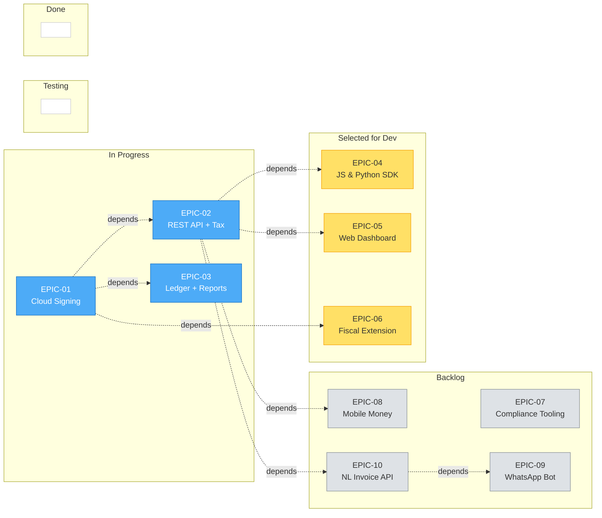

# Kanban Board — Epics

This board tracks the major epics across Stalela's phased implementation. Each epic card includes its task checklist, dependencies, and links to detailed design docs. Update statuses here as work progresses; the [Roadmap](roadmap.md) carries the timeline view.

!!! info "Board conventions"
    - **Columns:** Backlog → Selected for Development → In Progress → Testing → Done.
    - **Trust invariant:** The Cloud Signing Service (HSM) remains the fiscal authority. Epics that touch signing, ledger writes, or fiscal numbering must preserve the trust boundary defined in [trust-boundary.md](../architecture/trust-boundary.md).
    - **Canonical payload ordering** (`merchant_nif`, `outlet_id`, `pos_terminal_id`, `cashier_id`, `client`, `tax_groups`, `totals`, `payments`) is immutable across all epics.

---

## Backlog

Epics not yet scheduled for development.

### EPIC-07 · Manual Compliance Tooling & Onboarding
| Field | Value |
|---|---|
| **Phase** | 1 |
| **Owner** | — |
| **Dependencies** | EPIC-01, EPIC-02, Fiscal Ledger |
| **Links** | [Phase 1 detail](phase-1.md#5-manual-compliance-tooling-onboarding), [DGI Integration](../cloud/dgi-integration.md), [Invoice Verification](../fiscal/invoice-verification.md) |
| **Last updated** | 2026-02-22 |

**Tasks**

- [ ] Generate DGI-ready CSV/Excel exports (fiscal numbers, tax summaries, security elements)
- [ ] Produce Z/X/A reports and audit exports from the Fiscal Ledger
- [ ] Launch public verification portal (`verify.stalela.cd`) with QR scanning + fiscal number lookup
- [ ] Ship verification API endpoint (`/api/v1/verify/{fiscal_number}`)
- [ ] Distribute public signing keys via `/.well-known/fiscal-keys.json`
- [ ] Create onboarding docs, training materials, and API key provisioning flow

---

### EPIC-08 · Mobile Money Integration
| Field | Value |
|---|---|
| **Phase** | 2 |
| **Owner** | — |
| **Dependencies** | EPIC-02 (REST API) |
| **Links** | [Phase 2 detail](phase-2.md#2-mobile-money-integration), [Integrations](../platform/integrations.md) |
| **Last updated** | 2026-02-22 |

**Tasks**

- [ ] Build provider connectors or mocked adapters (M-Pesa, Airtel Money, Orange Money)
- [ ] Implement signed webhook verification + idempotent event processing
- [ ] Record payment callbacks in the invoice `payments` array (`pending` / `paid` / `failed` / `reversed`)
- [ ] Surface payment status indicators in dashboard and shared receipts
- [ ] Ensure fiscalization is independent of payment state (invoice sealed before or after payment)

---

### EPIC-09 · WhatsApp Invoice Bot
| Field | Value |
|---|---|
| **Phase** | 2 |
| **Owner** | — |
| **Dependencies** | EPIC-02, EPIC-10 (NL Invoice API) |
| **Links** | [Phase 2 detail](phase-2.md#6-whatsapp-invoice-bot), [AI Capabilities](../platform/ai-capabilities.md) |
| **Last updated** | 2026-02-22 |

**Tasks**

- [ ] Integrate WhatsApp Business API (Cloud API) for inbound/outbound messaging
- [ ] Route free-text messages through the NL Invoice Parser; present draft preview + confidence score
- [ ] Support status queries, receipt PDF downloads, and Z report requests
- [ ] Link phone number to merchant account via OTP
- [ ] Audit-log every interaction with `source: "whatsapp_bot"`; enforce 15-min session timeout

---

### EPIC-10 · Natural Language Invoice API
| Field | Value |
|---|---|
| **Phase** | 2 |
| **Owner** | — |
| **Dependencies** | EPIC-02, EPIC-03 (Tax Engine) |
| **Links** | [Phase 2 detail](phase-2.md#7-natural-language-invoice-api), [AI Capabilities](../platform/ai-capabilities.md) |
| **Last updated** | 2026-02-22 |

**Tasks**

- [ ] Build `/api/v1/invoices/natural` endpoint accepting `{ "text", "language" }`
- [ ] Implement entity extraction (items, quantities, prices, client, payment methods, currency)
- [ ] Add fuzzy matching against merchant product catalog for SKU + tax group resolution
- [ ] Auto-submit to Cloud Signing when confidence ≥ 0.85; return draft otherwise
- [ ] Apply same auth + rate limiting as core invoicing API

---

## Selected for Development

Epics approved and queued for the next sprint.

### EPIC-04 · JavaScript & Python SDK
| Field | Value |
|---|---|
| **Phase** | 1 |
| **Owner** | — |
| **Dependencies** | EPIC-02 (REST API) |
| **Links** | [Phase 1 detail](phase-1.md#4-javascript-python-sdk), [Cloud API](../api/cloud.md), [Invoicing SDK](../api/invoicing-sdk.md) |
| **Last updated** | 2026-02-22 |

**Tasks**

- [ ] Scaffold JS and Python SDK packages with typed request/response models
- [ ] Implement offline queue (IndexedDB for browser, SQLite for native) with configurable grace period
- [ ] Add tax engine helpers for building valid `tax_groups` and `tax_summary` arrays
- [ ] Wire event callbacks for queue state transitions (synced, failed, grace exceeded)
- [ ] Publish packages and write quickstart docs

---

### EPIC-05 · Web Dashboard MVP
| Field | Value |
|---|---|
| **Phase** | 1 |
| **Owner** | — |
| **Dependencies** | EPIC-02 (REST API), EPIC-01 (Cloud Signing) |
| **Links** | [Phase 1 detail](phase-1.md#3-web-dashboard-mvp), [Dashboard](../platform/dashboard.md), [Multi-User](../platform/multi-user.md) |
| **Last updated** | 2026-02-22 |

**Tasks**

- [ ] Scaffold React/Next.js PWA with service workers and IndexedDB offline queue
- [ ] Invoice CRUD: create, view, filter, void with status tracking
- [ ] Outlet registration + configuration UI
- [ ] User management + API key management with RBAC (Cashier, Supervisor, Manager, Owner)
- [ ] Z/X/A report generation and download
- [ ] Offline indicators (green/yellow/red) for queued drafts and sync status
- [ ] Bilingual support (French / English)

---

### EPIC-06 · Fiscal Extension (Chrome Extension — Delegated Offline Signing)
| Field | Value |
|---|---|
| **Phase** | 1.5 |
| **Owner** | — |
| **Dependencies** | EPIC-01 (Cloud Signing — Credential Issuer) |
| **Links** | [Delegated Offline Token](../architecture/delegated-offline-token.md), [Trust Boundary](../architecture/trust-boundary.md), [ADR-0006](../adr/FIS-ADR-0006.md) |
| **Last updated** | 2026-02-22 |

**Tasks**

- [ ] Build Chrome/Edge extension scaffold with isolated sandbox for key storage
- [ ] Implement Delegated Credential provisioning (generate keypair → request VC + block from Cloud)
- [ ] Implement local signing: validate origin (`pos.stalela.cd`), sign payload, return signature + VC
- [ ] Add PIN-based shift unlock and auto-lock on inactivity
- [ ] Implement online reconciliation: submit locally-sealed invoices → Cloud verifies against VC → ledger append
- [ ] Add tamper detection: Cloud flags missing blocks in allocated range
- [ ] Enforce strict CSP on companion PWA; validate payload totals before signing

---

## In Progress

Epics currently being implemented.

### EPIC-01 · Cloud Signing Service MVP
| Field | Value |
|---|---|
| **Phase** | 1 |
| **Owner** | — |
| **Dependencies** | HSM provider selection |
| **Links** | [Phase 1 detail](phase-1.md#1-cloud-signing-service-mvp), [Trust Boundary](../architecture/trust-boundary.md), [Components](../architecture/components.md) |
| **Last updated** | 2026-02-22 |

**Tasks**

- [ ] Set up HSM integration (AWS CloudHSM or Azure Managed HSM)
- [ ] Implement Monotonic Counter Manager with serializable DB isolation (gap-free per outlet)
- [ ] Build signing pipeline: accept canonical payload → assign fiscal number → ECDSA sign → generate QR payload
- [ ] Return sealed response with all 5 security elements (`fiscal_number`, `auth_code`, `timestamp`, `qr_payload`, `fiscal_authority_id`)
- [ ] Implement append-only hash-chained Fiscal Ledger (each entry references previous hash)
- [ ] Ensure void/refund/credit note create new fiscal events (no deletions)

---

### EPIC-02 · REST API + Tax Engine
| Field | Value |
|---|---|
| **Phase** | 1 |
| **Owner** | — |
| **Dependencies** | EPIC-01 (Cloud Signing) |
| **Links** | [Phase 1 detail](phase-1.md#2-rest-api-tax-engine), [Tax Engine](../fiscal/tax-engine.md), [Cloud API](../api/cloud.md) |
| **Last updated** | 2026-02-22 |

**Tasks**

- [ ] Scaffold API framework (FastAPI or NestJS) with auth (API keys scoped per merchant/outlet)
- [ ] Implement canonical payload validation (deterministic field ordering, required keys)
- [ ] Build Tax Engine: enforce TG01–TG14, client classification (individual, company, commercial_individual, professional, embassy), rounding rules
- [ ] Route validated payloads to Cloud Signing Service; return sealed responses
- [ ] Add rate limiting (100 req/s per API key) and idempotency keys
- [ ] Implement actionable error responses for validation failures

---

### EPIC-03 · Fiscal Ledger + Reports
| Field | Value |
|---|---|
| **Phase** | 1 |
| **Owner** | — |
| **Dependencies** | EPIC-01 (Cloud Signing) |
| **Links** | [Phase 1 detail](phase-1.md#1-cloud-signing-service-mvp), [Reports](../fiscal/reports.md), [Data Flow](../architecture/data-flow.md) |
| **Last updated** | 2026-02-22 |

**Tasks**

- [ ] Design PostgreSQL schema for hash-chained ledger entries (prev_hash, sealed payload, fiscal metadata)
- [ ] Implement Report Generator: Z reports (daily close), X reports (shift close), A reports (periodic audit)
- [ ] Add audit export endpoint (JSON + CSV) with fiscal number ranges, auth codes, and tax group totals
- [ ] Verify ledger hash-chain integrity on report generation

---

## Testing

Epics undergoing validation before release.

*No epics in Testing at this time.*

---

## Done

Completed epics.

*No epics completed yet.*

---

## Board Summary

