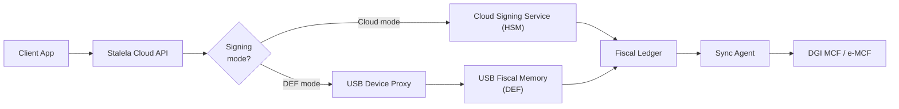

# Phase 3 — USB Hardware (DEF Homologation)

Phase 3 introduces the **USB Fiscal Memory device (DEF)** as an optional trust anchor for merchants who need full hardware homologation with the DGI. The Cloud Signing Service remains first-class — the DEF is an alternative signer that can replace or augment the cloud HSM for specific outlets. This phase delivers the firmware, dual-mode signing architecture, and DGI certification.

## Objectives

- **Scope:** USB Fiscal Memory firmware, dual-mode signing (Cloud HSM or DEF), device provisioning, and DGI hardware certification.
- **Target:** Merchants requiring DEF homologation; cloud-only merchants remain unaffected.

## Dual-mode signing architecture

Each outlet is configured with a signing mode (`cloud` or `def`). The API routes canonically identical payloads to the appropriate signer. Both signers produce the same five security elements and write to the same Fiscal Ledger, ensuring reports, audit exports, and DGI uploads are uniform regardless of signing mode.

## Epics

### 1. USB Fiscal Memory firmware

**Description:** Develop the firmware for the USB Fiscal Memory device that implements the PREPARE/COMMIT protocol, monotonic counter, ECDSA signing via the secure element, hash-chained journal, and Z report generation.

**Acceptance criteria:**

- PREPARE validates the canonical payload schema and returns a nonce without incrementing counters.
- COMMIT atomically increments the fiscal number, signs the payload, generates the timestamp and QR code, and appends to the hash-chained journal.
- Firmware generates Z reports from the local journal with sequence ranges, per-tax-group totals, and journal hashes.
- Power-loss recovery: interrupted COMMIT does not produce orphan fiscal numbers.

**Dependencies:** Hardware docs in `docs-archive/hardware/`, `spec/protocol-usb-fiscal-device-1.md`.

### 2. USB Device Proxy service

**Description:** Build a local daemon/service that bridges the Cloud API to the USB device via USB CDC. The proxy receives canonical payloads from the cloud, executes PREPARE/COMMIT on the DEF, and returns the sealed response.

**Acceptance criteria:**

- Proxy exposes a local REST/IPC interface that the Cloud API calls when the outlet is in DEF mode.
- Handles USB CDC framing, nonce lifecycle, and retry logic.
- Reports device health (counter, firmware version, free memory) back to the cloud for dashboard display.
- Auto-starts at boot; reconnects on USB disconnect.

**Dependencies:** `spec/protocol-usb-fiscal-device-1.md`.

### 3. Device provisioning & certificate management

**Description:** Build the provisioning workflow that registers a DEF with the Cloud, binds it to an outlet, provisions its signing certificate, and manages key rotation.

**Acceptance criteria:**

- Cloud registry tracks DEF serial, activation token, certificate, and firmware version per outlet.
- Activation flow binds a DEF to exactly one outlet (one-to-one mapping).
- Certificate rotation and revocation flows are documented and automated.
- Dashboard shows device status, certificate expiry, and firmware version.

**Dependencies:** `design/docs/cloud/architecture.md`.

### 4. Dual-mode integration & testing

**Description:** Ensure that Cloud HSM and DEF signers produce interchangeable sealed responses and that reports, audit exports, and DGI uploads work identically regardless of signing mode.

**Acceptance criteria:**

- Same canonical payload produces structurally identical sealed responses from both signers (differing only in `fiscal_authority_id` and signature bytes).
- Fiscal Ledger, reports, and audit exports are agnostic to signing source.
- Switching an outlet from cloud to DEF mode (or vice versa) is seamless — counter continuity is maintained.

### 5. DGI hardware homologation

**Description:** Prepare and submit the DEF for DGI homologation, including documentation, test evidence, and physical device submission.

**Acceptance criteria:**

- Homologation dossier includes: firmware specifications, security element generation proof, audit trail samples, Z/X/A report samples, and power-loss recovery evidence.
- DEF passes DGI technical committee review.
- Contingency plan: merchants can operate in cloud mode while homologation is pending.

**Dependencies:** `design/docs/regulatory/legal-framework.md`, `design/docs/regulatory/arretes.md`.

## Risks

!!! warning "Phase 3 Risks"
    - USB hardware BOM ($10–15 target) may be difficult to achieve with secure MCU, SE, flash, and RTC. Supply chain issues could delay production.
    - DGI homologation timelines are unpredictable. Cloud mode serves as the fallback.
    - Maintaining two signing paths increases testing surface area. Invest in automated dual-mode regression tests.
    - Field deployment of hardware in DRC conditions (power instability, heat, humidity) requires ruggedized design and extensive field testing.
