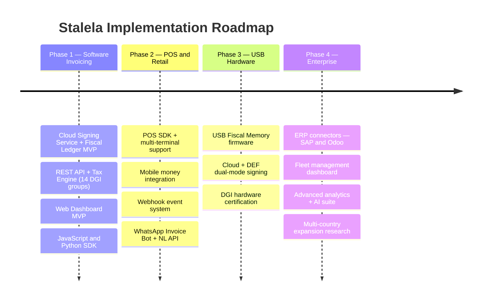

# Implementation Roadmap

## Overview

This document lays out the phased rollout for Stalela's fiscal invoicing platform, beginning with a software-first B2B pilot, scaling through POS and retail integrations, adding optional USB hardware for merchants that need DEF homologation, and culminating in enterprise-grade connectors and analytics. Each phase builds on the architecture, cloud signing, and fiscal engine work captured throughout these docs.

## Timeline

See the [Kanban Board](kanban.md) for the live epic-level status view with task checklists.

## Phase 1 — Software Invoicing

The foundation phase. Delivers the API-first invoicing platform with cloud fiscal signing, the tax engine, web dashboard, and SDKs.

**Key deliverables:**

- Cloud Signing Service (HSM) + Monotonic Counter Manager + Fiscal Ledger
- REST API with full invoice lifecycle (create, void, refund, credit note)
- Tax Engine enforcing all 14 DGI tax groups + client classification
- Web Dashboard for invoice management, reports, and outlet administration
- JavaScript and Python SDKs with offline queue support
- Z/X/A reports and audit export from the Fiscal Ledger
- Manual DGI compliance tooling (CSV/audit dump) until MCF/e-MCF API lands

See [Phase 1 detail](phase-1.md) for epics, acceptance criteria, and dependencies.

## Phase 2 — POS & Retail

Extends the platform to physical retail by adding POS SDK integration, multi-terminal support, mobile money payments, the webhook event system, and the first AI-powered capabilities.

**Key deliverables:**

- POS SDK that wraps the Cloud API with receipt rendering and offline queue
- Multi-terminal concurrency via the existing Monotonic Counter Manager
- Mobile money integration (M-Pesa, Airtel Money, Orange Money)
- Webhook API for real-time event streaming to external systems
- Enhanced dashboard with shift management and supervisor views
- Observability and alerting for fleet operations
- **WhatsApp Invoice Bot** — create, query, and receive sealed invoices via WhatsApp Business API (French, Lingala)
- **Natural Language Invoice API** — submit invoices as free-text via `/api/v1/invoices/natural`
- **Tax Auto-Classification API** — ML-assisted tax group suggestions for items and HS codes
- **Rule-based anomaly detection** — real-time alerts for numbering gaps, velocity spikes, and void rate anomalies

See [Phase 2 detail](phase-2.md) for epics, acceptance criteria, and dependencies.

## Phase 3 — USB Hardware

Introduces the USB Fiscal Memory device (DEF) as an optional trust anchor for merchants who need full DEF homologation. The cloud remains first-class; the DEF is an alternative signer.

**Key deliverables:**

- USB Fiscal Memory firmware (PREPARE/COMMIT protocol, immutable journal)
- Dual-mode architecture: Cloud HSM or DEF can sign invoices per outlet
- Device provisioning, activation, and certificate management
- Cloud sync for DEF-signed invoices (same Sync Agent pipeline)
- DGI hardware homologation and certification

See [Phase 3 detail](phase-3.md) for epics, acceptance criteria, and dependencies.

## Phase 4 — Enterprise & Scale

Enterprise-grade integrations, fleet management, advanced analytics, and the full AI suite for large-scale deployments.

**Key deliverables:**

- ERP connectors (SAP S/4HANA, Odoo) with tax group mapping
- Fleet management dashboard for multi-branch monitoring
- Advanced analytics (tax-group heatmaps, anomaly detection, trend analysis)
- Automated compliance reporting and audit export scheduling
- Multi-country expansion research (regulatory analysis for neighboring markets)
- **ML-based anomaly detection** — Isolation Forest / Autoencoder models replacing Phase 2 rule-based triggers
- **Predictive analytics** — tax liability forecasts, revenue projections, seasonal demand, and compliance risk scoring
- **OCR & document digitization** — scan paper invoices into structured records via camera or PDF upload
- **NLP compliance monitoring** — detect regulatory changes in DGI publications and alert merchants
- **Smart Search** — natural language queries over fiscal data (text-to-SQL) in the dashboard and API
- **Voice invoice creation** — speech-to-text pipeline feeding the NL Invoice Parser

See [Phase 4 detail](phase-4.md) for epics, acceptance criteria, and dependencies.

## Monitoring & Validation

Maintain a rolling review cadence after each phase completes:

- **Monthly sync audits** — Verify Fiscal Ledger integrity, DGI upload success rates, and counter continuity.
- **Quarterly security reviews** — Audit HSM key rotation, API key usage, and access control compliance.
- **Phase gate reviews** — Before advancing to the next phase, validate all acceptance criteria, run `mkdocs build --strict`, and confirm regulatory alignment.
- **DGI checkpoint** — As the MCF/e-MCF API details emerge, update the Sync Agent and DGI integration docs accordingly.
