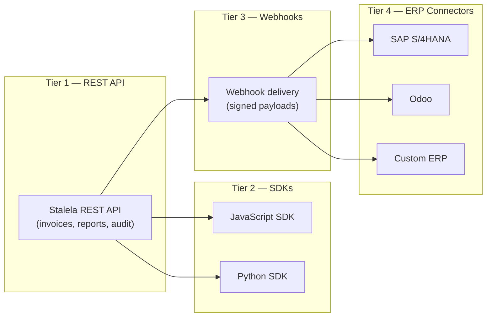

# Integrations

Stalela is designed as an **API-first invoicing platform** — every feature available in the web dashboard is also available through the REST API and SDKs. This page describes the integration tiers, partner connectors, and webhook system that allow external systems to consume sealed fiscal invoices, reports, and compliance events.

## Integration tiers



| Tier | Description | Phase |
|------|-------------|-------|
| **Tier 1 — REST API** | Direct HTTPS calls to the Stalela Cloud API. Full access to invoice creation, status queries, report generation, and audit exports. | Phase 1 |
| **Tier 2 — SDKs** | Official client libraries (JavaScript, Python) that wrap the REST API with offline queuing, retry logic, and type-safe models. | Phase 1 |
| **Tier 3 — Webhooks** | Event-driven notifications pushed to customer endpoints when invoices are sealed, reports are generated, or sync errors occur. Payloads are signed for verification. | Phase 2 |
| **Tier 4 — ERP Connectors** | Pre-built connectors for SAP S/4HANA and Odoo that map Stalela's 14 tax groups to ERP tax codes, sync sealed invoices, and push acknowledgement receipts. | Phase 4 |

## REST API integration

The REST API is the foundation for all integrations. Key capabilities:

| Endpoint | Method | Description |
|----------|--------|-------------|
| `/api/v1/invoices` | POST | Submit a canonical payload for fiscalization |
| `/api/v1/invoices/{fiscal_number}` | GET | Retrieve a sealed invoice |
| `/api/v1/invoices/batch` | POST | Submit multiple payloads in one request |
| `/api/v1/reports` | POST | Generate Z/X/A reports |
| `/api/v1/audit/export` | GET | Download hash-chained journal exports |
| `/api/v1/outlets/{outlet_id}/status` | GET | Check outlet sync health and counter |
| `/api/v1/verify/{fiscal_number}` | GET | **Public** — verify invoice authenticity (no auth required) |

All endpoints require TLS 1.3+, `Authorization: Bearer <api_key>`, and return JSON responses. See the [Cloud API Reference](../api/cloud.md) for full request/response schemas.

## Webhook events

Webhooks notify external systems of fiscal events in near real-time. Each webhook delivery includes:

- **Signed payload** — HMAC-SHA256 signature in the `X-Bono-Signature` header, computed with the webhook secret.
- **Event type** — identifies what happened (see table below).
- **Idempotency key** — prevents duplicate processing on the receiver side.

| Event | Trigger | Payload highlights |
|-------|---------|-------------------|
| `invoice.sealed` | Cloud Signing Service seals an invoice | `fiscal_number`, `auth_code`, `timestamp`, `outlet_id` |
| `invoice.sync.success` | DGI acknowledges the invoice | `fiscal_number`, `dgi_status`, `acknowledged_at` |
| `invoice.sync.failed` | DGI upload fails after max retries | `fiscal_number`, `error`, `retry_count` |
| `report.generated` | Z/X/A report is ready | `report_id`, `type`, `download_url` |
| `outlet.offline_alert` | Client drafts exceed grace period | `outlet_id`, `draft_count`, `oldest_draft_age` |

### Webhook configuration

```json
POST /api/v1/webhooks
{
  "url": "https://erp.example.com/bono-events",
  "events": ["invoice.sealed", "report.generated"],
  "secret": "whsec_...",
  "active": true
}
```

## ERP connectors (Phase 4)

Pre-built connectors for enterprise systems:

### SAP S/4HANA
- Ingest sealed invoices via IDoc or OData.
- Map TG01–TG14 to SAP tax codes automatically.
- Push journal entries to FI/CO modules.
- Reconcile fiscal reports with SAP cash management.

### Odoo
- Sync sealed invoices to Odoo's `account.move` model.
- Map tax groups to Odoo fiscal positions.
- Auto-generate Odoo payment entries from Stalela payment data.
- Dashboard widget showing DGI sync status.

### Custom ERP
- Use the webhook API (Tier 3) to receive events.
- Use the REST API (Tier 1) to pull invoices and reports on demand.
- Reference the canonical payload schema in `spec/schema-tax-engine-1.md` for field mapping.

## Mobile money integration (Phase 2)

Stalela supports mobile money as a payment method within invoices:

| Provider | Integration method | Notes |
|----------|--------------------|-------|
| M-Pesa | API callback | Payment confirmation triggers invoice submission |
| Airtel Money | API callback | Same flow as M-Pesa |
| Orange Money | API callback | Same flow as M-Pesa |

Mobile money payments are recorded in the invoice's `payments` array with `method: "mobile_money"` and the provider reference. The payment status does not affect fiscalization — invoices can be sealed before or after payment confirmation.

## POS integration (Phase 2)

In Phase 2, point-of-sale systems connect to Stalela as API consumers:

- POS terminals submit canonical payloads via the REST API or SDK.
- The POS SDK handles offline queuing, retry logic, and receipt rendering.
- Multi-terminal outlets share a single fiscal counter via the Monotonic Counter Manager.
- See [Multi-User Access Control](multi-user.md) for details on terminal/user identity.

## AI-powered integration surfaces

Stalela embeds AI across its integration tiers so external systems and end-users benefit from natural language processing, automated classification, and intelligent alerting:

| AI capability | Integration point | Phase |
|--------------|-------------------|-------|
| **Natural Language Invoice API** (`/api/v1/invoices/natural`) | Any REST client or SDK can submit invoices as free-text French/Lingala/Swahili instead of structured JSON | Phase 2 |
| **Tax Auto-Classification** (`/api/v1/tax/classify`) | ERPs and POS systems call the classifier to suggest tax groups before building the canonical payload | Phase 2 |
| **Anomaly Detection webhooks** (`anomaly.detected` event) | External systems receive real-time alerts when the Fiscal Ledger shows irregularities | Phase 2 |
| **Smart Search API** (`/api/v1/search/query`) | Dashboards and BI tools query fiscal data using natural language | Phase 4 |
| **WhatsApp Bot** | Merchants create, query, and receive invoices via WhatsApp Business API | Phase 2 |

See [AI & Natural Language Capabilities](ai-capabilities.md) for full specifications.

## Security considerations

- All integrations authenticate via [CIS](../../15-identity/index.md)-issued API keys (JWTs) scoped to specific outlets and permissions. CIS handles credential issuance, rotation, and revocation.
- Webhook payloads are signed with HMAC-SHA256; receivers must verify the signature before processing.
- ERP connectors use OAuth 2.0 (with CIS as the authorization server) or certificate-based authentication for the ERP side.
- API keys can be rotated and revoked without downtime via the CIS dashboard or API.
- Rate limiting protects the API from abuse (default: 100 req/s per API key).
- AI endpoints inherit the same authentication, rate limiting, and tenant isolation as the core invoicing API. AI models run within the Stalela cloud boundary — no customer data is sent to third-party providers unless explicitly opted in.
