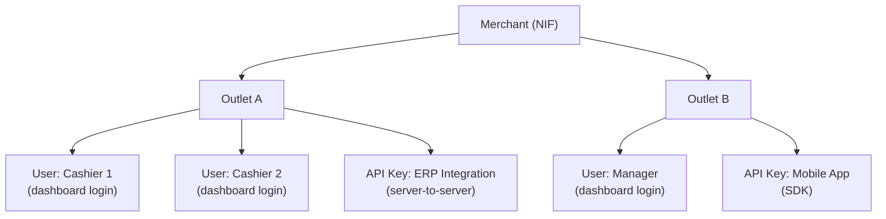
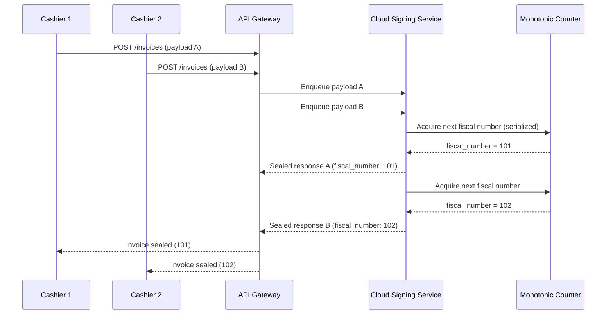

# Multi-User Access Control

Stalela supports multiple users, API keys, and roles within a single merchant account. Each outlet can have many concurrent users (cashiers, managers, API integrators) submitting invoices through the API, web dashboard, or SDK — while the **Monotonic Counter Manager** in the Cloud Signing Service guarantees serialized fiscal numbering per outlet.

## Identity model



| Entity | Description | Identifier |
|--------|-------------|------------|
| **Merchant** | The legal entity registered with the DGI. Owns one or more outlets. | `merchant_nif` |
| **Outlet** | A physical or logical business location. Each outlet has its own fiscal counter. | `outlet_id` |
| **User** | A human who logs into the web dashboard. Assigned a role per outlet. | `user_id` |
| **API Key** | A programmatic credential for server-to-server or SDK access. Scoped to an outlet. | `api_key_id` |

## Roles and permissions

| Role | Create invoices | View invoices | Generate reports | Manage users/keys | Manage outlet settings |
|------|:-:|:-:|:-:|:-:|:-:|
| **Cashier** | ✅ | Own only | ❌ | ❌ | ❌ |
| **Supervisor** | ✅ | All in outlet | ✅ | ❌ | ❌ |
| **Manager** | ✅ | All in outlet | ✅ | ✅ | ✅ |
| **Owner** | ✅ | All outlets | ✅ | ✅ | ✅ |
| **API Key** | ✅ | Scoped | Scoped | ❌ | ❌ |

!!! note "Principle of least privilege"
    Users and API keys default to the most restrictive permissions. Elevated roles must be explicitly granted by an Owner or Manager.

## Fiscal numbering under concurrency

When multiple users or API keys submit invoices to the same outlet simultaneously, the **Monotonic Counter Manager** serializes them:

1. Each invoice request enters a per-outlet queue inside the Cloud Signing Service.
2. The counter increments atomically under serializable database isolation — no gaps, no duplicates.
3. The sealed response includes the assigned `fiscal_number` and the `user_id` or `api_key_id` that submitted the payload, providing full traceability.



## Invoice tagging

Every sealed invoice carries metadata identifying who submitted it:

```json
{
  "fiscal_number": "BONO-OUTLET42-101",
  "merchant_nif": "123456789",
  "outlet_id": "OUTLET-42",
  "submitted_by": {
    "type": "user",
    "id": "USR-007",
    "role": "cashier"
  },
  "source": "dashboard"
}
```

For API key submissions, `submitted_by` contains `"type": "api_key"` and the key ID. The `source` field indicates the channel: `dashboard`, `api`, or `sdk`.

## API key management

- **Creation:** Owners and Managers create API keys scoped to a specific outlet via the dashboard or API.
- **Rotation:** Keys can be rotated without downtime — the old key remains valid for a configurable grace period (default: 24 hours).
- **Revocation:** Immediate revocation is available. Revoked keys return `401 Unauthorized`.
- **Scoping:** Each API key specifies which operations it can perform (e.g., create invoices only, or create + view reports).

## Audit trail

All user and API key actions are logged with:

- `user_id` or `api_key_id`
- Action performed (create_invoice, view_report, manage_user, etc.)
- Timestamp
- Outlet context
- IP address / user agent

Audit logs are available via the dashboard (Manager/Owner) and through the `/api/v1/audit/actions` endpoint.

## Session management

- Dashboard sessions use secure cookies with `HttpOnly`, `Secure`, and `SameSite=Strict` attributes.
- Session tokens are rotated on login to prevent session fixation.
- Idle sessions expire after 30 minutes (configurable per merchant).
- API keys do not use sessions — they authenticate via `Authorization: Bearer <api_key>` on every request.
