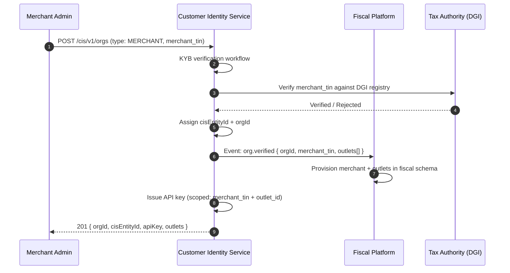
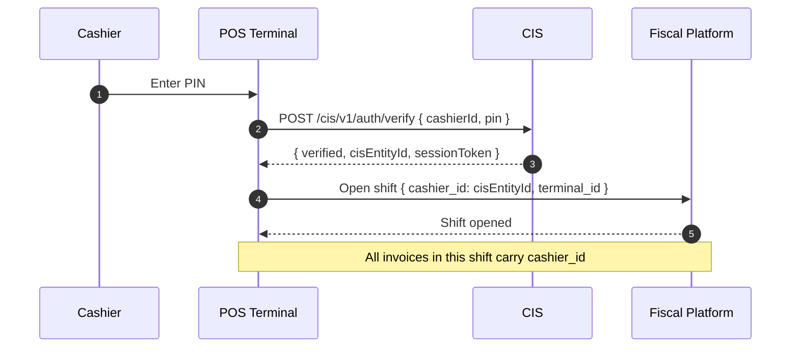
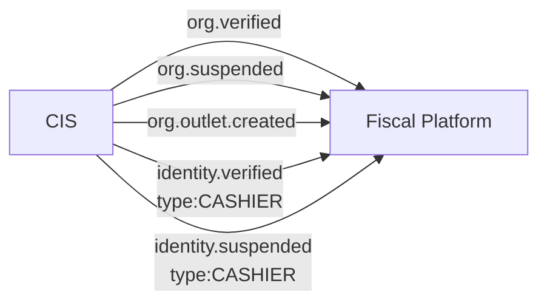

# CIS → Fiscal Platform Integration

**Purpose** — Defines how the Customer Identity Service (CIS) feeds
merchant verification, cashier identity, client identity, and
consent management into the Fiscal Invoicing Platform.

---

## Merchant Onboarding Flow

Before a merchant can issue fiscal invoices, they must complete KYB
verification through CIS. The Fiscal Platform never independently
verifies merchant identity.

> **Key principle**: CIS owns the `merchant_tin` ↔ `cisEntityId`
> binding. The Fiscal Platform trusts CIS-verified credentials and
> does not re-verify merchant identity.

---

## Outlet & POS Registration

Each merchant outlet and POS terminal is registered through CIS:

| Entity | CIS Registration | Fiscal Platform Effect |
|--------|-----------------|----------------------|
| Outlet | `POST /cis/v1/orgs/:orgId/outlets` | Fiscal creates outlet record; monotonic counter initialised |
| POS Terminal | `POST /cis/v1/orgs/:orgId/outlets/:outletId/terminals` | Terminal ID bound to outlet for invoice numbering |
| Cashier | `POST /cis/v1/identities` (type: CASHIER, linked to orgId) | Cashier can authenticate to POS and sign invoices |

---

## Cashier Identity

CIS manages POS terminal operators (cashiers) as identity entities:

1. **Registration**: Merchant admin registers cashier via CIS with
   name, national ID, and role assignment
2. **Authentication**: Cashier authenticates to POS terminal using
   PIN/biometric linked to their CIS identity
3. **Shift management**: POS terminal opens a shift session bound
   to the CIS-authenticated cashier identity
4. **Invoice attribution**: Every invoice carries
   `cashier_id` = CIS identity reference
5. **Delegated Offline Token**: Issuance requires CIS-verified
   cashier identity. See
   [Delegated Offline Token](../20-fiscal-platform/architecture/delegated-offline-token.md)

---

## Client Identity

Fiscal invoices include a `client` block. How this maps to CIS
depends on the client classification:

| Client Classification | CIS Involvement | `client.nif` Source |
|----------------------|----------------|-------------------|
| `REGISTERED` | CIS-verified entity | Auto-populated from CIS |
| `PROFESSIONAL` | CIS-verified organisation | KYB-verified `nif` from CIS |
| `DIPLOMATIC` | CIS-verified with exemptions | CIS stores diplomatic ID |
| `EXPORT` | May have partial CIS record | Foreign entity reference |
| `GUEST` | None required | Walk-in; no CIS entity |

For `REGISTERED` and `PROFESSIONAL` classifications, the Fiscal
Platform resolves `client.nif` from CIS at invoice creation time.
Guest clients do not require CIS involvement — they use the
standard "client of passage" flow.

---

## Consent Management

CIS stores and enforces consent records for PII processing under
POPIA, GDPR, and DRC data protection requirements:

| Consent Type | Managed By | Checked By |
|-------------|-----------|------------|
| PII processing (invoicing) | CIS | Fiscal Platform (at invoice creation) |
| Cross-border data sharing | CIS | Fiscal Platform (for export invoices) |
| Tax authority data submission | CIS | Tax Authority Sync Agent |
| Marketing / analytics | CIS | Not applicable to fiscal |

> See [Privacy — GDPR & POPIA](../15-identity/compliance/privacy-gdpr-popia.md)
> for the full consent lifecycle.

---

## Event Flow — CIS → Fiscal

| CIS Event | Fiscal Consumer | Behaviour |
|-----------|----------------|-----------|
| `org.verified` | Fiscal Platform | Enable merchant for invoicing |
| `org.suspended` | Fiscal Platform | Suspend all invoicing for merchant |
| `org.outlet.created` | Fiscal Platform | Provision outlet + monotonic counter |
| `identity.verified` (CASHIER) | Fiscal Platform | Allow cashier to open shifts |
| `identity.suspended` (CASHIER) | Fiscal Platform | Block cashier from POS |

---

## Credential Issuance

CIS issues all credentials used by the Fiscal Platform:

| Credential | Issued By | Scoped To | Rotation |
|-----------|----------|----------|---------|
| API Key (server-to-server) | CIS | merchant_tin + outlet_id | 90 days |
| OAuth2 access token (JWT) | CIS | tenantId + merchant_tin + kycTier | 15 min TTL |
| Delegated Offline Token | CIS + Cloud Signing Service | outlet_id + terminal_id | Per shift |
| Cashier session token | CIS | cashier_id + terminal_id | Shift duration |

---

## Related Documentation

- [Identity (CIS) Overview](../15-identity/index.md)
- [Merchant Onboarding How-To](../15-identity/howtos/onboard-merchant.md)
- [KYC/KYB Flows](../15-identity/compliance/kyc-kyb-flows.md)
- [Fiscal Platform Overview](../20-fiscal-platform/index.md)
- [Multi-User Model](../20-fiscal-platform/platform/multi-user.md)
- [Trust Boundary](../20-fiscal-platform/architecture/trust-boundary.md)
- [Delegated Offline Token](../20-fiscal-platform/architecture/delegated-offline-token.md)
- [Privacy — GDPR & POPIA](../15-identity/compliance/privacy-gdpr-popia.md)
