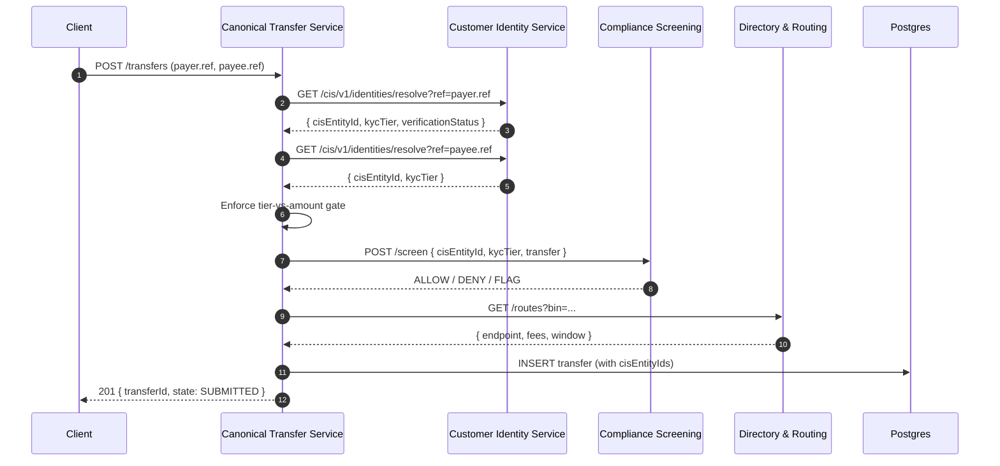
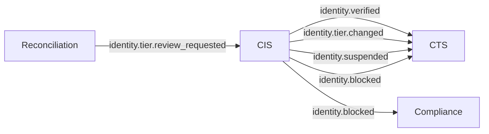
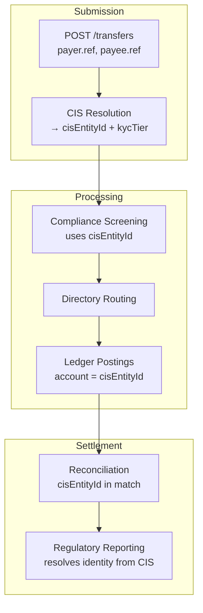

# CIS → Payments Nucleus Integration

**Purpose** — Defines how the Customer Identity Service (CIS) feeds
identity data, KYC tier decisions, and lifecycle events into the
Payments Nucleus (CTS, Compliance, Ledger, Directory).

---

## Identity Resolution Flow

Every canonical transfer carries `cisEntityId` for both payer and
payee. CTS resolves these during the normalisation step before
compliance screening or rail submission.

> **Cache strategy**: CTS caches CIS identity resolution responses
> with a short TTL (≤ 60 s). On `identity.tier.changed` events the
> cache entry is invalidated immediately.

---

## KYC Tier Gating

CIS assigns a graduated tier to every identity. CTS enforces
transfer limits based on this tier at the point of submission.

| Tier | Label | Daily Equivalent Limit | Corridors | Requirements |
|------|-------|----------------------|-----------|-------------|
| T0 | Unverified | $50 | Domestic only | Phone number + OTP |
| T1 | Basic | $1 000 | Domestic + regional | Government ID verified |
| T2 | Enhanced | $5 000 | All corridors | Biometric + address proof |
| T3 | Full | Regulatory cap | All corridors | Full KYC + ongoing monitoring |

> Exact thresholds are jurisdiction-specific. See
> [Risk & Limits](../10-payments-nucleus/specs/risk-limits.md) and
> [KYC/KYB Flows](../15-identity/compliance/kyc-kyb-flows.md).

If a transfer exceeds the payer's tier limit, CTS responds with
`403 KycTierInsufficient` (`errorCode: 42204`).

---

## Event Flow — CIS → Payments

CIS emits domain events that CTS and other Payments components
subscribe to via the transactional outbox / event bus.

| CIS Event | Payments Consumer | Behaviour |
|-----------|-------------------|-----------|
| `identity.verified` | CTS | Update cached tier; unblock pending transfers |
| `identity.tier.changed` | CTS | Invalidate tier cache; re-evaluate in-flight transfers |
| `identity.suspended` | CTS | Block new transfer submissions for entity |
| `identity.blocked` | CTS, Compliance | Freeze entity; flag existing unsettled transfers |
| `identity.unblocked` | CTS | Resume transfer processing |
| `identity.tier.review_requested` | CIS (inbound from Recon) | High return rate triggers CIS to reassess tier |

---

## Data Flow — cisEntityId Through the Transfer Lifecycle

`cisEntityId` is carried on `payer` and `payee` in the canonical
transfer record, in event payloads, in ledger journal entries, and
in compliance screening requests. It is the single stable
identifier that ties a transfer to a verified identity.

---

## Error Scenarios

| Scenario | CTS Behaviour | HTTP Response |
|----------|--------------|---------------|
| CIS unavailable (timeout) | Return cached tier if available; else reject | `503 ServiceUnavailable` |
| Identity not found in CIS | Reject transfer | `422 IdentityNotFound` (`42205`) |
| KYC tier insufficient | Reject transfer | `403 KycTierInsufficient` (`42204`) |
| Identity suspended | Reject transfer | `403 IdentitySuspended` |
| Identity verification pending | Hold transfer (INITIATED, not SUBMITTED) | `202 Accepted` (async) |
| CIS returns degraded response | Accept with UNVERIFIED tier limits only | `201 Created` (with warning header) |

> **Graceful degradation**: For transfers below T0 limits, CTS may
> proceed with a stale cached tier during CIS outages. Transfers
> above T0 always require live CIS resolution.

---

## Related Documentation

- [Identity (CIS) Overview](../15-identity/index.md)
- [CIS API — Identities](../15-identity/api/identities.md)
- [KYC/KYB Flows](../15-identity/compliance/kyc-kyb-flows.md)
- [Risk & Limits](../10-payments-nucleus/specs/risk-limits.md)
- [Canonical Transfer Service](../10-payments-nucleus/components/canonical-transfer-service.md)
- [Compliance Screening](../10-payments-nucleus/components/compliance-screening.md)
- [Events Spec](../10-payments-nucleus/specs/events.md)
