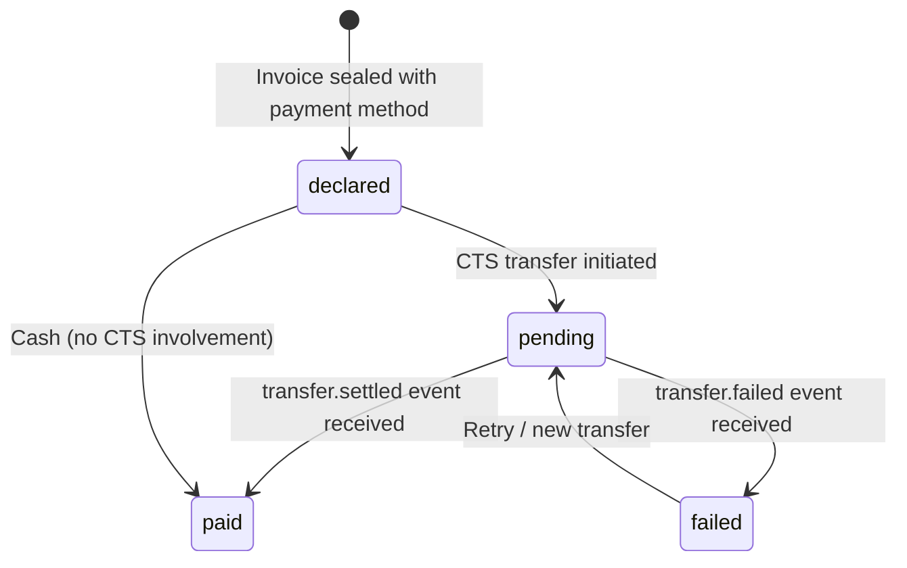
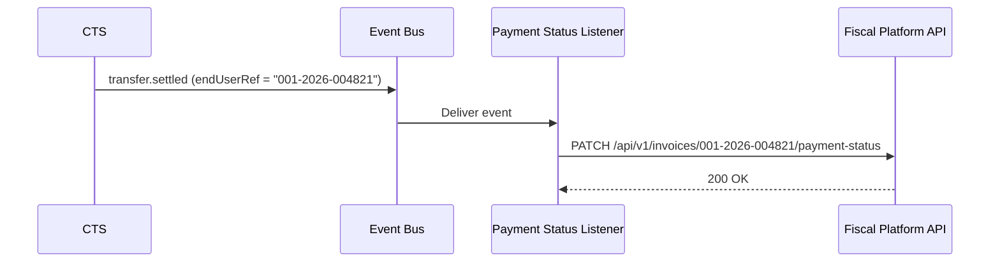

# Payment on Invoice

This page clarifies the relationship between the `payments` array inside a Canonical Invoice and actual money movement through the Canonical Transfer Service (CTS).

---

## Two Separate Concerns

| Concern | Owner | Record |
|---|---|---|
| **What was sold and how the customer intends to pay** | Fiscal Platform | `payments` array in the Canonical Invoice |
| **Actual money movement** | Payments Nucleus | `CanonicalTransfer` with settlement lifecycle |

The `payments` array on an invoice is a **declaration of payment method**, not proof of settlement. A sealed invoice might declare `"method": "mobile_money"` before the CTS has initiated the STK Push.

---

## Payment Status Lifecycle



| Status | Meaning |
|---|---|
| `declared` | Invoice records the intended payment method. No CTS transfer exists yet. |
| `pending` | A CTS transfer has been created with `endUserRef` = `fiscal_number`. Awaiting rail settlement. |
| `paid` | CTS emitted `transfer.settled`. Invoice payment status updated via Event Bus listener. |
| `failed` | CTS emitted `transfer.failed`. Cashier may retry or switch payment method. |

---

## Cash Payments

For cash payments, there is **no CTS involvement**. The Fiscal Platform records `"method": "cash"` and the payment status is immediately `paid` — the cashier confirms they received physical currency.

---

## Split Payments

DRC merchants routinely accept split payments (e.g., half cash, half mobile money):

```json
"payments": [
  { "method": "cash", "amount": "67500", "currency": "CDF", "status": "paid" },
  { "method": "mobile_money", "provider": "airtel_money", "amount": "67500", "currency": "CDF", "status": "pending" }
]
```

Each non-cash payment entry may correspond to a separate CTS transfer. The POS client manages this orchestration — the Fiscal Platform does not initiate transfers.

---

## Linking Mechanism

The cross-reference between an invoice and a transfer uses two opaque fields:

| Field | Location | Value |
|---|---|---|
| `endUserRef` | On the CTS `CanonicalTransfer` | Set to the `fiscal_number` of the invoice |
| `transfer_id` | On the invoice's `payments[].transfer_id` | Set to the CTS `transferId` after initiation |

Neither system queries the other's database. The POS client holds both identifiers and writes them to the appropriate payload.

---

## Event Bus Listener (Optional)

An optional microservice listens on the Event Bus for `transfer.settled` and `transfer.failed` events, matches by `endUserRef`, and updates the invoice's `payments[].status`:



This listener is a **convenience** — not a trust boundary component. If it is unavailable, the POS client can update payment status directly via the Fiscal Platform API.
