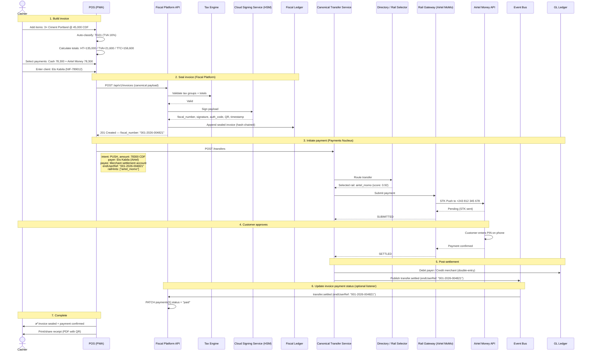

# End-to-End: Invoice → Pay

This page shows the complete sequence from a POS cashier creating an invoice to the customer completing mobile money payment. It is the most common cross-pillar interaction.

---

## Scenario

!!! note "DRC Example"
    This worked example uses a DRC (`CD`) jurisdiction scenario. The same flow applies to any supported jurisdiction — only the tax groups, currency, and authority sync protocol change.

A cashier at **Outlet Kinshasa Gombe** sells 3 bags of cement to **Ets Kabila** for 135,000 CDF. The customer pays half in cash and half via Airtel Money.

---

## Sequence Diagram

---

## Timing

| Step | Typical latency | Notes |
|---|---|---|
| Build invoice (client-side) | N/A | Depends on cashier speed |
| Seal invoice (Fiscal Platform) | < 1 s | HSM signing + ledger append |
| Route + submit to rail | < 500 ms | Smart Rail Selector + gateway call |
| STK Push delivery | 2–10 s | Depends on telco network |
| Customer PIN entry | 5–60 s | Human interaction |
| Settlement confirmation | < 2 s | Rail callback |
| Payment status update | < 1 s | Event Bus listener |
| **Total (seal → paid)** | **~10–75 s** | Dominated by customer PIN entry |

---

## Failure Scenarios

| Failure | Handling |
|---|---|
| **HSM signing fails** | POS shows error. Invoice is not sealed. No fiscal number assigned. Cashier retries. |
| **CTS route fails** | POS shows "Payment service unavailable". Invoice is already sealed — cashier can accept cash instead and update payment method. |
| **STK Push timeout** | CTS retries once. If still no response, marks transfer as `FAILED`. POS prompts cashier to retry or switch to cash. |
| **Customer declines** | TELCO returns decline → CTS marks `FAILED`. POS prompts for alternative payment. |
| **Event Bus listener down** | Invoice stays in `pending` payment status. POS client can poll CTS directly and update payment status via Fiscal Platform API. |

---

## Key Invariants

1. **The invoice is always sealed before payment is initiated.** The fiscal number exists regardless of whether payment succeeds.
2. **Cash payments skip the CTS entirely.** The `payments` array records `"method": "cash", "status": "paid"` immediately.
3. **The Fiscal Platform never calls the CTS.** The POS client initiates both requests.
4. **`endUserRef` is the only cross-reference.** Neither system queries the other's data store.
