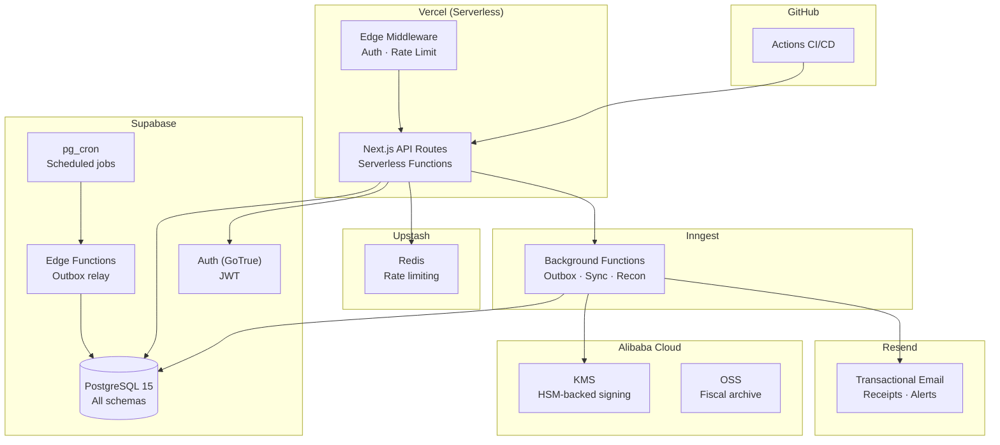
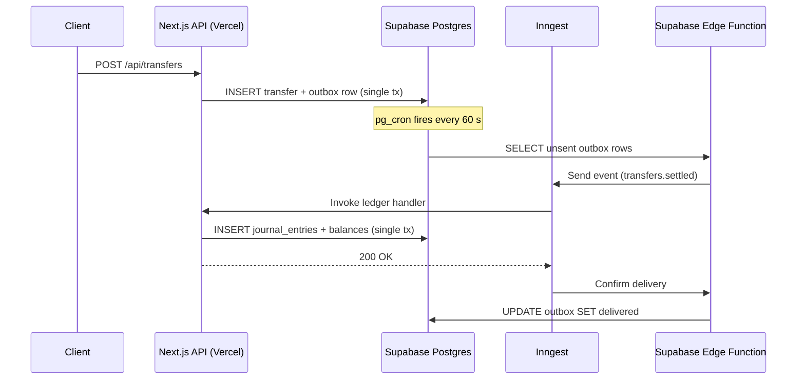
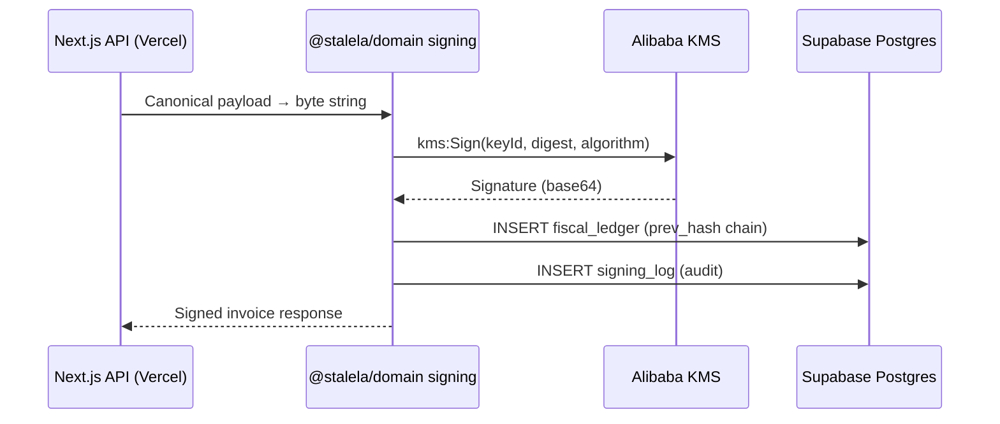
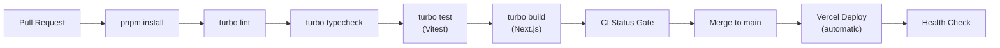

# Free-Stack Architecture

> **$0 – $20 / month** — pilot to early production on permanent free tiers.

## Service Inventory

| Service | Tier | Key Limits | Role in Stalela |
|---------|------|-----------|-----------------|
| **Supabase** | Free | 500 MB Postgres, 50 K MAU, 1 GB storage, 2 GB bandwidth | Database (all schemas), Auth (GoTrue JWT), Edge Functions, Cron |
| **Vercel** | Free (Hobby) | 100 GB bandwidth, 1 000 serverless invocations/day, 10 s function timeout | Next.js API + SSR, edge middleware, preview deploys |
| **Inngest** | Free | 25 K events/month, 5 concurrent functions | Background jobs: outbox relay, fiscal sync, reconciliation |
| **Upstash** | Free | 10 K commands/day, 256 MB | Rate limiting (Redis), future Kafka/QStash |
| **Alibaba Cloud** | Free trial → pay-as-you-go | KMS 20 K API calls/mo free, OSS 5 GB | HSM-backed fiscal signing, archival/backup |
| **Resend** | Free | 100 emails/day, 3 000/month | Receipts, DLQ/SLO alerts |
| **GitHub Enterprise** | Already licensed | Unlimited Actions minutes, Packages, Dependabot | CI/CD, security scanning |

---

## Deployment Topology



---

## Component Mapping — Payments Nucleus

All Nucleus components are TypeScript modules deployed as Vercel serverless functions
(Next.js API routes), backed by Supabase Postgres via Drizzle ORM.

| Component | Runtime | Storage | Events | Notes |
|-----------|---------|---------|--------|-------|
| **Canonical Transfer Service** | Vercel serverless `/api/transfers` | `payments.transfers`, `payments.transfer_events`, `payments.outbox` | Outbox → Inngest / Supabase Edge Function | Next.js route handlers, Supabase JWT auth, Upstash rate limiting |
| **Outbox Publisher** | Supabase Edge Function + Inngest | `payments.outbox` table | Exponential backoff; DLQ at 10 attempts | Replaces Go goroutine + SNS/SQS |
| **Rail Gateways** | Future: Inngest functions or Edge Functions | `payments.transfers` | Called by CTS via internal routing | ZimSwitch, OPPWA, M-Pesa, EcoCash, Algorand |
| **Ledger Service** | Vercel serverless `/api/ledger` | `ledger.journal_entries`, `ledger.balances` | Inngest event consumer | Double-entry, balance validation |
| **Compliance Screening** | Vercel serverless `/api/compliance` | `compliance.screening_results` | Fetch + retry adapter | Sanctions list cached in Upstash Redis |
| **Directory & Routing** | In-process module | `directory.directory_entries` | — | Route cache via Upstash Redis (TTL 5 m) |
| **Reconciliation** | Inngest scheduled function | `payments.recon_sessions` | Scheduled (daily) | Match internal vs bank statement |
| **Platform Base** | Edge middleware | `public.tenants`, `public.users` | — | Multi-tenant via `tenant_id` in Supabase JWT claims |
| **[CIS (Identity Service)](../15-identity/index.md)** | Vercel serverless `/api/identities` | `cis.identities`, `cis.credentials`, `cis.consents` | Identity events via outbox | KYC/KYB verification, credential issuance, consent management. Source of truth for `tenantId` ↔ `merchant_tin` binding |

---

## Component Mapping — Fiscal Platform

| Component | Runtime | Storage | Events | Notes |
|-----------|---------|---------|--------|-------|
| **Invoicing API** | Vercel serverless `/api/fiscal` | `fiscal.invoices`, `fiscal.invoice_items` | Internal event after signing | Canonical payload validation |
| **Serializer** | In-process (domain package) | — | — | JSON → canonical byte string (deterministic key order) |
| **Tax Engine** | Domain package `@stalela/domain` | `tax.jurisdiction_profiles`, `tax.tax_groups` | — | 14 tax groups (DRC TG01–TG14), 5 client classifications |
| **Cloud Signing Service** | Domain package → Alibaba KMS | `signing.signing_log` | Called after serialization | Web Crypto API for dev, Alibaba KMS for prod |
| **Monotonic Counter** | Domain package | `fiscal.fiscal_counters` | — | `pg_advisory_xact_lock` per outlet via Supabase RPC |
| **Hash-Chained Ledger** | Domain package | `fiscal.fiscal_ledger` | — | `prev_hash` column; append-only, tamper-evident |
| **Report Generator** | Inngest scheduled function | `fiscal.reports` | Scheduled (daily) | Z-reports, periodic summaries |
| **Tax Authority Sync** | Inngest scheduled function | `sync.authority_sync_queue` | Scheduled (every 5 min) | DGI protocol (DRC); jurisdiction-specific |
| **Receipt Delivery** | `@stalela/email` package → Resend API | `fiscal.receipt_log` | After signing completes | Email receipt link |
| **Verification Portal** | Future: Next.js page or API route | `fiscal.invoices` (public read) | — | QR code → verify endpoint |
| **Merchant Registry** | Vercel serverless CRUD | `fiscal.merchants`, `fiscal.outlets` | — | Managed via API |
| **Archival / Backup** | Inngest scheduled function → Alibaba OSS | OSS bucket | Nightly | 10-year retention for fiscal data |

---

## Supabase Schema Layout

All services share a **single Postgres database** organized by schema:

```
stalela_db (Supabase project)
├── public                    # Shared: tenants, users, auth helpers
├── cis                       # CIS: identities, orgs, credentials, consents, verification
├── payments                  # CTS: transfers, transfer_events, outbox
├── ledger                    # Journal entries, balances, chart of accounts
├── compliance                # Screening results, sanctions lists
├── directory                 # Alias → rail routing
├── recon                     # Recon sessions, matched/unmatched lines
├── rails                     # Rail configs, callback logs
├── fiscal                    # Invoices, items, fiscal_ledger, counters
├── tax                       # Jurisdiction profiles, tax groups
├── signing                   # Signing log, key metadata
├── reports                   # Z-reports, periodic summaries
├── sync                      # Authority sync queue, ack log
├── storage                   # Supabase Storage metadata (managed)
└── auth                      # Supabase Auth tables (managed)
```

**~25 application tables** across all schemas. Key tables:

| Schema | Table | Purpose |
|--------|-------|---------|
| `payments` | `transfers` | Transfer lifecycle (state machine) |
| `cis` | `identities` | CIS identity records (KYC/KYB verified entities) |
| `cis` | `credentials` | API keys, OAuth tokens, WebAuthn factors |
| `cis` | `consents` | User consent records (POPIA/GDPR) |
| `payments` | `transfer_events` | Append-only event log per transfer |
| `payments` | `outbox` | Transactional outbox for at-least-once delivery |
| `ledger` | `journal_entries` | Double-entry postings |
| `ledger` | `balances` | Materialized account balances |
| `compliance` | `screening_results` | Per-transfer compliance checks |
| `directory` | `directory_entries` | Alias → route resolution |
| `recon` | `recon_sessions` | Daily reconciliation runs |
| `fiscal` | `invoices` | Fiscal invoices (all jurisdictions) |
| `fiscal` | `fiscal_ledger` | Hash-chained, append-only ledger |
| `fiscal` | `fiscal_counters` | Monotonic counter per outlet |
| `tax` | `jurisdiction_profiles` | Country-specific tax configuration |
| `signing` | `signing_log` | Audit trail for every KMS sign call |
| `sync` | `authority_sync_queue` | Pending items for tax authority push |

### Row-Level Security (RLS)

Every table has RLS enabled. Policies enforce:

- **Tenant isolation**: `WHERE tenant_id = auth.jwt() ->> 'tenant_id'`
- **KYC tier gating**: `WHERE (auth.jwt() ->> 'kycTier')::text IN ('T1','T2')` for routes requiring verified identity
- **Role-based access**: `USING (role_check(auth.uid(), required_role))`
- **Outlet scoping**: Fiscal tables additionally filter by `outlet_id`

---

## Event Flow — Outbox Pattern

The TypeScript stack uses the transactional outbox pattern. Supabase Edge Functions
and Inngest replace pg_net/SNS/SQS for inter-service communication:



### Delivery Guarantees

| Concern | Solution |
|---------|----------|
| At-least-once | Outbox pattern: pg_cron retries unsent rows every 60 s |
| Idempotency | `idempotency_key` on transfers; `event_id` on events |
| Ordering | Single DB, sequential `event_id` per transfer |
| Dead letters | `outbox.retry_count`; after 5 failures → `status = 'dead'`, alert via Resend |
| Webhook failure | pg_net retries; pg_cron re-processes unsent rows |

---

## pg_cron Job Schedule

Supabase free tier allows **2 cron jobs**. We multiplex:

| Slot | Schedule | Job | Details |
|------|----------|-----|---------|
| **1** | `* * * * *` (every minute) | Outbox retry + GC | Retry unsent outbox rows; GC delivered rows older than 7 d |
| **2** | `*/5 * * * *` (every 5 min) | Tax authority sync + Archive trigger | Push pending fiscal events to authority; nightly: archive to Alibaba OSS |

The second job checks a `cron_tasks` table to decide which sub-task to run, enabling more than 2 logical jobs within the 2-slot limit.

---

## Signing Service — Alibaba KMS



- **Key type**: RSA_2048 or EC_P256 (jurisdiction-dependent)
- **Key rotation**: Annually; old key versions kept for verification
- **Cost**: 20 000 free API calls/month; ~$0.03 per 10 000 calls after that
- **Fallback**: If KMS is unreachable, queue invoice for retry (max 15 min before alert)

---

## Monorepo Structure

```
stalela/
├── apps/
│   └── api/                    # Next.js 16 — API routes + SSR
│       ├── app/
│       │   └── api/            # Route handlers (transfers, ledger, fiscal)
│       ├── middleware.ts        # Auth + rate limiting (edge)
│       └── vitest.config.ts    # Integration + e2e test config
├── packages/
│   ├── domain/                 # Pure TS domain logic (no framework deps)
│   │   └── src/
│   │       ├── transfer/       # Normalizer, state machine, idempotency
│   │       ├── ledger/         # Posting engine, journal, balance, statements
│   │       └── fiscal/         # Tax engine, signing, hash chain, counter
│   ├── db/                     # Drizzle ORM schemas + Supabase client
│   ├── config/                 # Env validation (Zod)
│   ├── crypto/                 # PII encryption, HMAC (Web Crypto API)
│   └── email/                  # Resend client wrapper
├── libs/
│   └── specs/                  # Language-neutral JSON Schema contracts
├── supabase/
│   └── migrations/             # SQL migrations (Supabase CLI)
├── tools/devstack/             # Docker Compose (Postgres for local dev)
├── .github/workflows/          # CI: pnpm → turbo lint/test/build
├── turbo.json                  # Turborepo pipeline config
├── vercel.json                 # Vercel deployment config
└── pnpm-workspace.yaml         # pnpm workspace definition
```

**Tech stack**: TypeScript 5 · Next.js 16 · Drizzle ORM · Supabase · Vitest · Turborepo · pnpm

---

## CI/CD Pipeline — GitHub Actions + Vercel



Key pipeline steps:

1. **PR opened** → `pnpm install --frozen-lockfile`, then `turbo lint`, `turbo typecheck`, `turbo test`
2. **Schema check** → validate JSON schemas in `libs/specs/`
3. **CI Status Gate** → all jobs must pass before merge
4. **Merge to main** → Vercel auto-deploys (zero-config for Next.js)
5. **Preview deploys** → every PR gets a preview URL from Vercel
6. **Smoke tests** → `/api/health` and `/api/health/ready` endpoint checks

### Vercel Deployment

The `vercel.json` at root configures:

- **Framework**: Next.js (auto-detected)
- **Build command**: `pnpm turbo build --filter=api...`
- **Install command**: `pnpm install --frozen-lockfile`
- **Ignore command**: `npx turbo-ignore api` (skip deploys if api unchanged)
- **Environment variables**: `SUPABASE_URL`, `SUPABASE_ANON_KEY`, `SUPABASE_SERVICE_ROLE_KEY`, etc. (set via Vercel dashboard)

---

## Cost Breakdown

| Service | Free Tier | When You Pay | Estimated at Scale |
|---------|-----------|-------------|-------------------|
| Supabase | 500 MB DB, 50 K MAU, 2 GB bandwidth | > 500 MB DB or > 50 K MAU | Pro $25/mo |
| Vercel | 100 GB bandwidth, serverless functions | > hobby limits or need team features | Pro $20/mo |
| Inngest | 25 K events/month | > 25 K events | $25/mo (100 K events) |
| Upstash | 10 K Redis commands/day | > 10 K commands | Pay-as-you-go ~$0.20/100 K |
| Alibaba KMS | 20 K sign calls/month | > 20 K calls | ~$0.03 / 10 K calls |
| Alibaba OSS | 5 GB storage | > 5 GB | ~$0.02 / GB / month |
| Resend | 3 000 emails/month | > 3 000 emails | $20/mo (50 K emails) |
| GitHub Enterprise | Unlimited (licensed) | — | Already paid |
| **Total** | **$0** | **Pilot traffic** | **$25 – $90 /mo** |

!!! info "Pilot Capacity"
    At free-tier limits, you can handle approximately:

    - **1 000 transfers/day** (CTS + ledger + outbox)
    - **500 fiscal invoices/day** (signing + hash chain + authority sync)
    - **100 email receipts/day** (Resend)
    - **Unlimited** serverless cold starts (Vercel auto-scales)

---

## Scale-Up Path

When free-tier limits are exceeded, services can be upgraded independently:

| Trigger | Action | Cost Impact |
|---------|--------|-------------|
| DB > 500 MB | Upgrade Supabase to Pro | +$25/mo |
| Need team features | Upgrade Vercel to Pro | +$20/mo |
| Events > 25 K/mo | Upgrade Inngest plan | +$25/mo |
| Signing > 20 K/mo | Alibaba KMS pay-as-you-go | +$3 – $10/mo |
| Emails > 3 K/mo | Resend Growth plan | +$20/mo |
| Need message broker | Add Upstash Kafka or QStash | +$10 – $30/mo |
| Need dedicated DB | Migrate to Supabase Pro or Neon | +$25 – $69/mo |
| Regulatory/compliance | Migrate to AWS (see [AWS Blueprint](../10-payments-nucleus/infra/aws-infra.md)) | $800+ /mo |

The architecture is designed so that **each component can migrate independently** —
start with Supabase + Vercel, move individual services to AWS as needed.

---

## Comparison: AWS vs Free Stack

| Dimension | Free Stack | AWS Blueprint |
|-----------|-----------|---------------|
| **Monthly cost** | $0 – $90 | $800 – $2 500+ |
| **Setup time** | Hours | Weeks |
| **Operational burden** | Minimal (fully managed, serverless) | High (VPC, IAM, monitoring) |
| **Runtime** | Vercel serverless functions | ECS Fargate |
| **Database** | Supabase Postgres (shared) | RDS Multi-AZ per service |
| **Events** | Outbox + Inngest / Edge Functions | SNS/SQS FIFO |
| **Signing** | Alibaba KMS | AWS CloudHSM |
| **Auth** | Supabase Auth (GoTrue JWT) | Cognito / custom |
| **CDN/Edge** | Vercel Edge Network | CloudFront + WAF |
| **CI/CD** | GitHub Actions → Vercel | GitHub Actions + CDK |
| **Multi-AZ HA** | Vercel global edge (automatic) | Self-configured |
| **Data residency** | Supabase region + Vercel region | af-south-1 (Cape Town) |
| **Best for** | Pilot, MVP, < 10 K txn/day | Regulated production, > 10 K txn/day |

!!! warning "Production Readiness"
    The free stack is suitable for **pilot and early production**. Before processing high-volume regulated traffic, evaluate:

    - Data residency requirements per jurisdiction
    - SLA guarantees (Supabase free tier has no SLA)
    - Backup/DR testing
    - Penetration testing on the full stack
