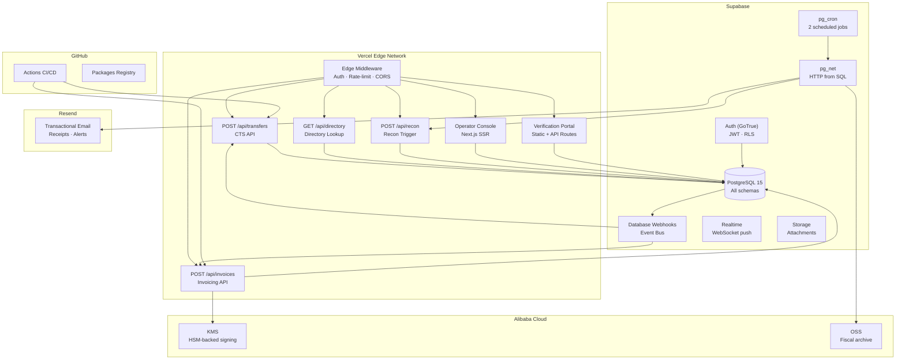
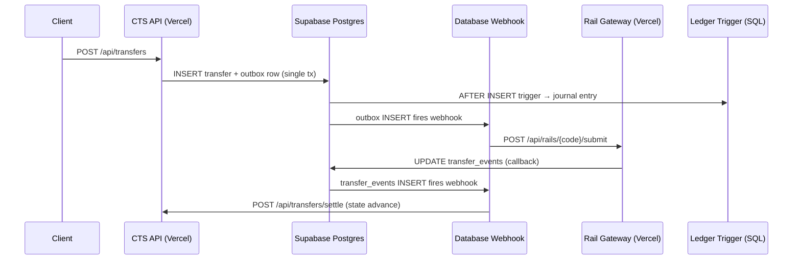
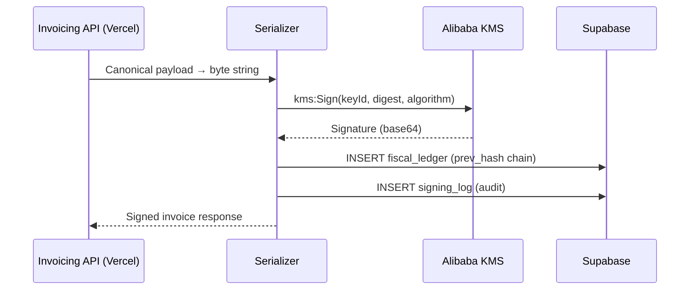

# Free-Stack Architecture

> **$0 – $20 / month** — pilot to early production on permanent free tiers.

## Service Inventory

| Service | Tier | Key Limits | Role in Stalela |
|---------|------|-----------|-----------------|
| **Supabase** | Free | 500 MB Postgres, 50 K MAU, 500 K Edge invocations, 1 GB storage, 2 GB bandwidth | Database, Auth, Webhooks, Cron, Realtime, Storage |
| **Vercel** | Hobby / Pro ($20) | 100 GB bandwidth, 1 000 images, Serverless & Edge functions | API surface, frontends, Edge Middleware, Cron |
| **Alibaba Cloud** | Free trial → pay-as-you-go | KMS 20 K API calls/mo free, OSS 5 GB | HSM-backed fiscal signing, archival/backup |
| **Resend** | Free | 100 emails/day, 3 000/month | Receipts, DLQ/SLO alerts |
| **GitHub Enterprise** | Already licensed | Unlimited Actions minutes (self-hosted), Packages, Dependabot | CI/CD, container registry, security scanning |

---

## Deployment Topology



---

## Component Mapping — Payments Nucleus

Every Nucleus component maps to a Vercel serverless function backed by Supabase tables.

| Component | Runtime | Storage | Events | Notes |
|-----------|---------|---------|--------|-------|
| **Canonical Transfer Service** | Vercel Function `POST /api/transfers` | `transfers`, `transfer_events`, `outbox` | DB Webhook → rail gateway | State machine in SQL function |
| **Outbox Publisher** | pg_cron (every 60 s) + pg_net | `outbox` table | Publishes pending rows via HTTP | Replaces SNS/SQS; at-least-once delivery |
| **Rail Gateways** (M-Pesa, EcoCash, MTN, Airtel, OPPWA, PayShap, EFT, RTGS) | Vercel Functions per rail | `transfers`, `rail_callbacks` | DB Webhook on `transfer_events` | Each rail has `POST /api/rails/{code}/callback` |
| **Ledger Service** | SQL functions (triggers) | `journal_entries`, `balances` | Triggered by transfer state changes | Double-entry via Postgres triggers |
| **Compliance Screening** | Vercel Function middleware | `screening_results` | Pre-transfer hook | Sanctions list cached in `screening_lists` table |
| **Directory & Routing** | Vercel Function `GET /api/directory` | `directory_entries` | — | Lookup by alias → rail + account |
| **Reconciliation** | Vercel Cron (daily) + Function | `recon_sessions`, `recon_lines` | Cron trigger | Match internal vs bank statement |
| **Event Bus** | Supabase Database Webhooks | `outbox` | Row INSERT triggers webhook | Webhook targets are Vercel Function URLs |
| **Operator Console** | Next.js on Vercel | All tables (read via RLS) | Realtime subscriptions | Protected by Supabase Auth + RLS |
| **AI Agents** | Vercel Function + external LLM API | `agent_logs` | On-demand | Optional; uses Supabase context |
| **Platform Base** | Supabase Auth + Edge Middleware | `tenants`, `users`, `roles` | — | Multi-tenant via RLS `tenant_id` |

---

## Component Mapping — Fiscal Platform

| Component | Runtime | Storage | Events | Notes |
|-----------|---------|---------|--------|-------|
| **Invoicing API** | Vercel Function `POST /api/invoices` | `invoices`, `invoice_items` | DB Webhook → signing | Canonical payload validation |
| **Serializer** | In Vercel Function (same request) | — | — | JSON → canonical byte string |
| **Tax Engine** | SQL function or Vercel middleware | `jurisdiction_profiles`, `tax_groups` | — | Jurisdiction-configured tax calculation |
| **Cloud Signing Service** | Vercel Function → Alibaba KMS | `signing_log` | Called after serialization | `kms:Sign` with RSA-2048 or ECDSA |
| **Monotonic Counter** | Postgres `SERIAL` + advisory lock | `fiscal_counters` | — | `SELECT nextval()` under `pg_advisory_xact_lock` |
| **Hash-Chained Ledger** | SQL trigger on `fiscal_ledger` | `fiscal_ledger` | — | `prev_hash` column; append-only |
| **Report Generator** | Vercel Cron (daily) + Function | `reports` | Cron trigger | Z-reports, periodic summaries |
| **Tax Authority Sync** | pg_cron + pg_net | `authority_sync_queue` | Scheduled (every 5 min) | pg_net HTTP POST to DGI/authority endpoint |
| **Invoice Store** | Supabase Storage (buckets) | `invoices` bucket | — | Signed PDF/JSON archival |
| **Receipt Delivery** | Vercel Function → Resend API | `receipt_log` | After signing completes | Email / WhatsApp receipt link |
| **Dashboard** | Next.js PWA on Vercel | All fiscal tables via RLS | Realtime | Merchant-facing analytics |
| **Verification Portal** | Static + API route on Vercel | `invoices` (public read) | — | QR code → verify endpoint |
| **Merchant Registry** | Supabase Auth + `merchants` table | `merchants`, `outlets`, `terminals` | — | CRUD via Operator Console |
| **Multi-User Access** | Supabase Auth + RLS policies | `users`, `roles`, `permissions` | — | Role-based per outlet/merchant |
| **Archival / Backup** | pg_cron → pg_net → Alibaba OSS | OSS bucket | Nightly | 10-year retention for fiscal data |

---

## Supabase Schema Layout

All services share a **single Postgres database** organized by schema:

```
stalela_db (Supabase project)
├── public                    # Shared: tenants, users, auth helpers
├── payments                  # CTS: transfers, transfer_events, outbox
├── ledger                    # Journal entries, balances, chart of accounts
├── compliance                # Screening results, sanctions lists
├── directory                 # Alias → rail routing
├── recon                     # Recon sessions, matched/unmatched lines
├── rails                     # Rail configs, callback logs
├── fiscal                    # Invoices, items, fiscal_ledger, counters
├── tax                       # Jurisdiction profiles, tax groups
├── signing                   # Signing log, key metadata
├── reports                   # Z-reports, periodic summaries
├── sync                      # Authority sync queue, ack log
├── storage                   # Supabase Storage metadata (managed)
└── auth                      # Supabase Auth tables (managed)
```

**~25 application tables** across all schemas. Key tables:

| Schema | Table | Purpose |
|--------|-------|---------|
| `payments` | `transfers` | Transfer lifecycle (state machine) |
| `payments` | `transfer_events` | Append-only event log per transfer |
| `payments` | `outbox` | Transactional outbox for at-least-once delivery |
| `ledger` | `journal_entries` | Double-entry postings |
| `ledger` | `balances` | Materialized account balances |
| `compliance` | `screening_results` | Per-transfer compliance checks |
| `directory` | `directory_entries` | Alias → route resolution |
| `recon` | `recon_sessions` | Daily reconciliation runs |
| `fiscal` | `invoices` | Fiscal invoices (all jurisdictions) |
| `fiscal` | `fiscal_ledger` | Hash-chained, append-only ledger |
| `fiscal` | `fiscal_counters` | Monotonic counter per outlet |
| `tax` | `jurisdiction_profiles` | Country-specific tax configuration |
| `signing` | `signing_log` | Audit trail for every KMS sign call |
| `sync` | `authority_sync_queue` | Pending items for tax authority push |

### Row-Level Security (RLS)

Every table has RLS enabled. Policies enforce:

- **Tenant isolation**: `WHERE tenant_id = auth.jwt() ->> 'tenant_id'`
- **Role-based access**: `USING (role_check(auth.uid(), required_role))`
- **Outlet scoping**: Fiscal tables additionally filter by `outlet_id`

---

## Event Flow — Database Webhooks

With no message broker, Supabase Database Webhooks replace SNS/SQS:



### Delivery Guarantees

| Concern | Solution |
|---------|----------|
| At-least-once | Outbox pattern: pg_cron retries unsent rows every 60 s |
| Idempotency | `idempotency_key` on transfers; `event_id` on events |
| Ordering | Single DB, sequential `event_id` per transfer |
| Dead letters | `outbox.retry_count`; after 5 failures → `status = 'dead'`, alert via Resend |
| Webhook failure | Supabase retries with exponential backoff (3 attempts) |

---

## pg_cron Job Schedule

Supabase free tier allows **2 cron jobs**. We multiplex:

| Slot | Schedule | Job | Details |
|------|----------|-----|---------|
| **1** | `* * * * *` (every minute) | Outbox retry + GC | Retry unsent outbox rows; GC delivered rows older than 7 d |
| **2** | `*/5 * * * *` (every 5 min) | Tax authority sync + Archive trigger | Push pending fiscal events to authority; nightly: archive to Alibaba OSS |

The second job checks a `cron_tasks` table to decide which sub-task to run, enabling more than 2 logical jobs within the 2-slot limit.

---

## Signing Service — Alibaba KMS



- **Key type**: RSA_2048 or EC_P256 (jurisdiction-dependent)
- **Key rotation**: Annually; old key versions kept for verification
- **Cost**: 20 000 free API calls/month; ~$0.03 per 10 000 calls after that
- **Fallback**: If KMS is unreachable, queue invoice for retry (max 15 min before alert)

---

## Monorepo Structure

```
stalela/
├── apps/
│   ├── api/                    # Vercel Functions (Next.js API routes)
│   │   ├── transfers/          # CTS endpoints
│   │   ├── invoices/           # Fiscal endpoints
│   │   ├── rails/              # Rail gateway callbacks
│   │   ├── directory/          # Directory lookups
│   │   ├── recon/              # Reconciliation triggers
│   │   └── middleware.ts       # Edge: auth, rate-limit, CORS
│   ├── console/                # Operator Console (Next.js)
│   └── portal/                 # Verification Portal (Next.js)
├── packages/
│   ├── db/                     # Supabase migrations, seed, types
│   ├── domain/                 # Shared domain logic (transfer SM, tax engine)
│   ├── signing/                # Alibaba KMS client wrapper
│   ├── email/                  # Resend client wrapper
│   └── config/                 # ESLint, TypeScript, Tailwind configs
├── supabase/
│   ├── migrations/             # SQL migrations (managed by Supabase CLI)
│   ├── functions/              # Supabase Edge Functions (if needed)
│   └── seed.sql                # Dev seed data
├── .github/
│   └── workflows/
│       ├── ci.yml              # Lint, test, type-check
│       ├── deploy-preview.yml  # PR preview deployments
│       ├── deploy-prod.yml     # Production deployment
│       └── db-migrate.yml      # Schema migration pipeline
├── turbo.json                  # Turborepo config
└── package.json                # Workspace root
```

**Tech stack**: TypeScript · Next.js 14 (App Router) · Turborepo · Supabase JS v2 · Tailwind CSS

---

## CI/CD Pipeline — GitHub Actions

```mermaid
graph LR
    PR["Pull Request"] --> LINT["Lint + Type-check"]
    LINT --> TEST["Unit + Integration Tests"]
    TEST --> MIGRATE["DB Migration (staging)"]
    MIGRATE --> PREVIEW["Vercel Preview Deploy"]
    PREVIEW --> APPROVE["Manual Approval"]
    APPROVE --> PROD_MIG["DB Migration (prod)"]
    PROD_MIG --> PROD["Vercel Prod Deploy"]
    PROD --> SMOKE["Smoke Tests"]
```



Key pipeline steps:

1. **PR opened** → lint, type-check, unit tests (GitHub Actions)
2. **DB migrations** → `supabase db push` against staging project
3. **Preview deploy** → Vercel builds preview URL automatically
4. **Merge to main** → migration against prod Supabase → Vercel prod deploy
5. **Smoke tests** → health check endpoints, sample transfer creation

---

## Cost Breakdown

| Service | Free Tier | When You Pay | Estimated at Scale |
|---------|-----------|-------------|-------------------|
| Supabase | 500 MB DB, 50 K MAU, 2 GB bandwidth | > 500 MB DB or > 50 K MAU | Pro $25/mo |
| Vercel | 100 GB bandwidth, serverless functions | > 100 GB bandwidth or team features | Pro $20/mo |
| Alibaba KMS | 20 K sign calls/month | > 20 K calls | ~$0.03 / 10 K calls |
| Alibaba OSS | 5 GB storage | > 5 GB | ~$0.02 / GB / month |
| Resend | 3 000 emails/month | > 3 000 emails | $20/mo (50 K emails) |
| GitHub Enterprise | Unlimited (licensed) | — | Already paid |
| **Total** | **$0** | **Pilot traffic** | **$20 – $65 /mo** |

!!! info "Pilot Capacity"
    At free-tier limits, you can handle approximately:

    - **1 000 transfers/day** (CTS + ledger + webhooks)
    - **500 fiscal invoices/day** (signing + hash chain + authority sync)
    - **100 email receipts/day** (Resend)
    - **50 concurrent users** on operator console (Supabase Realtime)

---

## Scale-Up Path

When free-tier limits are exceeded, services can be upgraded independently:

| Trigger | Action | Cost Impact |
|---------|--------|-------------|
| DB > 500 MB | Upgrade Supabase to Pro | +$25/mo |
| Bandwidth > 100 GB | Upgrade Vercel to Pro | +$20/mo |
| Signing > 20 K/mo | Alibaba KMS pay-as-you-go | +$3 – $10/mo |
| Emails > 3 K/mo | Resend Growth plan | +$20/mo |
| Need message broker | Add Upstash Kafka or QStash | +$10 – $30/mo |
| Need dedicated DB | Migrate to Supabase Pro or Neon | +$25 – $69/mo |
| Regulatory/compliance | Migrate to AWS (see [AWS Blueprint](../10-payments-nucleus/infra/aws-infra.md)) | $800+ /mo |

The architecture is designed so that **each component can migrate independently** — start with Supabase + Vercel, move individual services to AWS as needed.

---

## Comparison: AWS vs Free Stack

| Dimension | Free Stack | AWS Blueprint |
|-----------|-----------|---------------|
| **Monthly cost** | $0 – $65 | $800 – $2 500+ |
| **Setup time** | Hours | Weeks |
| **Operational burden** | Minimal (managed services) | High (VPC, IAM, monitoring) |
| **Database** | Supabase Postgres (shared) | RDS Multi-AZ per service |
| **Events** | Database Webhooks + pg_cron | SNS/SQS FIFO |
| **Signing** | Alibaba KMS | AWS CloudHSM |
| **Auth** | Supabase Auth (GoTrue) | Cognito / custom |
| **CDN/Edge** | Vercel Edge Network | CloudFront + WAF |
| **CI/CD** | GitHub Actions + Vercel | GitHub Actions + CDK |
| **Multi-AZ HA** | Supabase-managed | Self-configured |
| **Data residency** | Supabase region choice | af-south-1 (Cape Town) |
| **Best for** | Pilot, MVP, < 10 K txn/day | Regulated production, > 10 K txn/day |

!!! warning "Production Readiness"
    The free stack is suitable for **pilot and early production**. Before processing high-volume regulated traffic, evaluate:

    - Data residency requirements per jurisdiction
    - SLA guarantees (Supabase free tier has no SLA)
    - Backup/DR testing
    - Penetration testing on the full stack
