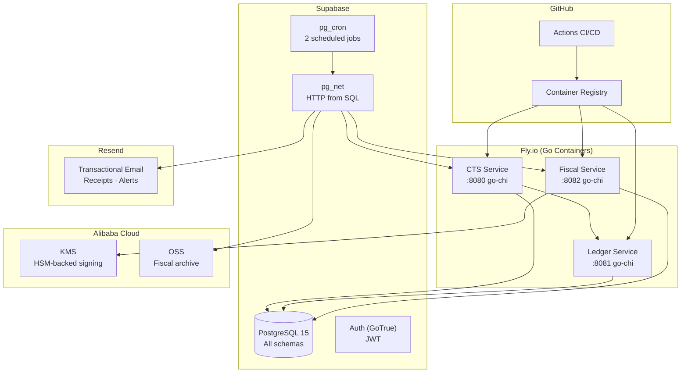
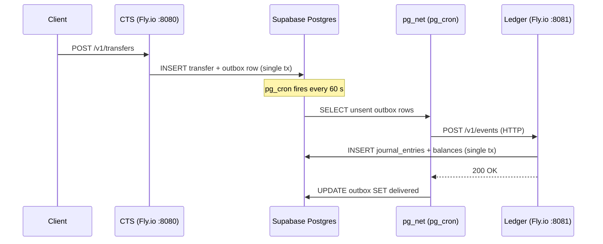
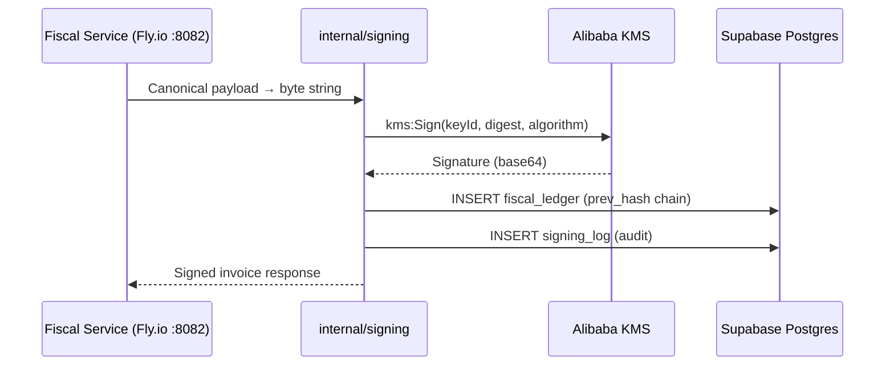
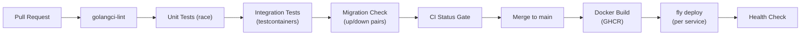

# Free-Stack Architecture

> **$0 – $20 / month** — pilot to early production on permanent free tiers.

## Service Inventory

| Service | Tier | Key Limits | Role in Stalela |
|---------|------|-----------|-----------------|
| **Supabase** | Free | 500 MB Postgres, 50 K MAU, 1 GB storage, 2 GB bandwidth | Database (all schemas), Auth, Webhooks, Cron |
| **Fly.io** | Free (Hobby) | 3 shared-cpu-1x VMs, 256 MB RAM each, 3 GB persistent volumes | Go service containers (CTS, Ledger, Fiscal) |
| **Alibaba Cloud** | Free trial → pay-as-you-go | KMS 20 K API calls/mo free, OSS 5 GB | HSM-backed fiscal signing, archival/backup |
| **Resend** | Free | 100 emails/day, 3 000/month | Receipts, DLQ/SLO alerts |
| **GitHub Enterprise** | Already licensed | Unlimited Actions minutes (self-hosted), Packages, Dependabot | CI/CD, container registry, security scanning |

---

## Deployment Topology



---

## Component Mapping — Payments Nucleus

Every Nucleus component is a Go service deployed as a Docker container on Fly.io,
backed by Supabase Postgres.

| Component | Runtime | Storage | Events | Notes |
|-----------|---------|---------|--------|-------|
| **Canonical Transfer Service** | Go container on Fly.io `:8080` | `payments.transfers`, `payments.transfer_events`, `payments.outbox` | Outbox → SNS (LocalStack dev) / pg_net (prod) | go-chi router, JWT auth, rate-limit middleware |
| **Outbox Publisher** | Goroutine in CTS process | `payments.outbox` table | Exponential backoff 1 s → 16 h; DLQ at 10 attempts | Replaces external message broker |
| **Rail Gateways** | Go modules in `gateways/` | `payments.transfers` | Called by CTS via internal routing | ZimSwitch, OPPWA, M-Pesa, EcoCash, Algorand |
| **Ledger Service** | Go container on Fly.io `:8081` | `ledger.journal_entries`, `ledger.balances` | SQS consumer (dev) / pg_net webhook (prod) | Double-entry, balance validation |
| **Compliance Screening** | Go service `services/compliance/` | `compliance.screening_results` | Circuit-breaker adapter (gobreaker) | Sanctions list cached in-memory |
| **Directory & Routing** | Go module in CTS | `directory.directory_entries` | — | Route cache TTL 5 m, negative-cache TTL 45 s |
| **Reconciliation** | pg_cron trigger → Go endpoint | `payments.recon_sessions` | Scheduled (daily) | Match internal vs bank statement |
| **Platform Base** | JWT middleware in Go | `public.tenants`, `public.users` | — | Multi-tenant via `tenant_id` in JWT claims |

---

## Component Mapping — Fiscal Platform

| Component | Runtime | Storage | Events | Notes |
|-----------|---------|---------|--------|-------|
| **Invoicing API** | Go container on Fly.io `:8082` | `fiscal.invoices`, `fiscal.invoice_items` | Internal event after signing | Canonical payload validation |
| **Serializer** | In Fiscal Service (same process) | — | — | JSON → canonical byte string (deterministic key order) |
| **Tax Engine** | Go module `internal/tax/` | `tax.jurisdiction_profiles`, `tax.tax_groups` | — | 14 tax groups (DRC TG01–TG14), 5 client classifications |
| **Cloud Signing Service** | Go module `internal/signing/` → Alibaba KMS | `signing.signing_log` | Called after serialization | Local RSA for dev, Alibaba KMS for prod |
| **Monotonic Counter** | Go module `internal/counter/` | `fiscal.fiscal_counters` | — | `pg_advisory_xact_lock` per outlet |
| **Hash-Chained Ledger** | Go module `internal/ledger/` | `fiscal.fiscal_ledger` | — | `prev_hash` column; append-only, tamper-evident |
| **Report Generator** | pg_cron → Go endpoint | `fiscal.reports` | Scheduled (daily) | Z-reports, periodic summaries |
| **Tax Authority Sync** | Go service `services/sync/` | `sync.authority_sync_queue` | Scheduled (every 5 min) | DGI protocol (DRC); jurisdiction-specific |
| **Receipt Delivery** | Go via `libs/email/` → Resend API | `fiscal.receipt_log` | After signing completes | Email receipt link |
| **Verification Portal** | Future: static site or Go handler | `fiscal.invoices` (public read) | — | QR code → verify endpoint |
| **Merchant Registry** | Go CRUD in Fiscal Service | `fiscal.merchants`, `fiscal.outlets` | — | Managed via API |
| **Archival / Backup** | pg_cron → pg_net → Alibaba OSS | OSS bucket | Nightly | 10-year retention for fiscal data |

---

## Supabase Schema Layout

All services share a **single Postgres database** organized by schema:

```
stalela_db (Supabase project)
├── public                    # Shared: tenants, users, auth helpers
├── payments                  # CTS: transfers, transfer_events, outbox
├── ledger                    # Journal entries, balances, chart of accounts
├── compliance                # Screening results, sanctions lists
├── directory                 # Alias → rail routing
├── recon                     # Recon sessions, matched/unmatched lines
├── rails                     # Rail configs, callback logs
├── fiscal                    # Invoices, items, fiscal_ledger, counters
├── tax                       # Jurisdiction profiles, tax groups
├── signing                   # Signing log, key metadata
├── reports                   # Z-reports, periodic summaries
├── sync                      # Authority sync queue, ack log
├── storage                   # Supabase Storage metadata (managed)
└── auth                      # Supabase Auth tables (managed)
```

**~25 application tables** across all schemas. Key tables:

| Schema | Table | Purpose |
|--------|-------|---------|
| `payments` | `transfers` | Transfer lifecycle (state machine) |
| `payments` | `transfer_events` | Append-only event log per transfer |
| `payments` | `outbox` | Transactional outbox for at-least-once delivery |
| `ledger` | `journal_entries` | Double-entry postings |
| `ledger` | `balances` | Materialized account balances |
| `compliance` | `screening_results` | Per-transfer compliance checks |
| `directory` | `directory_entries` | Alias → route resolution |
| `recon` | `recon_sessions` | Daily reconciliation runs |
| `fiscal` | `invoices` | Fiscal invoices (all jurisdictions) |
| `fiscal` | `fiscal_ledger` | Hash-chained, append-only ledger |
| `fiscal` | `fiscal_counters` | Monotonic counter per outlet |
| `tax` | `jurisdiction_profiles` | Country-specific tax configuration |
| `signing` | `signing_log` | Audit trail for every KMS sign call |
| `sync` | `authority_sync_queue` | Pending items for tax authority push |

### Row-Level Security (RLS)

Every table has RLS enabled. Policies enforce:

- **Tenant isolation**: `WHERE tenant_id = auth.jwt() ->> 'tenant_id'`
- **Role-based access**: `USING (role_check(auth.uid(), required_role))`
- **Outlet scoping**: Fiscal tables additionally filter by `outlet_id`

---

## Event Flow — Outbox Pattern

Go services use the transactional outbox pattern. In the free stack,
pg_net replaces SNS/SQS for inter-service communication:



### Delivery Guarantees

| Concern | Solution |
|---------|----------|
| At-least-once | Outbox pattern: pg_cron retries unsent rows every 60 s |
| Idempotency | `idempotency_key` on transfers; `event_id` on events |
| Ordering | Single DB, sequential `event_id` per transfer |
| Dead letters | `outbox.retry_count`; after 5 failures → `status = 'dead'`, alert via Resend |
| Webhook failure | pg_net retries; pg_cron re-processes unsent rows |

---

## pg_cron Job Schedule

Supabase free tier allows **2 cron jobs**. We multiplex:

| Slot | Schedule | Job | Details |
|------|----------|-----|---------|
| **1** | `* * * * *` (every minute) | Outbox retry + GC | Retry unsent outbox rows; GC delivered rows older than 7 d |
| **2** | `*/5 * * * *` (every 5 min) | Tax authority sync + Archive trigger | Push pending fiscal events to authority; nightly: archive to Alibaba OSS |

The second job checks a `cron_tasks` table to decide which sub-task to run, enabling more than 2 logical jobs within the 2-slot limit.

---

## Signing Service — Alibaba KMS



- **Key type**: RSA_2048 or EC_P256 (jurisdiction-dependent)
- **Key rotation**: Annually; old key versions kept for verification
- **Cost**: 20 000 free API calls/month; ~$0.03 per 10 000 calls after that
- **Fallback**: If KMS is unreachable, queue invoice for retry (max 15 min before alert)

---

## Monorepo Structure

```
stalela/
├── services/
│   ├── transfer/               # CTS — go-chi :8080
│   │   ├── cmd/server/         # main.go entrypoint
│   │   ├── internal/           # api, state, outbox, normalizer, etc.
│   │   ├── migrations/         # golang-migrate SQL files
│   │   ├── Dockerfile          # Multi-stage build
│   │   └── fly.toml            # Fly.io deployment config
│   ├── ledger/                 # Ledger Service — go-chi :8081
│   │   ├── cmd/server/
│   │   ├── internal/           # consumer, posting, journal, balance, etc.
│   │   ├── migrations/
│   │   ├── Dockerfile
│   │   └── fly.toml
│   ├── fiscal/                 # Fiscal Service — go-chi :8082
│   │   ├── cmd/server/
│   │   ├── internal/           # signing, counter, ledger, tax, etc.
│   │   ├── migrations/
│   │   ├── Dockerfile
│   │   └── fly.toml
│   ├── compliance/             # Compliance screening (stub)
│   └── sync/                   # Tax Authority Sync Agent (stub)
├── gateways/
│   ├── zimswitch/              # ZimSwitch rail adapter
│   ├── oppwa/                  # OPPWA (card) adapter
│   ├── mpesa/                  # M-Pesa adapter
│   ├── ecocash/                # EcoCash adapter
│   └── algorand/               # Algorand adapter
├── libs/
│   ├── crypto/                 # PII encryption, HMAC
│   ├── logging/                # Structured logging (slog)
│   └── email/                  # Resend client wrapper
├── apps/
│   └── gateway/                # API gateway (future)
├── tests/                      # Cross-service integration tests
├── tools/devstack/             # docker-compose (Postgres, LocalStack)
├── .github/workflows/          # CI: ci.yml, transfer-ci.yml, etc.
├── go.work                     # Go workspace (15 modules)
└── Makefile                    # build-all, test-all, lint-all, migrate-all
```

**Tech stack**: Go 1.24 · go-chi/chi · pgx/v5 · golang-migrate · OpenTelemetry · Prometheus · testcontainers-go

---

## CI/CD Pipeline — GitHub Actions



Key pipeline steps:

1. **PR opened** → golangci-lint, unit tests with `-race`, integration tests via testcontainers
2. **Migration check** → validate all `.up.sql` have matching `.down.sql`
3. **CI Status Gate** → all jobs must pass before merge
4. **Merge to main** → Docker multi-stage build → push to GitHub Container Registry
5. **Deploy** → `fly deploy` per service (CTS, Ledger, Fiscal)
6. **Smoke tests** → `/healthz` and `/readyz` endpoint checks

### Fly.io Deployment

Each service has a `fly.toml` that defines:

- **VM size**: `shared-cpu-1x` (free tier)
- **Memory**: 256 MB
- **Internal port**: service-specific (8080, 8081, 8082)
- **Health check**: `/healthz` HTTP endpoint
- **Env vars**: `CTS_DATABASE_URL`, `LEDGER_DATABASE_URL`, etc. (set via `fly secrets`)
- **Region**: `iad` (US East) to match Supabase region

---

## Cost Breakdown

| Service | Free Tier | When You Pay | Estimated at Scale |
|---------|-----------|-------------|-------------------|
| Supabase | 500 MB DB, 50 K MAU, 2 GB bandwidth | > 500 MB DB or > 50 K MAU | Pro $25/mo |
| Fly.io | 3 shared VMs, 256 MB each | > 3 VMs or need dedicated CPU | ~$5 – $15/mo per extra VM |
| Alibaba KMS | 20 K sign calls/month | > 20 K calls | ~$0.03 / 10 K calls |
| Alibaba OSS | 5 GB storage | > 5 GB | ~$0.02 / GB / month |
| Resend | 3 000 emails/month | > 3 000 emails | $20/mo (50 K emails) |
| GitHub Enterprise | Unlimited (licensed) | — | Already paid |
| **Total** | **$0** | **Pilot traffic** | **$25 – $70 /mo** |

!!! info "Pilot Capacity"
    At free-tier limits, you can handle approximately:

    - **1 000 transfers/day** (CTS + ledger + outbox)
    - **500 fiscal invoices/day** (signing + hash chain + authority sync)
    - **100 email receipts/day** (Resend)
    - **3 concurrent Go services** on Fly.io free tier

---

## Scale-Up Path

When free-tier limits are exceeded, services can be upgraded independently:

| Trigger | Action | Cost Impact |
|---------|--------|-------------|
| DB > 500 MB | Upgrade Supabase to Pro | +$25/mo |
| Need dedicated CPU | Upgrade Fly.io VMs | +$5 – $30/mo |
| Signing > 20 K/mo | Alibaba KMS pay-as-you-go | +$3 – $10/mo |
| Emails > 3 K/mo | Resend Growth plan | +$20/mo |
| Need message broker | Add Upstash Kafka or QStash | +$10 – $30/mo |
| Need dedicated DB | Migrate to Supabase Pro or Neon | +$25 – $69/mo |
| Regulatory/compliance | Migrate to AWS (see [AWS Blueprint](../10-payments-nucleus/infra/aws-infra.md)) | $800+ /mo |

The architecture is designed so that **each component can migrate independently** —
start with Supabase + Fly.io, move individual services to AWS ECS Fargate as needed.

---

## Comparison: AWS vs Free Stack

| Dimension | Free Stack | AWS Blueprint |
|-----------|-----------|---------------|
| **Monthly cost** | $0 – $70 | $800 – $2 500+ |
| **Setup time** | Hours | Weeks |
| **Operational burden** | Minimal (managed services) | High (VPC, IAM, monitoring) |
| **Runtime** | Fly.io Docker containers | ECS Fargate |
| **Database** | Supabase Postgres (shared) | RDS Multi-AZ per service |
| **Events** | Outbox + pg_cron/pg_net | SNS/SQS FIFO |
| **Signing** | Alibaba KMS | AWS CloudHSM |
| **Auth** | JWT middleware in Go | Cognito / custom |
| **CDN/Edge** | Fly.io Anycast | CloudFront + WAF |
| **CI/CD** | GitHub Actions → Fly.io | GitHub Actions + CDK |
| **Multi-AZ HA** | Fly.io multi-region (paid) | Self-configured |
| **Data residency** | Supabase region + Fly.io region | af-south-1 (Cape Town) |
| **Best for** | Pilot, MVP, < 10 K txn/day | Regulated production, > 10 K txn/day |

!!! warning "Production Readiness"
    The free stack is suitable for **pilot and early production**. Before processing high-volume regulated traffic, evaluate:

    - Data residency requirements per jurisdiction
    - SLA guarantees (Supabase free tier has no SLA)
    - Backup/DR testing
    - Penetration testing on the full stack
