# Stalela Platform — Unified Epic Board

> **Two pillars, one free stack.**  
> Kanban board tracking all epics across Payments Nucleus + Fiscal Platform.  
> Stack: [Supabase · Vercel · Alibaba KMS · Resend · GitHub Actions](../60-infra/free-stack.md)

**Columns:** Backlog → Selected for Dev → In Progress → Testing → Done

---

## In Progress

Epics actively being implemented in Sprint 001.

### PLAT-01 · Monorepo & Supabase Setup
| Field | Value |
|---|---|
| **Pillar** | Platform (shared) |
| **Sprint** | 001 |
| **Owner** | Sprint Master |
| **Dependencies** | None (foundation) |
| **Links** | [Free Stack](../60-infra/free-stack.md), [Sprint 001](../sprint-001.md) |

**Tasks**

- [ ] Scaffold Turborepo monorepo (`apps/api`, `apps/console`, `packages/*`)
- [ ] Create Supabase project; enable `pg_cron`, `pg_net`, `pgcrypto` extensions
- [ ] Create schemas: `payments`, `ledger`, `fiscal`, `tax`, `signing`, `sync`, `compliance`, `directory`, `recon`, `rails`
- [ ] Configure Supabase Auth (email + API key strategy)
- [ ] Set up RLS policies for `tenant_id` isolation on all tables
- [ ] Wire Vercel project to monorepo; configure `apps/api` for Serverless Functions
- [ ] Configure Resend + create `packages/email` wrapper

---

### PLAT-02 · CI/CD Pipeline
| Field | Value |
|---|---|
| **Pillar** | Platform (shared) |
| **Sprint** | 001 |
| **Owner** | Sprint Master |
| **Dependencies** | PLAT-01 |
| **Links** | [Free Stack — CI/CD](../60-infra/free-stack.md#cicd-pipeline-github-actions) |

**Tasks**

- [ ] GitHub Actions: lint → type-check → unit tests → Vercel preview deploy
- [ ] Supabase migration workflow: `supabase db push` on merge to `main`
- [ ] Contract validation step (golden fixtures for transfer + invoice payloads)
- [ ] PR preview deployments via Vercel

---

### PLAT-03 · Specs & Contracts
| Field | Value |
|---|---|
| **Pillar** | Platform (shared) |
| **Sprint** | 001 |
| **Owner** | Sprint Master + Developer |
| **Dependencies** | None |
| **Links** | [Events spec](../10-payments-nucleus/specs/events.md), [API spec](../10-payments-nucleus/specs/api-canonical-transfer.md) |

**Tasks**

- [ ] Finalize event envelope v1 (`events.md`) with `"v": 1` field
- [ ] Canonical Transfer API contract (`POST /api/transfers`, `GET /api/transfers/:id`)
- [ ] Canonical Invoice API contract (`POST /api/invoices`, `GET /api/invoices/:id`)
- [ ] Posting rules linked into ledger service
- [ ] ADR: Outbox pattern on Supabase DB Webhooks (PAY-ADR-0001 update)
- [ ] ADR: Alibaba KMS as signing provider (FIS-ADR-0007)

---

### PAY-01 · Canonical Transfer Service (CTS)
| Field | Value |
|---|---|
| **Pillar** | Payments Nucleus |
| **Sprint** | 001 |
| **Owner** | Developer |
| **Dependencies** | PLAT-01 (Supabase), PLAT-03 (contracts) |
| **Links** | [CTS component](../10-payments-nucleus/components/canonical-transfer-service.md), [API spec](../10-payments-nucleus/specs/api-canonical-transfer.md) |

**Tasks**

- [ ] `POST /api/transfers`: validate, normalize, INSERT into `payments.transfers` + `payments.outbox` (single tx)
- [ ] `GET /api/transfers/:id`: return transfer state + event timeline
- [ ] Idempotency middleware (`Idempotency-Key` header + body hash)
- [ ] Structured logging (transferId, tenantId, correlationId)
- [ ] Health endpoints: `/api/health/live`, `/api/health/ready`

---

### PAY-02 · Outbox & Event Bus (DB Webhooks)
| Field | Value |
|---|---|
| **Pillar** | Payments Nucleus |
| **Sprint** | 001 |
| **Owner** | Sprint Master |
| **Dependencies** | PAY-01, PLAT-01 |
| **Links** | [Event Bus](../10-payments-nucleus/components/event-bus-outbox.md), [Free Stack — Event Flow](../60-infra/free-stack.md#event-flow-database-webhooks) |

**Tasks**

- [ ] Supabase Database Webhook: on `payments.outbox` INSERT → fire HTTP to rail gateway endpoint
- [ ] pg_cron job (slot 1): retry unsent outbox rows every 60 s; GC delivered rows > 7 d
- [ ] `outbox.retry_count` + dead-letter logic (after 5 failures → `status = 'dead'`, Resend alert)
- [ ] Webhook on `payments.transfer_events` INSERT → advance transfer state machine

---

### PAY-03 · Ledger Service (SQL Triggers)
| Field | Value |
|---|---|
| **Pillar** | Payments Nucleus |
| **Sprint** | 001 |
| **Owner** | Sprint Master |
| **Dependencies** | PAY-01 |
| **Links** | [Ledger Service](../10-payments-nucleus/components/ledger-service.md), [Posting Rules](../10-payments-nucleus/specs/posting-rules.md) |

**Tasks**

- [ ] Create `ledger.journal_entries` + `ledger.balances` tables with double-entry constraints
- [ ] SQL trigger: on `transfer_events` state change → INSERT journal entries (debit/credit)
- [ ] `GET /api/balances`: return materialized balances per account
- [ ] Idempotent posting by (transferId, eventType)

---

### FIS-01 · Cloud Signing Service (Alibaba KMS)
| Field | Value |
|---|---|
| **Pillar** | Fiscal Platform |
| **Sprint** | 001 |
| **Owner** | Developer |
| **Dependencies** | PLAT-01 (Supabase), Alibaba Cloud account |
| **Links** | [Trust Boundary](../20-fiscal-platform/architecture/trust-boundary.md), [Components](../20-fiscal-platform/architecture/components.md), [Free Stack — Signing](../60-infra/free-stack.md#signing-service-alibaba-kms) |

**Tasks**

- [ ] Provision Alibaba KMS key (RSA-2048 or EC_P256 per jurisdiction config)
- [ ] Create `packages/signing` wrapper: `sign(digest)` → base64 signature, `verify(digest, sig)`
- [ ] Monotonic Counter: `fiscal.fiscal_counters` with `pg_advisory_xact_lock` + `nextval()` per outlet
- [ ] Signing pipeline: serialize canonical payload → SHA-256 digest → `kms:Sign` → return signature
- [ ] INSERT into `signing.signing_log` (audit trail for every KMS call)
- [ ] Integration test: sign + verify round-trip

---

### FIS-02 · Invoicing API + Tax Engine
| Field | Value |
|---|---|
| **Pillar** | Fiscal Platform |
| **Sprint** | 001 |
| **Owner** | Developer |
| **Dependencies** | FIS-01 (Signing), PLAT-01 (Supabase) |
| **Links** | [Tax Engine](../20-fiscal-platform/fiscal/tax-engine.md), [Cloud API](../20-fiscal-platform/api/cloud.md), [DRC Tax Groups](../40-jurisdictions/cd/tax-groups.md) |

**Tasks**

- [ ] `POST /api/invoices`: validate canonical payload (deterministic field ordering, required keys)
- [ ] Tax Engine: enforce jurisdiction-configured tax groups (DRC: TG01-TG14), client classifications, rounding rules
- [ ] Route validated payload to signing pipeline; return sealed response with 5 security elements
- [ ] Rate limiting (100 req/s per API key) + idempotency keys
- [ ] Actionable error responses for validation failures
- [ ] `GET /api/invoices/:id`: return sealed invoice

---

### FIS-03 · Fiscal Ledger (Hash-Chained)
| Field | Value |
|---|---|
| **Pillar** | Fiscal Platform |
| **Sprint** | 001 |
| **Owner** | Sprint Master |
| **Dependencies** | FIS-01 (Signing) |
| **Links** | [Data Flow](../20-fiscal-platform/architecture/data-flow.md), [Reports](../20-fiscal-platform/fiscal/reports.md) |

**Tasks**

- [ ] `fiscal.fiscal_ledger` table: append-only, `prev_hash` column for chain integrity
- [ ] SQL trigger: on INSERT, compute `hash = SHA256(prev_hash || payload)` and set `prev_hash`
- [ ] Void / refund / credit note create new fiscal events (never delete)
- [ ] Chain integrity verification function: walk ledger, verify all hashes

---

## Selected for Development

Epics approved for Sprint 002.

### PAY-04 · Rail Gateway — EcoCash
| Field | Value |
|---|---|
| **Pillar** | Payments Nucleus |
| **Sprint** | 002 |
| **Owner** | Developer |
| **Dependencies** | PAY-01 (CTS), PAY-02 (Webhooks) |
| **Links** | [EcoCash Gateway](../10-payments-nucleus/components/rail-gateway-ecocash.md) |

**Tasks**

- [ ] `POST /api/rails/ecocash/submit`: initiate STK push via EcoCash API
- [ ] `POST /api/rails/ecocash/callback`: receive payment confirmation webhook
- [ ] Emit `transfer_events` (accepted/settled/failed) on callback
- [ ] Timeout handling: if no callback within 5 min → mark `timed_out`
- [ ] Mock mode for dev/staging environments

---

### PAY-05 · Compliance Screening
| Field | Value |
|---|---|
| **Pillar** | Payments Nucleus |
| **Sprint** | 002 |
| **Owner** | Sprint Master |
| **Dependencies** | PAY-01 |
| **Links** | [Compliance](../10-payments-nucleus/components/compliance-screening.md) |

**Tasks**

- [ ] `compliance.screening_lists` table (cached sanctions data)
- [ ] Pre-transfer middleware: screen sender/receiver against lists
- [ ] `compliance.screening_results` table for audit trail
- [ ] Block or flag transfers based on match confidence

---

### PAY-06 · Directory & Routing
| Field | Value |
|---|---|
| **Pillar** | Payments Nucleus |
| **Sprint** | 002 |
| **Owner** | Developer |
| **Dependencies** | PAY-01 |
| **Links** | [Directory](../10-payments-nucleus/components/directory-routing.md) |

**Tasks**

- [ ] `directory.directory_entries` table (alias → rail + account mapping)
- [ ] `GET /api/directory?alias=...`: lookup with 400 ms timeout
- [ ] Cache layer (in-memory or Supabase materialized view)
- [ ] Integrate into CTS transfer submission flow

---

### FIS-04 · Web Dashboard MVP
| Field | Value |
|---|---|
| **Pillar** | Fiscal Platform |
| **Sprint** | 002 |
| **Owner** | Developer |
| **Dependencies** | FIS-02 (API), PLAT-01 (Auth) |
| **Links** | [Dashboard](../20-fiscal-platform/platform/dashboard.md), [Multi-User](../20-fiscal-platform/platform/multi-user.md) |

**Tasks**

- [ ] Scaffold Next.js PWA (`apps/console`) with Supabase Auth + Realtime
- [ ] Invoice CRUD: create, view, filter, void with status tracking
- [ ] Outlet registration + configuration UI
- [ ] User management + API key management with RBAC (Cashier, Supervisor, Manager, Owner)
- [ ] Z/X/A report generation and download
- [ ] Offline indicators for queued drafts
- [ ] Bilingual support (French / English)

---

### FIS-05 · JavaScript & Python SDK
| Field | Value |
|---|---|
| **Pillar** | Fiscal Platform |
| **Sprint** | 002 |
| **Owner** | Developer |
| **Dependencies** | FIS-02 (API) |
| **Links** | [Invoicing SDK](../20-fiscal-platform/api/invoicing-sdk.md), [Cloud API](../20-fiscal-platform/api/cloud.md) |

**Tasks**

- [ ] Scaffold JS and Python SDK packages with typed request/response models
- [ ] Implement offline queue (IndexedDB for browser, SQLite for native)
- [ ] Tax engine helpers for building valid `tax_groups` and `tax_summary` arrays
- [ ] Event callbacks for queue state transitions (synced, failed, grace exceeded)
- [ ] Publish packages and quickstart docs

---

### FIS-06 · Fiscal Reports
| Field | Value |
|---|---|
| **Pillar** | Fiscal Platform |
| **Sprint** | 002 |
| **Owner** | Sprint Master |
| **Dependencies** | FIS-03 (Ledger) |
| **Links** | [Reports](../20-fiscal-platform/fiscal/reports.md) |

**Tasks**

- [ ] Report Generator: Z reports (daily close), X reports (shift close), A reports (periodic audit)
- [ ] Vercel Cron trigger for daily Z-report generation
- [ ] Audit export endpoint (JSON + CSV) with fiscal number ranges and tax group totals
- [ ] Verify hash-chain integrity on report generation

---

### PAY-07 · Operator Console
| Field | Value |
|---|---|
| **Pillar** | Payments Nucleus |
| **Sprint** | 002 |
| **Owner** | Sprint Master |
| **Dependencies** | PAY-01, PAY-03, PLAT-01 |
| **Links** | [Operator Console](../10-payments-nucleus/components/operator-console.md) |

**Tasks**

- [ ] Extend `apps/console` with payments views (shared Next.js app)
- [ ] Transfer timeline: status, events, rail, amounts
- [ ] Exception queue: stuck/failed transfers with retry actions
- [ ] Balance dashboard: account balances, daily totals
- [ ] Supabase Realtime subscriptions for live updates

---

## Backlog

### PAY-08 · Reconciliation
| Field | Value |
|---|---|
| **Pillar** | Payments Nucleus |
| **Sprint** | 003 |
| **Dependencies** | PAY-04 (Rail GW), PAY-03 (Ledger) |
| **Links** | [Reconciliation](../10-payments-nucleus/components/reconciliation-returns.md) |

**Tasks**

- [ ] `recon.recon_sessions` + `recon.recon_lines` tables
- [ ] Vercel Cron: daily reconciliation trigger
- [ ] Match internal transfer events vs bank/rail settlement files
- [ ] Surface unmatched items in Operator Console
- [ ] Emit `transfers.settled` / `transfers.returned` events on match

---

### PAY-09 · Multi-Rail Expansion (M-Pesa, MTN, OPPWA)
| Field | Value |
|---|---|
| **Pillar** | Payments Nucleus |
| **Sprint** | 004 |
| **Dependencies** | PAY-04 (EcoCash pattern) |
| **Links** | [M-Pesa GW](../10-payments-nucleus/components/rail-gateway-mtn-momo.md), [OPPWA GW](../10-payments-nucleus/components/rail-gateway-oppwa.md) |

**Tasks**

- [ ] M-Pesa gateway (STK push + callback pattern)
- [ ] MTN MoMo gateway (Collection API)
- [ ] OPPWA gateway (card payments + 3DS)
- [ ] Each rail follows the same Vercel Function + DB Webhook pattern

---

### PAY-10 · AI Agents
| Field | Value |
|---|---|
| **Pillar** | Payments Nucleus |
| **Sprint** | 004 |
| **Dependencies** | PAY-01, PAY-08 |
| **Links** | [AI Agents](../10-payments-nucleus/components/orchestration-ai-agents.md) |

**Tasks**

- [ ] LLM-powered exception triage for stuck transfers
- [ ] Natural language query interface for Operator Console
- [ ] Anomaly detection on transfer patterns
- [ ] `agent_logs` table for audit trail

---

### FIS-07 · Tax Authority Sync
| Field | Value |
|---|---|
| **Pillar** | Fiscal Platform |
| **Sprint** | 003 |
| **Dependencies** | FIS-03 (Ledger), PLAT-01 |
| **Links** | [Authority Sync](../20-fiscal-platform/cloud/authority-sync.md), [DRC Integration](../40-jurisdictions/cd/authority-integration.md) |

**Tasks**

- [ ] `sync.authority_sync_queue` table (pending fiscal events for push)
- [ ] pg_cron job (slot 2): every 5 min, push pending items via pg_net HTTP POST
- [ ] Handle DGI MCF/e-MCF protocol (when spec is available)
- [ ] Acknowledgment tracking + retry logic
- [ ] Manual fallback: CSV/Excel export for submission

---

### FIS-08 · Verification Portal
| Field | Value |
|---|---|
| **Pillar** | Fiscal Platform |
| **Sprint** | 003 |
| **Dependencies** | FIS-01 (Signing) |
| **Links** | [Invoice Verification](../20-fiscal-platform/fiscal/invoice-verification.md) |

**Tasks**

- [ ] Static + API route on Vercel (`apps/portal`)
- [ ] QR code scanning → verify signature against public key
- [ ] Manual fiscal number lookup
- [ ] Public key distribution via `/.well-known/fiscal-keys.json`
- [ ] `/api/verify/{fiscal_number}` — rate-limited public endpoint

---

### FIS-09 · Compliance Tooling & Onboarding
| Field | Value |
|---|---|
| **Pillar** | Fiscal Platform |
| **Sprint** | 003 |
| **Dependencies** | FIS-03, FIS-06 |
| **Links** | [Phase 1 detail](../20-fiscal-platform/implementation/phase-1.md#5-manual-compliance-tooling-onboarding) |

**Tasks**

- [ ] DGI-ready CSV/Excel exports (fiscal numbers, tax summaries, security elements)
- [ ] Z/X/A report exports from Fiscal Ledger
- [ ] Onboarding docs, training materials, API key provisioning flow

---

### FIS-10 · WhatsApp Invoice Bot + NL API
| Field | Value |
|---|---|
| **Pillar** | Fiscal Platform |
| **Sprint** | 004 |
| **Dependencies** | FIS-02, FIS-05 |
| **Links** | [AI Capabilities](../20-fiscal-platform/platform/ai-capabilities.md) |

**Tasks**

- [ ] WhatsApp Business API integration (Cloud API) for inbound/outbound
- [ ] `/api/invoices/natural` endpoint for free-text invoice creation
- [ ] Entity extraction: items, quantities, prices, client, payment methods, currency
- [ ] Fuzzy matching against merchant product catalog
- [ ] Auto-submit when confidence ≥ 0.85; return draft otherwise
- [ ] `source: "whatsapp_bot"` audit logging

---

### FIS-11 · Fiscal Extension (Offline Signing)
| Field | Value |
|---|---|
| **Pillar** | Fiscal Platform |
| **Sprint** | 004 |
| **Dependencies** | FIS-01 (Cloud Signing) |
| **Links** | [Delegated Offline Token](../20-fiscal-platform/architecture/delegated-offline-token.md), [ADR-0006](../20-fiscal-platform/adr/FIS-ADR-0006.md) |

**Tasks**

- [ ] Chrome/Edge extension scaffold with isolated key storage
- [ ] Delegated Credential provisioning (generate keypair → request VC + block from Cloud)
- [ ] Local signing: validate origin, sign payload, return signature + VC
- [ ] PIN-based shift unlock + auto-lock on inactivity
- [ ] Online reconciliation: submit locally-sealed invoices → Cloud verify → ledger append
- [ ] Tamper detection: Cloud flags missing blocks in allocated range

---

### FIS-12 · Mobile Money Integration (Fiscal)
| Field | Value |
|---|---|
| **Pillar** | Fiscal Platform |
| **Sprint** | 004 |
| **Dependencies** | FIS-02, PAY-04 |
| **Links** | [Integrations](../20-fiscal-platform/platform/integrations.md) |

**Tasks**

- [ ] Payment state tracking in invoice `payments` array (pending/paid/failed/reversed)
- [ ] Webhook verification + idempotent event processing
- [ ] Surface payment status in dashboard and shared receipts
- [ ] Ensure fiscalization is independent of payment state

---

## Testing

*No epics in Testing at this time.*

---

## Done

*No epics completed yet.*

---

## Board Summary

```mermaid
graph TB
    subgraph "In Progress (Sprint 001)"
        PLAT01["PLAT-01<br/>Monorepo + Supabase"]
        PLAT02["PLAT-02<br/>CI/CD Pipeline"]
        PLAT03["PLAT-03<br/>Specs & Contracts"]
        PAY01["PAY-01<br/>CTS API"]
        PAY02["PAY-02<br/>Outbox + Webhooks"]
        PAY03["PAY-03<br/>Ledger (Triggers)"]
        FIS01["FIS-01<br/>Cloud Signing (KMS)"]
        FIS02["FIS-02<br/>Invoice API + Tax"]
        FIS03["FIS-03<br/>Fiscal Ledger"]
    end

    subgraph "Selected for Dev (Sprint 002)"
        PAY04["PAY-04<br/>EcoCash Gateway"]
        PAY05["PAY-05<br/>Compliance"]
        PAY06["PAY-06<br/>Directory"]
        PAY07["PAY-07<br/>Operator Console"]
        FIS04["FIS-04<br/>Dashboard"]
        FIS05["FIS-05<br/>JS + Python SDK"]
        FIS06["FIS-06<br/>Reports"]
    end

    subgraph "Backlog (Sprint 003)"
        PAY08["PAY-08<br/>Reconciliation"]
        FIS07["FIS-07<br/>Authority Sync"]
        FIS08["FIS-08<br/>Verification Portal"]
        FIS09["FIS-09<br/>Compliance Tooling"]
    end

    subgraph "Backlog (Sprint 004)"
        PAY09["PAY-09<br/>Multi-Rail"]
        PAY10["PAY-10<br/>AI Agents"]
        FIS10["FIS-10<br/>WhatsApp + NL API"]
        FIS11["FIS-11<br/>Fiscal Extension"]
        FIS12["FIS-12<br/>Mobile Money"]
    end

    %% Dependencies
    PLAT01 -.-> PAY01 & PAY02 & PAY03 & FIS01 & FIS02 & FIS03
    PLAT02 -.-> PLAT01
    PAY01 -.-> PAY02 & PAY03
    FIS01 -.-> FIS02 & FIS03
    PAY01 -.-> PAY04 & PAY05 & PAY06
    PAY02 -.-> PAY04
    FIS02 -.-> FIS04 & FIS05 & FIS10
    FIS03 -.-> FIS06 & FIS07
    PAY04 -.-> PAY08 & PAY09
    FIS01 -.-> FIS08 & FIS11

    %% Styles
    style PLAT01 fill:#4dabf7,stroke:#1971c2,color:#fff
    style PLAT02 fill:#4dabf7,stroke:#1971c2,color:#fff
    style PLAT03 fill:#4dabf7,stroke:#1971c2,color:#fff
    style PAY01 fill:#4dabf7,stroke:#1971c2,color:#fff
    style PAY02 fill:#4dabf7,stroke:#1971c2,color:#fff
    style PAY03 fill:#4dabf7,stroke:#1971c2,color:#fff
    style FIS01 fill:#4dabf7,stroke:#1971c2,color:#fff
    style FIS02 fill:#4dabf7,stroke:#1971c2,color:#fff
    style FIS03 fill:#4dabf7,stroke:#1971c2,color:#fff
    style PAY04 fill:#ffe066,stroke:#f59f00,color:#333
    style PAY05 fill:#ffe066,stroke:#f59f00,color:#333
    style PAY06 fill:#ffe066,stroke:#f59f00,color:#333
    style PAY07 fill:#ffe066,stroke:#f59f00,color:#333
    style FIS04 fill:#ffe066,stroke:#f59f00,color:#333
    style FIS05 fill:#ffe066,stroke:#f59f00,color:#333
    style FIS06 fill:#ffe066,stroke:#f59f00,color:#333
    style PAY08 fill:#dee2e6,stroke:#868e96,color:#333
    style PAY09 fill:#dee2e6,stroke:#868e96,color:#333
    style PAY10 fill:#dee2e6,stroke:#868e96,color:#333
    style FIS07 fill:#dee2e6,stroke:#868e96,color:#333
    style FIS08 fill:#dee2e6,stroke:#868e96,color:#333
    style FIS09 fill:#dee2e6,stroke:#868e96,color:#333
    style FIS10 fill:#dee2e6,stroke:#868e96,color:#333
    style FIS11 fill:#dee2e6,stroke:#868e96,color:#333
    style FIS12 fill:#dee2e6,stroke:#868e96,color:#333
```

---

## Epic Count by Pillar

| Pillar | Sprint 001 | Sprint 002 | Sprint 003 | Sprint 004 | Total |
|--------|-----------|-----------|-----------|-----------|-------|
| **Platform (shared)** | 3 | — | — | — | 3 |
| **Payments Nucleus** | 3 | 4 | 1 | 2 | 10 |
| **Fiscal Platform** | 3 | 3 | 3 | 3 | 12 |
| **Total** | **9** | **7** | **4** | **5** | **25** |
