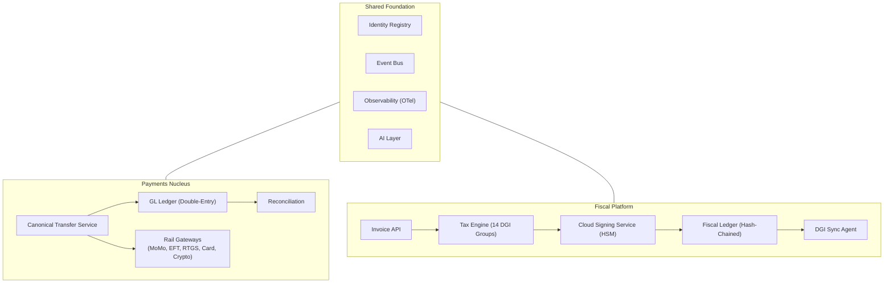

# Stalela Platform

The Stalela Platform is a unified fintech infrastructure for **moving money** and **issuing fiscally compliant invoices** across sub-Saharan African markets. It comprises two decoupled product pillars and a shared foundation.

---

## Platform Architecture

---

## Two Pillars

| Pillar | Purpose | Core Abstraction | Documentation |
|---|---|---|---|
| **Payments Nucleus** | Move money across rails — mobile money, card, crypto, EFT, RTGS | `CanonicalTransfer` | [Payments Nucleus →](10-payments-nucleus/overview/index.md) |
| **Fiscal Platform** | Create sealed, fiscally compliant invoices for DRC (and beyond) | `CanonicalInvoice` | [Fiscal Platform →](20-fiscal-platform/index.md) |

The pillars are **decoupled by design** — no shared databases, no synchronous RPC between them. They connect through opaque references (`endUserRef`) and async events on the Event Bus.

---

## Quick Navigation

| Section | What's Inside |
|---|---|
| [Foundation](00-foundation/index.md) | Shared concepts — glossary, canonical payloads, multi-tenant model, mobile money, AI capabilities |
| [Payments Nucleus](10-payments-nucleus/overview/index.md) | CTS, rail gateways, GL ledger, reconciliation, compliance, operator console |
| [Fiscal Platform](20-fiscal-platform/index.md) | Invoice API, tax engine, cloud signing (HSM), fiscal ledger, DGI sync, POS |
| [Integration](30-integration/overview.md) | How the two pillars interact — payment on invoice, merchant identity, end-to-end sequences |
| [Sprints](70-sprints/epics-and-stories.md) | Sprint planning and epic tracking |
| [Templates](90-templates/TEMPLATE-adr.md) | ADR, component, sequence, and state diagram templates |

