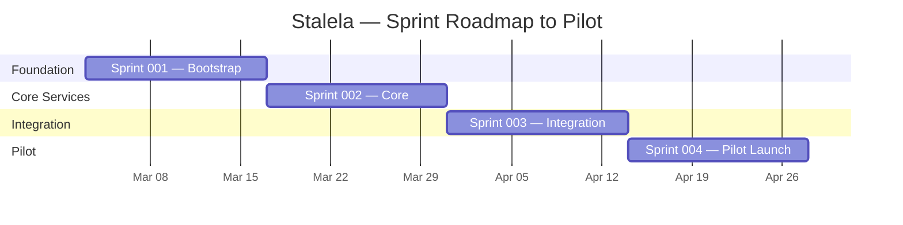

# Sprint 001 — Foundation & Free-Stack Bootstrap

**Dates:** 2026-03-03 → 2026-03-14 (2 weeks)  
**Team:** 2 devs (Sprint Master / System Design + Developer)  
**Stack:** [Free Stack](60-infra/free-stack.md) — Supabase · Vercel · Alibaba KMS · Resend · GitHub Actions  
**Focus:** Bootstrap the **monorepo**, provision free-stack infrastructure, deliver the first end-to-end slice from **both pillars** (Payments Nucleus + Fiscal Platform).

---

## 🎯 Goals (Sprint Outcome)

1. **Monorepo scaffold** (`stalela/`) deployed on Vercel with Turborepo.
2. **Supabase project** provisioned with schemas for `payments`, `ledger`, `fiscal`, `tax`, `signing`, `auth`.
3. **Alibaba Cloud KMS** key created (RSA-2048 or EC_P256) for fiscal signing.
4. **CI/CD green** — lint, type-check, test, preview deploy on every PR.
5. **Payments slice**: `POST /api/transfers` → outbox → DB Webhook → mock rail callback → ledger posting.
6. **Fiscal slice**: `POST /api/invoices` → tax engine → Alibaba KMS sign → fiscal ledger (hash-chained).
7. **Specs & contracts** finalized for both pillars (event envelope, canonical payloads, posting rules).

---

## 🗂 Scope (Stories)

### 1. Monorepo & Infra Setup

| # | Story | Owner |
|---|-------|-------|
| 1.1 | Scaffold Turborepo monorepo (`apps/api`, `apps/console`, `packages/db`, `packages/domain`, `packages/signing`, `packages/email`, `packages/config`) | Sprint Master |
| 1.2 | Create Supabase project; enable extensions (`pg_cron`, `pg_net`, `pgcrypto`); create schemas (`payments`, `ledger`, `fiscal`, `tax`, `signing`, `sync`, `compliance`, `directory`, `recon`, `rails`) | Sprint Master |
| 1.3 | Provision Alibaba Cloud KMS key (RSA-2048); create `packages/signing` wrapper with `sign()` and `verify()` | Developer |
| 1.4 | Configure Supabase Auth (email + API key strategy); set up RLS policies for `tenant_id` isolation | Sprint Master |
| 1.5 | Wire Vercel project to monorepo; configure `apps/api` for Serverless Functions | Developer |
| 1.6 | Configure Resend for transactional email; create `packages/email` wrapper | Developer |

### 2. CI/CD Pipeline

| # | Story | Owner |
|---|-------|-------|
| 2.1 | GitHub Actions workflow: lint → type-check → unit tests → Vercel preview deploy | Sprint Master |
| 2.2 | Supabase migration workflow: `supabase db push` on merge to `main` | Sprint Master |
| 2.3 | Contract validation step (golden fixtures for transfer + invoice payloads) | Developer |

### 3. Specs & Contracts

| # | Story | Owner |
|---|-------|-------|
| 3.1 | Finalize event envelope v1 (`events.md`) with `"v": 1` field | Sprint Master |
| 3.2 | Canonical Transfer API contract (`POST /api/transfers`, `GET /api/transfers/:id`) | Sprint Master |
| 3.3 | Canonical Invoice API contract (`POST /api/invoices`, `GET /api/invoices/:id`) | Sprint Master |
| 3.4 | Posting rules for transfers (`posting-rules.md`) linked into ledger service | Developer |
| 3.5 | ADR: Outbox pattern on Supabase (PAY-ADR-0001 update for DB Webhooks) | Sprint Master |
| 3.6 | ADR: Alibaba KMS as signing provider (FIS-ADR-0007) | Developer |

### 4. Payments Nucleus — First Slice

| # | Story | Owner |
|---|-------|-------|
| 4.1 | `POST /api/transfers`: validate, normalize, INSERT into `payments.transfers` + `payments.outbox` (single tx) | Developer |
| 4.2 | `GET /api/transfers/:id`: return transfer state + event timeline | Developer |
| 4.3 | Supabase Database Webhook on `payments.outbox` INSERT → mock rail gateway endpoint | Sprint Master |
| 4.4 | Mock EcoCash rail callback → UPDATE `payments.transfer_events` | Developer |
| 4.5 | Ledger trigger: on `transfer_events` state change → INSERT `ledger.journal_entries` (double-entry) | Sprint Master |
| 4.6 | `GET /api/balances`: return account balances from `ledger.balances` view | Developer |

### 5. Fiscal Platform — First Slice

| # | Story | Owner |
|---|-------|-------|
| 5.1 | `POST /api/invoices`: validate canonical payload, run jurisdiction tax engine (DRC TG01-TG14) | Developer |
| 5.2 | Monotonic counter: `fiscal.fiscal_counters` with `pg_advisory_xact_lock` + `nextval()` per outlet | Sprint Master |
| 5.3 | Alibaba KMS signing pipeline: serialize → digest → `kms:Sign` → base64 signature | Developer |
| 5.4 | Hash-chained fiscal ledger: INSERT into `fiscal.fiscal_ledger` with `prev_hash` | Sprint Master |
| 5.5 | Return sealed response (fiscal_number, auth_code, timestamp, qr_payload, fiscal_authority_id) | Developer |
| 5.6 | `GET /api/invoices/:id`: return sealed invoice with security elements | Developer |

---

## ✅ Definition of Done

| Criterion | Verification |
|-----------|-------------|
| Monorepo builds | `turbo build` passes; Vercel preview deploys |
| Supabase schemas | `supabase db push` succeeds; RLS policies tested |
| CI/CD green | All workflows pass on `main` |
| Payments E2E | `curl POST /api/transfers` → webhook fires → ledger entry visible |
| Fiscal E2E | `curl POST /api/invoices` → KMS signs → fiscal ledger entry with `prev_hash` |
| Specs published | Event envelope, transfer API, invoice API contracts in docs site |
| Signing | Alibaba KMS `sign()` + `verify()` round-trip passes in integration test |

---

## 🚧 Out of Scope

- Real rail integrations (EcoCash, M-Pesa, OPPWA) — Sprint 002
- Operator Console / Web Dashboard UI — Sprint 002
- Tax Authority Sync (DGI) — Sprint 003
- Reconciliation service — Sprint 003
- WhatsApp Bot / NL Invoice API — Sprint 004
- Fiscal Extension (offline signing) — Sprint 004

---

## 🔮 Risks & Mitigation

| Risk | Mitigation |
|------|-----------|
| Alibaba KMS region latency | Test from Vercel edge; add 500 ms timeout + retry |
| Supabase free-tier limits | Monitor via dashboard; 500 MB DB is ample for pilot |
| Spec churn | Freeze contracts after ADR sign-off in week 1 |
| pg_cron 2-slot limit | Multiplex via `cron_tasks` table (designed in free-stack doc) |
| Dev environment parity | Use Supabase CLI local dev (`supabase start`) for offline development |

---

## 📊 Metrics

| Metric | Target |
|--------|--------|
| Stories completed | ≥ 18 of 21 |
| CI pass rate on `main` | 100% |
| E2E transfer latency | < 500 ms (local Supabase) |
| E2E invoice signing latency | < 1 s (including KMS round-trip) |
| Test coverage (domain logic) | ≥ 80% |

---

## 👥 Ownership

| Role | Scope |
|------|-------|
| Sprint Master / System Design | Infra setup, Supabase schemas, DB Webhooks, ledger triggers, CI/CD, specs, ADRs |
| Developer | API routes (transfers + invoices), KMS wrapper, rail mock, tax engine, contract fixtures |

---

## 📝 Sprint 002 Preview

- **Real rail integration**: EcoCash gateway (STK push + callback)
- **Operator Console MVP**: Next.js dashboard with Supabase Auth + Realtime
- **Compliance screening**: Sanctions list + pre-transfer check middleware
- **Directory & Routing**: Alias-to-rail lookups
- **Web Dashboard MVP**: Fiscal invoice management + outlet admin
- **JS & Python SDK**: Typed client libraries with offline queue

---

## 📅 Sprint Roadmap (4 Sprints to Pilot)

| Sprint | Focus | Payments Nucleus | Fiscal Platform |
|--------|-------|-----------------|-----------------|
| **001** | Foundation | CTS + Ledger + mock rail | Signing + Tax Engine + Fiscal Ledger |
| **002** | Core Services | EcoCash GW + Compliance + Directory | Dashboard + SDK + Reports |
| **003** | Integration | Reconciliation + Operator Console | Authority Sync + Verification Portal |
| **004** | Pilot Launch | Multi-rail (M-Pesa, OPPWA) + AI Agents | WhatsApp Bot + NL API + Fiscal Extension |
